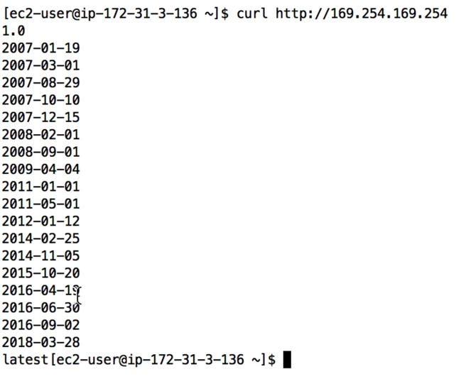
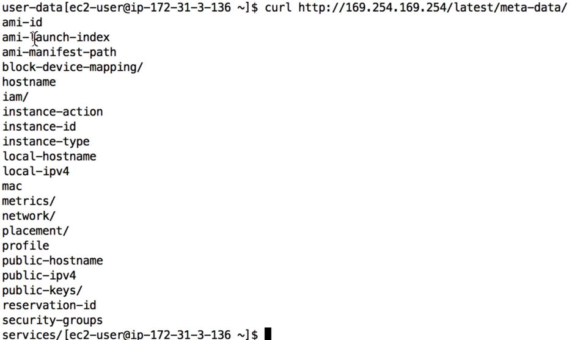
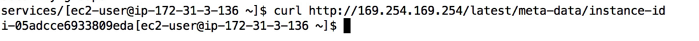
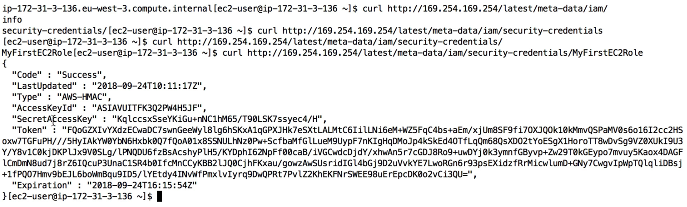

# AWS EC2 인스턴스 메타데이터

- 매우 강력한 기능으로 개발자에게 잘 알려지지 않은 기능이다.
- EC2 인스턴스가 스스로 학습하여 IAM 이 필요로 하지 않게 된다.
- http://169.254.169.254/latest/meta-data URL 을 기억해야 한다. 169.254.169.254 IP 는 AWS 의 내부 IP 로 오직 EC2 인스턴스에서만 작동한다.
- 해당 URL 을 사용하면 메타 데이터에서 IAM 역할명을 검색할 수 있다. 하지만 IAM 정책은 검색할 수 없다.
- IAM 정책을 테스트하는 유일한 방법은 정책 시뮬레이터나 드라이 런 옵션을 사용하는 것이다.
- Metadata 는 EC2 인스턴스 자체의 정보이다.
- Userdata 는 인스턴스 첫 실행 시에 시작되는 배치 스크립트이다.

EC2 인스턴스에서 curl http://169.254.169.254 을 입력해보자.

여러 숫자와 날짜를 얻게 된다. 

curl http://169.254.169.254/latest/ 를 입력해보자.

dynamic, meta-data, user-data 가 나온다.

즉, curl http://169.254.169.254/latest/dynamic or meta-data or user-data 로 검색을 할 수 있다는 뜻이다.

ami-id, launch-index, hostname, iam 등 다양한 옵션을 얻을 수 있다.

결과값으로 나온 것들중에 뒤에 / 가 존재하면 그 안에 뭔가가 더 있다는 뜻이다.

만약 인스턴스 아이디가 궁금하면 /meta-data/instance-id 를 입력하면 된다.

/iam/security-credentials 를 입력하면 역할 이름을 얻을 수 있고 그 뒤에 /역할 이름을 작성하면 Access Key ID, Secret Access Key 그리고 Token 을 얻는다. 또한, 만료 날짜도 얻을 수 있다. 보통은 1시간 정도이다.

따라서 EC2 인스턴스가 연결된 IAM 을 통해서만 임시 보안 인증을 얻는 것이다. 