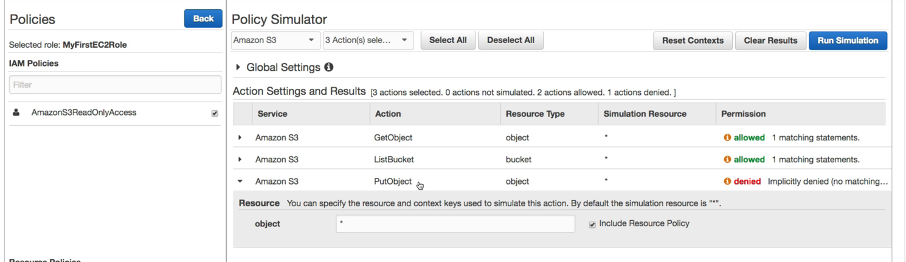
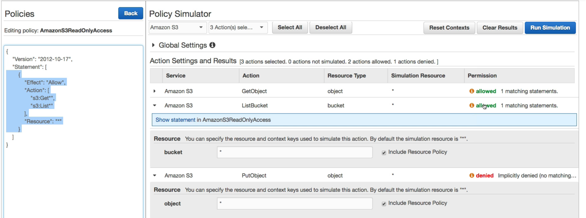

# AWS Policy Simulator

서비스들에 대한 정책을 만들어 시뮬레이션 해주는 서비스이다.

즉, 어떤 모든 리소스에게 Get*, List* 권한을 줬다고 시뮬레이터에 설정을 한다.

그 후, 해당 정책에서 PutObject 액션이 필요한 경우가 있다면 실행이 되는지 안되는지를 Permission 을 통해서 알려준다.

show statement 를 클릭해서 JSON 문서에서 정책을 확인할 수도 있다.