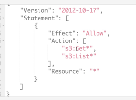
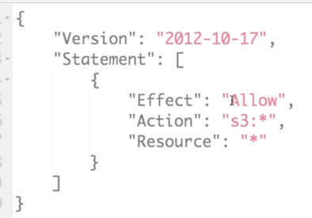

# IAM 역할 및 정책 실습

직접 정책을 생성할 떄는 서비스, 액션, 리소스, 요청 조건을 지정할 수 있다.

혹은 관리형 정책들을 가져와서 커스터마이징을 할 수도 있다.

혹은 AWS 서비스(EC2, S3...)에 자체적으로 인라인 정책을 걸 수 있다. 

즉 인라인 정책은 해당 역할에만 적합한 정책이라는 뜻이다.

인라인 정책을 사용하는 것을 추천하지는 않는다.

AnazonS3ReadOnlyAccess 의 JSON 을 한 번 살펴보자.

* 리소스에 대해 Get, List 라는 이름으로 시작하는 모든 API 호출이 가능하다는 것이다.

AmazonS3FullAccess 의 JSON 을 살펴보자.

s3* 가 허용으로 나온다. 리소스도 * 로 표시되어 모든 리소스에서 기능을 허용한다는 뜻이다.

특정 리소스를 지정하여 그 리소스만 허용하고 싶다면, 여기선 S3 이니 버킷에 대한 ARN 을 리소스에 적어주면 해당 버킷만 권한을 주겠다는 뜻이다.

즉, 이 JSON 문서를 통해서 원하는 정책을 지정할 수 있다.

AWS Policy Generator 를 사용하여 S3 Bucket Policy, IAM Policy, SQS Queue Policy, VPC Endpoint Policy, SNS Topic Policy 등 정책 유형 별로 정책을 생성할 수 있다.

