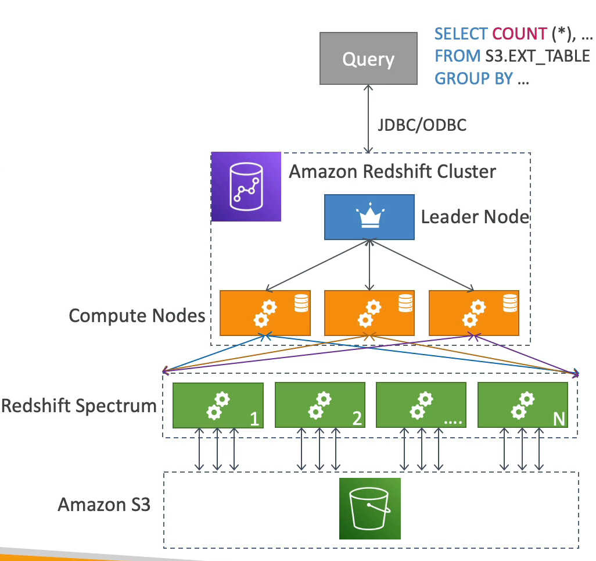

# Redshift

- Redshift 는 PostgreSQL 을 기반으로 작동하지만 OLTP 즉, 온라인 트랜잭션 처리에는 사용되지 않는다. 분석을 할 때 사용한다.
- Redshift 는 성능이 매우 뛰어나다. 다른 데이터 웨어 하우스에 비해서 열배 정도 성능이 더 좋고 페타바이트까지 데이터를 스케일할 수 있다.
- 데이터는 행이 아닌 열에 저장되기 때문에 컬럼 형식 스토리지 데이터라고 부른다.
- 고성능인 이유는 병렬 쿼리 실행 엔진인 MPP 때문이다.
- 사용한 만큼 과금된다.
- 인스턴스의 유형에 따라서 Redshift 클러스터의 일부로 프로비저닝된다. 
- 쿼리문을 수행하는 SQL 인터페이스가 존재한다.
- QuickSight 나 Tableau 를 Redshift 와 통합하여 사용할 수 있다. 

### Redshift Contiuned

- 데이터를 S3 버킷, DynamoDB, DMS, 다른 DB 에서 가져올 수 있다.
- Redshift 클러스터 안에서 최대 128개의 노드를 가질 수 있고 각각의 노드 당 최대 128TB 용량을 가질 수 있다.
- Redshift 는 두가지 종류의 노드가 존재한다.
  - Leader 노드: 쿼리 planning 과 쿼리 결과 집계에 사용된다.
  - Compute 노드: 쿼리를 수행하고 수행된 결과값을 Leader 노드로 전송하는 역할을 한다.
- Redshift Spectrum: S3 에서 쿼리를 직접 수행할 때 사용한다. 즉, Redshift 클러스터에서 데이터를 로드할 필요가 없을 때 사용한다.
- 백업과 복구가 가능하고, 보안에 관련해서는 Redshift 클러스터가 VPC 에서 배포되며 IAM, KMS 을 사용하여 Redshift API 를 보호하며 다른 서비스들과 마찬가지로 모니터링이 가능하다.
- Enhanced VPC Routing 을 통해서 public internet 대신 S3 에 직접 데이터를 복사 붙여넣기 해서 Redshift 로 가져올 수 있다.

### Redshift - Snapshots & DR

- Redshift 는 Multi AZ 기능이 없다 모든 클러스터가 단일 가용 영역에서만 작동한다.
- Redshift 에서 재해 복구 전략으로 스냅샷을 사용한다. 스냅샷은 S3 에 저장된다.
- 새로운 Redshift 클러스터에 스냅샷을 복원할 수 있다.
- 스냅샷 클래스에는 두 가지 모드가 존재한다.
  - Automated: 자동화를 통해 8시간 혹은 5GB 마다 스냅샷이 이뤄진다.
  - Manual: 수동 스냅샷의 경우 수동으로 스냅샷을 삭제할 때 까지 스냅샷이 보존된다.
- Redshift 는 스냅샷 설정이 수동이든 자동이든 상관없이 클러스터의 스냅샷을 자동으로 복사하여 AWS 리전으로 보내 재해 복구 전략을 제공한다는 점이다.

### Loading data into Redshift

- 첫 번째로 방법으로 Amazon Kinesis Data Firehose 를 사용하는 방법이 있다. 
  - Firehose 가 다른 서비스에서 데이터를 가져온 뒤 Redshift 로 데이터를 전송한다.
- 두 번째 방법으로 Redshift 로 데이터를 전송하기 위해서는 S3 버킷에 데이터를 write 하고 Firehose 가 자동으로 S3 Copy 명령을 실행하여 Redshift 에 데이터를 복사한다.
  - S3 버킷에서 Copy 명령을 실행할 때 Redshift 클러스터의 IAM 역할을 사용한다. 이 IAM 역할을 통해서 다른 사용자들이 S3 버킷에 접근을 할 수 없고 역할을 부여받은 Redshift 클러스터가 인터넷을 통해 데이터를 복사해서 가져오는 것이다.
  - 만약에 Redshift 클러스터가 private Subnet 에 위치한 경우 Enhanced VPC Routing 을 활성화하여 VPC 를 통해 데이터를 복사할 수 있다.
- 세 번쨰 방법으로 JDBC 드라이버를 사용해서 Redshift 클러스터에 데이터를 전송할 수 있다.
  - EC2 인스턴스에 앱이 띄워져 있고 Redshift 클러스터에 데이터를 write 해야 할 경우 한 번에 여러개를 write 해서 효율적으로 사용하는 것이 좋기 때문에 Redshift Spectrum 을 사용한다.

### Redshift Spectrum

- S3 에 데이터가 있고 해당 데이터들을 Redshift 클러스터로 가져오지 않고 S3 버킷에서 Redshift Spectrum 을 사용해서 데이터를 처리하는 방식이다.
- Redshift 클러스터에 Leader 노드 한개와 그에 연결된 여러 대의 Compute 노드가 존재한다. 
- EC2 인스턴스에 띄워져 있는 앱에서 쿼리문을 Redshift 클러스터로 날리면 Redshift 클러스터는 S3 버킷으로부터 데이터를 가져오지 않고 Redshift Spectrum 이 실행되어 수천개의 노드가 S3 에서 쿼리문을 실행한다. 
- 즉, Compute 노드에서 S3 버킷에 있는 데이터를 가져와서 쿼리문을 처리하는 것이 아니라 Redshift Spectrum 이 실행되고 해당 노드에서 S3 데이터를 읽고 쿼리문을 처리하는 방식인 것이다.
- 앱에서 보낸 쿼리문을 Redshift Spectrum 에서 모두 처리하면 결과값을 Redshift 클러스터로 돌려보내고 다시 앱으로 전송한다.

