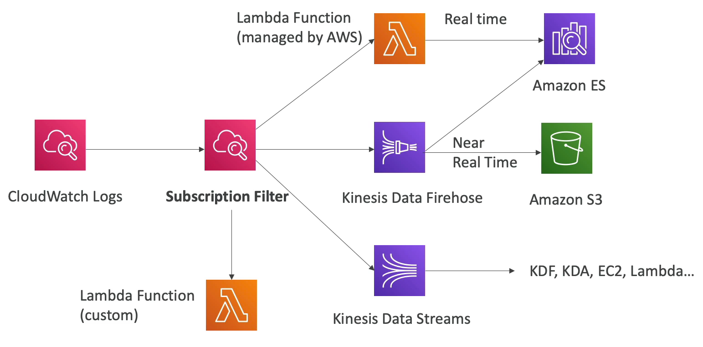
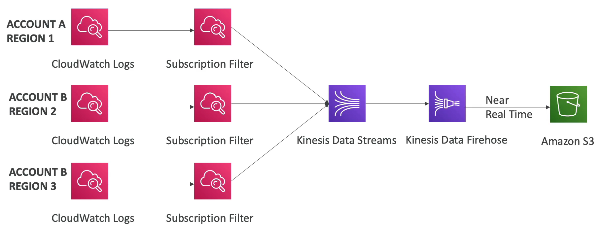

# CloudWatch Logs

- AWS 에서 로그를 저장하는 최적의 장소가 바로 CloudWatch Logs 이다.
- 로그들은 로그 그룹으로 그룹화한다. 로그 그룹의 이름은 보통 애플리케이션을 나타낸다.
- 각 로그 그룹 내에는 로그 스트림이 있고 로그 스트림은 애플리케이션 내의 인스턴스나 다양한 로그 파일명, 컨테이너 등을 나타낸다.
- 로그 만료일도 정의할 수 있다. 로그가 영원히 만료되지 않게 하거나 일정 기간이 지난 후에 만료되도록 할 수 있다.
- CloudWatch Logs 스토리지는 유료이다.
- 로그는 S3 나 Kinesis Data Streams 및 Firehose Lambda, ElasticSearch 등으로 보낼 수 있다.

### CloudWatch Logs - Sources

- SDK, CloudWatch Logs 에이전트, 통합 CloudWatch 에이전트를 통해 로그를 보낼 수 있다. 통합 CloudWatch 에이전트를 사용하는 방식은 사장되는 추세이다.
- Elastic Beanstalk 는 애플리케이션의 로그를 CloudWatch 에 전송한다. 
- ECS 는 컨테이너의 로그를 CloudWatch 에 전송한다. 
- Lambda 는 함수 자체에서 로그를 전송한다. 
- VPC Flow Logs 는 VPC 네트워크 트래픽 로그를 전송한다.
- API Gateway 는 받은 모든 요청을 CloudWatch Logs 로 보낸다.
- CloudTail 은 필터링을 하여 로그를 전송할 수 있다.
- Route53 은 모든 DNS 쿼리를 로그로 저장한다.

### CloudWatch Logs Metric Filter & Insights

- CloudWatch Logs 에서는 정규 표현식을 사용할 수 있다.
  - 예를 들어, 로그 내 특정 IP 를 찾는다거나, ERROR 문구를 갖는 모든 로그를 찾을 수 있다.
- metrics 필터를 통해 출현 빈도를 계산하여 metrics 를 만들 수 있고 이렇게 만든 metrics 를 CloudWatch alarms 에 연동할 수 있다.
- CloudWatch Logs Insights 기능을 통해 로그를 쿼리하고 이 쿼리를 대시보드에 바로 추가할 수 있다.
- 자주 쓰이는 쿼리들도 AWS 에서 자체적으로 추가했으며 아주 사용하기 간편한 쿼리 언어이다.

### CloudWatch Logs - S3 Export 

- CloudWatch 에서 S3 로 로그를 전송할 때 실시간으로 전송하지 않는다. export 하는데 최대 12시간이 걸릴 수도 있다.
- CreateExportTask 라는 API 를 사용하여 export 한다.
- CloudWatch Logs 에서 로그를 스트림하고 싶다면 Logs Subscription 을 사용해야 한다.

### CloudWatch Logs Subscriptions

- Logs Subscriptions 에 구독 필터를 적용하여 원하는 목적지로 보낸다.
- 목적지로는 Lambda 함수, Kinesis Data Firehose, Kinesis Data Streams 가 될 수 있다.

### CloudWatch Logs Aggregation Multi-Account & Multi Region

- CloudWatch Logs 로 여러 계정과 리전간 로그를 집계할 수 있다.
- 여러 리전에서 여러 계정이 구독 필터를 사용해서 Kinesis Data Streams 로 로그를 전송하고 Kinesis Data Streams 는 전송된 모든 로그를 모아서 Kinesis Data Firehose 로 전송한다. 이후 실시간으로 S3 버킷에 로그 데이터를 쌓는다.