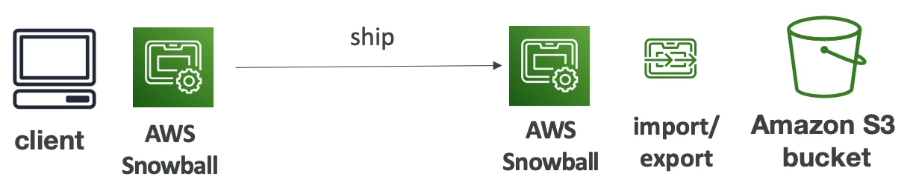
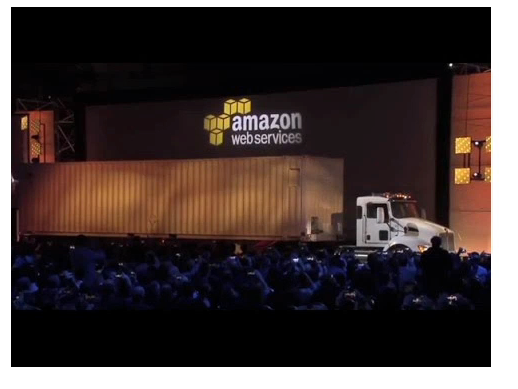

# AWS Snow Family

- AWS Snow 제품군은 보안성이 높고, 엣지에서 데이터를 수집하고 처리하기 위해 사용되거나 AWS 안팎으로 데이터를 마이그레이션 할 때 사용하는 휴대용 장치이다.
- 데이터 마이그레이션을 위한 Snow 제품군으로는 Snowcone, Snowball Edge, Snowmobile 가 있다.
- 엣지 컴퓨팅을 위한 Snow 제품군으로는 Snowcone, Snowball Edge 가 있다.

### 데이터 마이그레이션을 할 때 Snow 제품군을 사용하는 이유

일반적인 네트워크를 사용해서 대량의 데이터를 전송하려면 시간이 엄청 오래 걸린다.

예를 들어 100TB 를 전송하려는 경우, 1GB/s 회선을 사용한다면 전송을 완료하는데 12일이 걸린다.

만약 전송할 데이터의 단위가 PB 가 넘어가게 된다면 상상도 할 수 없을 만큼 오랜 시간이 걸릴 것 이다.

이 뿐 만 아니라 네트워크 회선을 사용하는 비용도 무료가 아니라 클라우드 회사에 엄청나게 많은 비용을 지불해야 한다.

즉, 문제점은 다음과 같다.
- 대역폭 공유 문제
- 높은 네트워크 비용
- 제한된 대역폭 문제
- 연결 안정화 문제

바로 이런 문제들 때문에 Snow 제품들이 사용된다. Snow 제품들은 오프라인에서 데이터 마이그레이션을 실행하는 장치이다.

AWS 가 우편으로 장치를 보내주면 그 장치에 데이터를 업로드하고 다시 AWS 로 보내주면 된다.

일반적으로 데이터 전송하는데 걸리는 시간이 일주일이 넘어간다면 Snowball 장치를 사용해야 한다.

Amazon S3 로 직접 파일을 업로드하려면 클라이언트가 Amazon S3 로 데이터를 전송할 것이다.

만약, Snowball 장치가 있다면 로컬에서 데이터를 직접 장치로 업로드한다. 그리고 해당 장치를 다시 AWS 로 보내주면 AWS 측에서 인프라에 데이터를 마이그레이션 해준다.

### Snowball Edge

- TB 나 PB 이상의 데이터를 전송해야 할 경우 사용한다.
- 데이터 전송 건마다 비용이 청구된다.
- 자체적으로 블록 스토리지를 사용하나 Amazon S3 호환되는 객체 스토리지도 제공해준다.
- Snowball Edge 에는 두 가지 옵션이 있다.
  1. Snowball Edge Storage Optimized : 블록 스토리지로 사용할 수 있도록 80 TB 의 HDD 를 제공해주고 필요하다면 S3 와 호환되는 객체 스토리지를 제공해준다.
  2. Snowball Edge Compute Optimized : 42 TB 의 HDD 를 제공해주고 필요하다면 S3 와 호환되는 객체 스토리지를 제공해준다.
- Snowball Edge 를 데이터 전송에 쓰는 경우는 보통 온프레미스에서 클라우드로 전환할 때 대량의 데이터를 클라우드에 마이그레이션 하거나 AWS 에 데이터를 백업하는 경우다.

### Snowcone

- Snowball Edge 보다 더 작은 장치로 휴대 가능한 장치이며 무게는 2.1kg 정도 된다. 어느 환경에서도 사용할 수 있다.(사막이나 물속이든 상관 없다.)
- 8TB 를 저장할 수 있고 엣지 컴퓨팅이나 데이터 전송에 사용된다.
- Snowcone 은 보통 환경이나 공간의 제약을 받는 상황에 사용한다. 드론에 연결하여 데이터를 저장할 수도 있고 이외에도 활용 방법은 많다.
- Snowcone 이 드론에 연결되어 있는 상태이다. 인터넷으로 연결을 할 수 없는 상황이고, 드론은 데이터를 계속해서 수집하여 Snowcone 에 저장한다. 드론을 회수하고 Snowcone 을 온프레미스 환경에 연결하면 데이터가 자동으로 AWS 에 전송되도록 할 수 있따.

### Snowmobile

- Snowmobile 은 진짜 리얼 트럭이다. 데이터 트럭.
- 100PB 까지 데이터를 저장할 수 있다.
- 보안성이 굉장히 뛰어나고 온도 조절도 가능하며 GPS 로 추적할 수 있고 CCTV 로 감시할 수도 있다.
- 안전성이 굉장히 높은 데이터 전송 방법을 사용하여 10PB 이상의 데이터를 전송하려면 Snowball 대신 Snowmobile 을 사용하는 것이 좋다.

### AWS Snow Family for Data Migrations

AWS 에서 권장하는 마이그레이션 데이터 크기는 다음과 같다.

- Snowcone 은 최대 24TB, DataSync 가 설치되어 있어 인터넷을 통해 AWS 에 데이터를 업로드할 수 있다.
- Snowball Edge 는 최대 PB, 클러스터링으로 Snowball Edge 15개를 같이 구축하여 스토리지 크기를 늘릴 수 있다.
- Snowmobile 은 최대 EB 데이터까지 전송 가능하다.

### 엣지 컴퓨팅?

- 데이터가 엣지 로케이션에서 생성될 때 실시간으로 데이터를 처리하는 방식을 뜻한다.
- 엣지 로케이션이란 데이터를 생성은 하지만 인터넷과 연결되어 있지 않는 모든 장소를 뜻한다. 인터넷이 연결되지 않는 곳에서 데이터 처리를 해야 할 경우 엣지 컴퓨팅이 필요로 하다.
- Snowball Edge 나 Snowcone 장치를 주문해서 엣지 로케이션에 장착시키면 엣지 컴퓨팅을 시작할 수 있다.
- 엣지 컴퓨팅의 예시를 들면 데이터 전처리, 클라우드에서 머신 러닝을 하지 않고 엣지 컴퓨팅으로 머신 러닝을 하거나 미디어 스트림을 트랜스 코딩하는 작업들이 있다.
- 어찌됐든 간에 데이터를 AWS 로 보내야 하는 경우 Snowcone 이나 Snowball Edge 장치를 AWS 로 보내주면 된다. 즉, Snowball Edge, Snowcone 에서 엣지 컴퓨팅을 하고 완료된 작업물을 AWS 로 보내서 클라우드에 업로드하는 것이다.