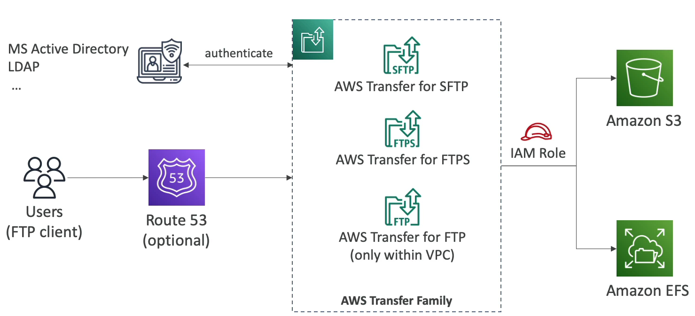

# AWS Transfer Family

- AWS 전송 제품군을 살펴본다.
- S3 나 EFS 를 사용하지 않고 FTP 프로토콜을 사용하여 데이터를 업로드하고 싶다면 어떻게 해야 될까? 이런 경우 AWS 전송 제품군을 사용한다.
- 지원하는 프로토콜 목록은 아래와 같다.
  1. FTP(File Transfer Protocol)
  2. FTPS(File Transfer Protocol over SSL)
  3. SFTP(Secure File Transfer Protocol)
- FTP 는 암호화되지 않았지만 FTPS, SFTP 는 전송 중에 암호화 된다는 것만 알면된다.
- FTP 프로토콜을 사용해서 S3 나 EFS 에 파일을 업로드할 수 있다.
- AWS Transfer Family 는 완전 관리형 서비스이며 확장성, 안정성이 높고 가용성(multi AZ)이 높다는 것이 특징이다.
- 시간당 프로비저닝 된 엔드 포인트 비용에 AWS Transfer 을 사용하여 내외부로 전송된 데이터의 GB 당 요금을 더한다.
- Microsoft Active Directory, LDAP, Okta, Amazon Cognito 등 기존의 인증 시스템과 통합할 수 있다.
- 보통 파일을 공유 및 공용 데이터셋을 올리거나 CRM, ERP 등을 하기 위해 사용한다.

사용자는 FTP 의 엔드 포인트를 통해 직접 액세스하거나 Route 53의 DNS 를 사용하여 FTP 서비스에 고유한 호스트 이름을 제공할 수 있다.

FTP 서비스를 사용하여 전송할 때 IAM Role 이 존재하여 Amazon S3 나 Amazon EFS 의 파일을 보내거나 읽도록 할 수 있다.

일련의 과정들은 쉽게 이뤄지며 많은 설정이 필요 없다. AWS Transfer 의 보안을 위해 외부 인증 시스템을 통해 사용자를 인증할 수 있다. 

외부 인증 시스템으로는 Active Directory 와 LDAP 등이 있다.