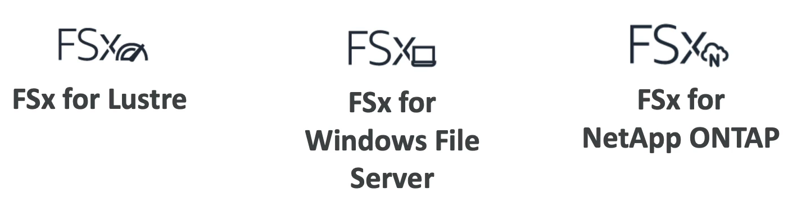
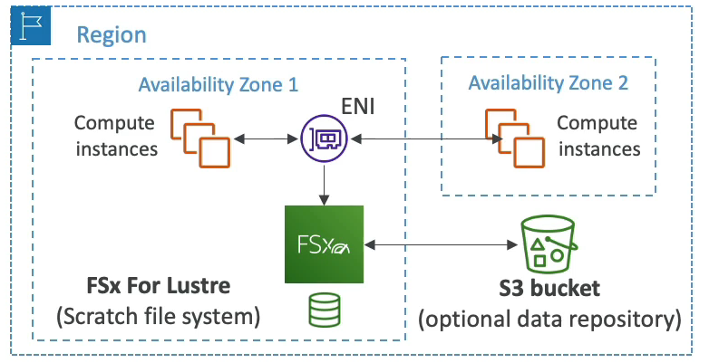
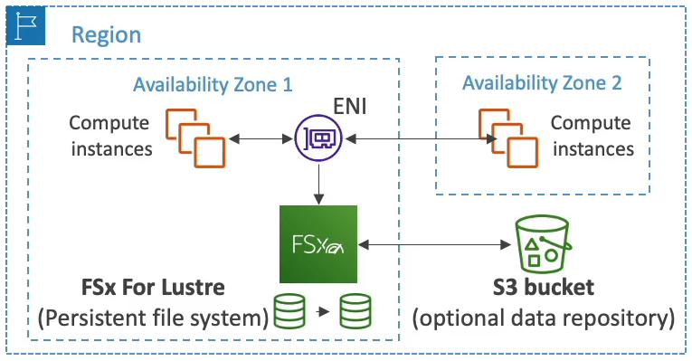

# Amazon FSx

- AWS 에서 실행되는 파일 시스템으로 고성능이며 서드 파티 제품이다.
- 완전 관리형 서비스로, S3, EFS 가 아닌 다른 파일 시스템을 사용하고 싶을 때 사용한다. 예를 들어 Lustre, Windows File Server, NetApp ONTAP 등이 될 수 있다.
- 좀 간단하게 말하자면 FSx 가 타사(서드 파티)의 고성능 파일 시스템을 실행시키는 방법이라고 말할 수 있다.

### Amazon FSx for Windows(File Server)

- EFS 는 리눅스 시스템에서 사용되는 공유 POSIX 파일 시스템이다. 리눅스 계열에서 사용되는 파일 시스템이라는 것이다.
- 윈도우 서버에서는 EFS 를 사용할 수 없다. 그럼 윈도우 서버는 스토리지를 어떻게 공유할까?
- 아마존은 윈도우용 FSx 를 사용하여 완전 관리형 윈도우 파일 시스템(공유 드라이브) 를 사용할 수 있게 했다.
- SMB 프로토콜과 윈도우 NTFS 프로토콜을 지원한다.
- 마이크로소프트의 Active Directory 통합, ALCs, 사용자 할당량도 지원한다.
- SSD 상에서 구축되는데 규모가 커서 초당 수십 GB, 수백만 IOPs, 수백 PB 의 데이터로 스케일 업될 수 있다.
- 온프레미스 환경에서 액세스가 가능하다.
- Multi AZ 로 구성될 수 있어 가용성이 높다.
- 데이터는 매일 S3 에 백업된다. 그래서 S3 에서 파일 시스템을 직접 복구할 수 있다.
- 쉽게 말해, Amazon FSx 는 윈도우 서버들의 공유 스토리지라고 생각하면 된다.

### Amazon FSx for Lustre

- Lustre 는 대규모 컴퓨팅을 위한 병렬 분산 파일 시스템이다. 
- Lustre 라는 이름은 Linux 와 클러스터에서 따왔다.
- Lustre 는 Linux 인스턴스 전용이고 클러스터에서 유래한 데서 알 수 있듯 주로 대규모 컴퓨팅에 쓰인다.
- 주로 머신 러닝과 고성능 컴퓨팅, HPC 에 사용된다.
- 고성능 컴퓨팅을 수행하기 위해 파일 시스템을 사용해야 한다면 Lustre 가 해결책이 될 것이다.
- 영상 처리, 재무 모델링, 전기 설계 자동화 등 파일 시스템과 하이 레벨의 분산이 요구되는 어떤 작업에 상관없이 사용 가능하다.
- 초당 수백 GB 및 수백만 IOPs 로 확장가능하고 1/1000 초 이하의 지연시간을 갖는다.
- S3 와 아무 문제 없이 통합된다.
  - Lustre 파일 시스템으로 S3 버킷을 읽고 S3 에 출력물을 저장할 수 있다.
  - S3 버킷을 파일 시스템으로서 나타내는 방법이다.
- 필요하다면 온프레미스 서버에서 사용될 수 있다.

### FSx File System Deployment Options

두 가지 파일 시스템 옵션을 기억하면 된다.

1. Scratch File System
   - 임시 스토리지이고 데이터가 복제되지 않는다. 즉, 마스터 서버에 에러가 발생하여 고장나면 파일을 잃게 된다.
   - 최적화가 굉장히 잘 되어 있어서 1초에 테라바이트 당 200MB 를 처리할 수 있다.
   - 짧은 시간에 데이터를 처리할 때 사용하고 데이터를 복제하지 않아 비용을 최소화해야 할 때 사용한다.
   - FSx 가 있으면 인스턴스가 가용 영역 1과 2에 연결되고 Lustre 용 FSx 의 Scratch 파일 시스템이 데이터의 사본을 가진다.

2. Persistent File System
   - 민감한 데이터를 오랫동안 저장해야 하는 스토리지에 사용되는 파일 시스템이다.
   - 데이터는 동일한 가용 영역에서 복제가 된다. 즉, 마스터 서버에 에러가 발생하여 실패하더라도 파일들이 몇 분 내로 교체될 수 있다.
   - 데이터 사본을 두 개 갖는다. 