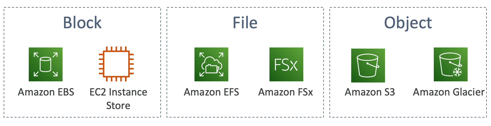
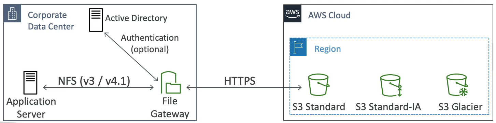
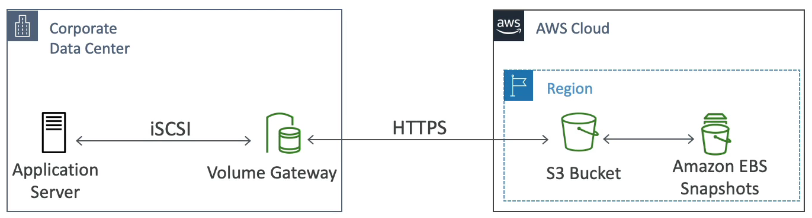
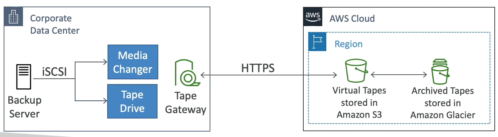

# Storage Gateway 개요

- AWS 는 하이브리드 클라우드를 추진 중이다.
- 하이브리드 클라우드란 일부는 AWS 클라우드를 사용하고 일부는 온프레미스를 사용하는 방식을 뜻한다. 즉, 말그대로 클라우드 + 온프레미스 방식이다.
- 하이브리드 클라우드로 추진하는 이유는 클라우드 상에서 시간이 오래 걸리는 마이그레이션, 보안 요건 준수, 탄력있는 워크로드 클라우드를 사용하기 위해서다.
- S3 의 경우 어떻게 온프레미스 방식으로 변경할 수 있을까? 온프레미스와 인프라 사이를 잇는 가교 역할을 하는 것이 AWS 스토리지 게이트웨이이다.

### AWS Storage Cloud Native Options

- AWS 스토리지 클라우드 네이티브 옵션을 보면 블록 스토리지인 EBS 와 EC2 인스턴스 스토어가 있고, 파일 시스템인 Amazon EFS, Amazon FSx, 객체 스토리지인 Amazon S3, Amazon Glacier 가 있다.

### AWS Storage Gateway

- 스토리지 게이트웨이는 온프레미스 데이터와 S3의 클라우드를 연결한다.
- 스토리지 게이트웨이는 주로 재해 복구, 백업 및 복원, 계층화된 스토리지에 사용된다.
- 스토리지 게이트는 세 가지 유형이 있다.
  1. File Gateway 
  2. Volume Gateway 
  3. Tape Gateway
- 스토리지 게이트웨이는 온프레미스의 데이터를 Amazon EBS 또는 Amazon S3 나 Glacier 로 가져온다.

### File Gateway

- NFS 와 SMB 프로토콜을 사용하여 S3 버킷에 액세스 가능하게 한다.
- S3 Standard, S3 IA, S3 One Zone IA 등의 스토리지 유형을 지원한다.
- 각 게이트웨이의 IAM 역할을 사용하는 버킷 액세스가 보호되고 가장 최근에 사용된 데이터는 파일 게이트웨이에 캐싱된다.
- 파일 게이트웨이는 온프레미스 여러 서버에 설정될 수 있다.
- 사용자 인증이 필요한 경우 온프레미스의 Active Directory 와 통합되어 사용자 인증을 진행할 수 있다.

애플리케이션 서버는 NFS 프로토콜인 V3 혹은 V4.12 를 통해 파일 게이트웨이와 통신하고 파일 게이트웨이는 AWS 클라우드와 온프레미스를 연결해준다.

클라우드 안에서 S3 Standard, S3 IA, S3 One Zone IA, S3 Glacier 를 사용할 수 있다.

파일 게이트웨이는 HTTPS 를 통해 클라우드의 버킷들에 액세스 및 통신하게 된다. 

버킷들과 통신하기 위해서 사용자 인증이 필요로 하고 Active Directory 를 설정한 상태라면 Active Directory 와 파일 게이트웨이의 통합으로 파일 게이트웨이 레벨의 인증을 제공해준다.

Amazon S3 로 파일이 액세스 및 확장되기 때문에 파일 시스템에 매우 큰 스토리지를 제공하게 된다.

가장 많이 사용된 파일은 파일 게이트웨이에 캐싱되어 파일 액세스 지연 시간을 낮춰준다.

이런 방식으로 온프레미스의 NFS 크기를 확장할 수 있다.

### Volume Gateway

- S3 의 iSCSI 프로토콜을 사용하는 블록 스토리지이다.
- EBS 의 스냅샷으로 백업되는 볼륨을 갖게 되고 필요한 경우 온프레미스 볼륨을 복구하는 데 도움을 준다.
- 볼륨 게이트웨이는 두 가지 종류가 있다.
  1. Cached volumes : 최근 액세스 된 데이터의 액세스 지연 시간을 줄여주는 캐시 된 볼륨 
  2. Stored volumes : 전체 데이터셋이 온프레미스에서 제공되는 저장된 볼륨
- 볼륨 게이트웨이는 S3 가 지원하는 Amazon EBS 스냅샷을 생성한다.

볼륨 게이트웨이의 목표는 온프레미스 서버의 볼륨을 백업하는 것이다.

### Tape Gateway

- 물리적인 테이프를 사용해서 백업하는 테이프 백업 시스템이다.
- 테이프 게이트웨이를 사용하더라도 모든 과정은 동일하고 단지 테이프가 클라우드에 백업되는 것이다.
- 가상 테이프 라이브러리인 VTL 은 S3 와 Glacier 을 사용할 수 있고, 기존 데이터를 백업할 때 테이프 기반 프로세스 및 iSCSI 인터페이스를 사용한다.
- 백업 소프트웨어 판매 업체와 협업하기도 한다.

아마존 S3 나 Glacier 에 테이프를 저장하는 방식으로 테이프 게이트웨이가 클라우드에 접속한다. 해당 게이트웨이는 온프레미스가 위치한 기업 데이터 센터에 설치된다.

온프레미스 서버에서 데이터를 테이프에 저장하고 테이프 게이트웨이를 통해 클라우드에 데이터를 저장한다.

### Storage Gateway - Hardware appliance

- 기업에 온프레미스 데이터 센터가 없으면 AWS 에서 제공해주는 하드웨어를 사용해야 하고 이를 스토리지 게이트웨이 하드웨어 어플라이언스라고 부른다.
- 아마존에서 주문 가능하다.
- 기업에 미니 서버가 설치되면 볼륨 게이트웨이, 파일 게이트웨이, 테이프 게이트웨이 중 하나로 설정할 수 있다.
- 물리적으로 데이터 센터를 설치하는 방법으로 충분한 CPU 성능, 메모리, 네트워크, SSD 등이 필요하다.
- 주로 소규모 데이터 센터에서 매일 NFS 백업을 수행하지만 가상화가 불가능한 경우 사용한다.

### 정리

- 온프레미스와 데이터 클라우드 사이에 연결다리가 필요하면 스토리지 게이트웨이를 사용해야 한다.
- 네트워크 파일 시스템과 함께 사용자 인증이 필요한 Active Directory 를 사용한다? => File Gateway, 데이터는 S3 로 백업된다.
- 볼륨, 블록 스토리지, iSCSI 를 사용한다? => 볼륨 게이트웨이, EBS 스냅샷이 S3 에 생성되고 백업된다.
- VTL 테이프 방식, iSCSI 로 백업을 한다? => 테이프 게이트웨이, S3 나 Glacier 로 백업된다.
- 온프레미스 가상화 시스템이 없는 경우? => 하드웨어 어플라이언스를 사용한다.