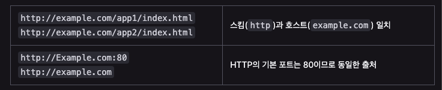
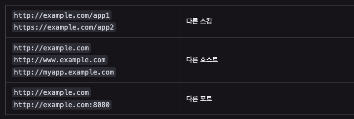
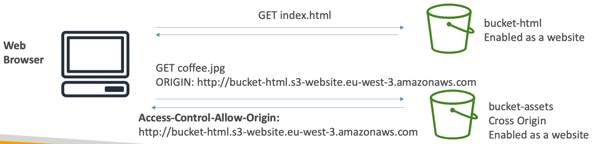

# S3 CORS

교차 출처 리소스 공유(Cross Origin Resource Sharing)에 대해 살펴보자.

- origin : 웹 컨텐츠의 출처(origin)는 접근할 때 사용하는 URL 의 스킴(프로토콜, 호스트(도메인), 포트)로 정의 된다. 그래서 두 객체의 스킴, 호스트, 포트가 모두 일치하는 경우 같은 출처를 가졌다고 말한다.
  - 동일 출처는 다음과 같다.
  
  - 다른 출처는 다음과 같다.
  
- 보안 상의 이유로, 웹 브라우저는 기본적으로 다른 출처의 리소스를 가져오지 못한다.
- CORS 를 사용할 경우 한 출처에서 실행 중인 웹 애플리케이션이 다른 출처의 선택한 자원에 접근할 수 있는 권한을 부여하도록 브라우저에게 알려주는 체제이다.
- 웹 애플리케이션은 리소스가 자신의 출처(도메인, 프로토콜, 포트)와 다를 때 교차 출처 HTTP 요청을 실행한다.
- CORS 체제는 브라우저와 서버 간의 안전한 교차 출처 요청 및 데이터 전송을 지원한다.
- 최신 브라우저는 XMLHttpRequest 또는 Fetch 와 같은 API 에서 CORS 를 사용하여 교차 출처 HTTP 요청의 위험을 완화한다. 

### S3 CORS

- 클라이언트가 웹사이트에서 S3 버킷에 교차 출처 리소스 공유를 요청하는 경우 올바른 CORS 헤더를 활성화 하여 CORS 를 허용해야 한다.
- CORS 헤더를 활성화해야 하는 시점과 어느 위치에서 활성화를 해야하는지 이해해야 한다.
- 특정 출처의 이름을 지정해서 특정 출처만 허용할 수 있고, * 와일드 카드를 사용하여 모든 출처에 허용할 수 있다.

예시를 확인해보자.

웹 브라우저는 버킷에서 HTML 파일을 가져온다.

이 때 버킷은 웹 사이트로 활성화 되어 있는 상태이다.

여기서 두 번째 버킷이 교차 출처 버킷이 되는데 여기도 위 버킷과 동일하게 웹 사이트로 활성화되어 있으며 동일한 파일을 가지고 있다.

이 때 버킷에 index.html 파일을 보내달라고 GET 요청을 보내면 버킷에서 웹 사이트로 index.html 을 응답해준다.

그리고 index.html 에는 coffe.jpg 파일이 필요해서 두 번째 버킷으로 coffe.jpg 파일을 보내달라고 GET 요청을 보내게 된다.

coffe.jpg 파일은 다른 출처에 있기 때문에 두 번째 S3 버킷에 CORS 정책이 설정되어 있지 않으면 웹 브라우저가 요청을 보내도 옳바른 응답이 오지 않는다. 아마도 CORS 관련 오류가 발생할 것이다.

