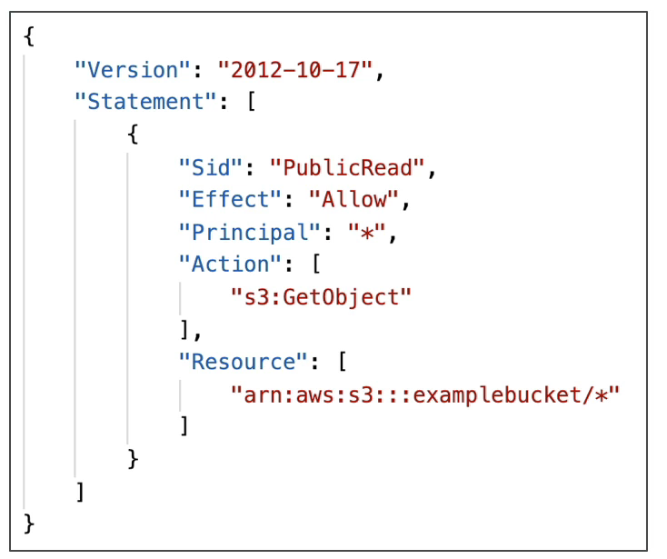

# S3 보안 및 버킷 정책

- 사용자 기반 보안 정책
  - IAM 정책 : IAM 사용자는 IAM 정책을 가지고 특정 서비스에 대한 권한을 허가 받는다. 만약 어떤 유저가 IAM 정책을 통해 Amazon S3 버킷에 액세스하는 권한을 받으면 S3 서비스를 사용할 수 있게 된다.
- 리소스 기반 보안 정책
  - 버킷 정책 : 악명 높은 S3 버킷 정책이다. S3 콘솔에서 설정 가능한 버킷에 대한 전반적인 규칙들로, S3 버킷에서 보안 주체가 무엇을 할 수 있는지 없는지를 결정하는 정책이다. 이를 통해, S3 버킷으로의 교차 계정 액세스가 활성화된다.
  - Object Access Control List(ACL) : 객체 레벨에서 액세스 규칙을 설정한다.
  - Bucket Access Control List(ACL) : 버킷 레벨에서 액세스 규칙을 설정한다.

IAM 유저의 경우 S3 에 대한 권한이 있을 때에만 S3 객체에 액세스할 수 있다. 다시 말해서, S3 버킷에 액세스를 허용하는 보안 주체(유저)와 연결되어 있는 경우 + S3 버킷 정책이 허용하는 경우에만 S3 에 액세스가 가능하다는 뜻이다.

즉, 사용자가 IAM 을 통해 S3 버킷에 액세스할 수 있다고 하더라도, 버킷 정책이 사용자 접근을 명시적으로 거부한다면 접근이 불가능하다.

### S3 Bucket Polices

- JSON 기반 정책이다.
  - Effect 는 해당 리소스에 접근을 허용하는지 허용하지 않는지에 대한 정보이고 Principal 은 정책을 적용할 유저(사용자)를 나타낸다. 여기서는 모든 사용자에게 리소스에 접근하는 것을 허용한다는 것이다.
  - Action 은 해당 리소스의 어떤 API(기능)를 허용하는지에 대한 정보를 담고 있다.
  - Resource 는 버킷에 대한 정보이다.
  - 즉, 풀어서 말하자면 S3 의 examplebucket 이름을 갖는 버킷에 모든 사용자들이 접근할 수 있고 객체를 읽을 수 있다는 것이다.
- 주로 버킷에 퍼블릭 액세스 권한을 승인하거나 업로드 시점에 객체를 암호화시킬 경우, 교차 계정 S3 버킷 정책을 사용해서 다른 계정에 액세스 권한을 줄 때 사용한다.

### Block Public Access(퍼블릭 액세스 차단)

- 객체가 퍼블릭화 되는 것을 차단하는 새로운 설정으로 계정에 제한이 있을 경우 사용한다.
  - new access control list(ACLs) 
  - any access control lists(ACLs)
  - 객체와 버킷이 외부로 공개되지 않도록 인바운드 되는 모든 녀석들을 차단할 수 있다.
  - 퍼블릭 버킷이나 액세스 포인트 정책을 통해 버킷과 객체를 향한 퍼블릭 및 교차 계정 크로스를 막을 수도 있다.
- 이러한 설정들을 사용하면 S3 버킷에 퍼블릭 액세스를 차단할 수 있다.
- 퍼블릭 액세스 차단은 기업에서 데이터가 유출되지 않도록 하기 위해 만들어졌다.

### S3 Security - Other

- Networking
  - VPC 엔드포인트로 S3 에 비공개 액세스가 가능하다.
  - 다시 말해, Private Subnet 에 존재하는 EC2 인스턴스가 VPC 엔드포인트 기능을 사용하여 바로 S3 버킷에 액세스가 가능하다는 것
- Logging and Audit
  - 로깅 및 감시에서 S3 액세스 로그를 활성화하면 또 다른 S3 버킷에 로그가 저장된다.
  - API 호출을 하고 싶으면 AWS CloutTrail 을 사용하거나, API 호출이 가능한 다른 AWS 리소스에서 사용할 수 있다.
- User Security
  - 사용자 보안에는 멀티 팩터 인증 삭제가 존재한다. 즉 특정 버전 객체를 삭제하고 싶을 때는 MFA 인증이 되어야 삭제가 가능하다.
  - Pre-Signed URLs, 사전 서명된 URL 이 있다. AWS 의 자격 증명으로 서명된 URL 로 한정된 시간 동안만 유효하고, 특정 사용자가 특정 파일에 제한된 시간 내에 액세스해야 한다면 사전 서명된 URLs 기능을 사용해야 한다.