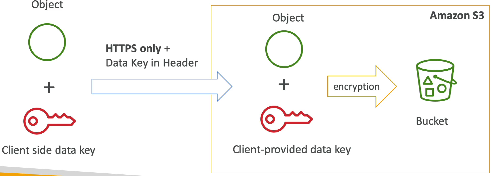

# S3 객체 암호화

아마존 S3 에 객체를 업로드할 경우 해당 객체로 접근하지 못하게끔 보호해야 한다.

객체를 보호하기 위해 사용하는 암호화 방식이 4가지가 있다.

- SSE-S3 : AWS 가 관리하는 키를 사용하여 S3 객체를 암호화하는 방법이다.
- SSE-KMS : AWS 의 Key Management 서비스를 사용하여 암호화 키를 관리하는 방법이다.
- SSE-C : 사용자가 만든 암호화 키를 관리할 때 사용하는 방법이다.
- 클라이언트 측 암호화 방식

특정 상황에서 어떤 방법을 사용하여 암호화 해야 하는지를 묻는 문제가 나온다.

### SSE-S3

- 이 방식은 아마존 S3 에서 관리하는 키를 사용하여 암호화하는 방법이다. 
- S3 객체는 서버 측에서 암호화된다.
- 암호화 알고리즘으로는 AES-256 을 사용한다.
- SSE-S3 로 암호화 하기 위해서는 헤더에 "x-amz-server-side-encryption":"AES256" 으로 설정해야 한다. x-amz 는 x Amazon 이고, x Amazon 서버에서 AES-256 알고리즘으로 암호화를 해준다.

아래 예시를 확인해보자.

암호화되지 않은 객체를 S3 로 업로드하여 SSE-S3 암호화를 할 것이다.

S3 로 객체를 전송할 때 HTTP 나 HTTPS 프로토콜을 사용하여 보낼 것이고 헤더에 "x-amz-server-side-encryption":"AES256" 을 설정해준다.

그러면 Amazon S3 는 이 헤더를 통해 S3 Managed Data Key 로 전송받은 Object 를 암호화한다. 

암호화 된 객체를 S3 버킷에 저장하면 일련의 과정이 끝이 난다.

S3 에서 암호화 하는 데이터 키를 소유하고 관리하고 있는 방식이다.

### SSE-KMS

- KMS 는 키 관리 서비스를 의미하고, 암호화 관련된 서비스들 중 하나이다.
- SES-KMS 에서 암호화 키는 KMS 서비스에서 관리를 한다.
- KMS 에서 키를 관리하는 이유는 어떤 사람이 키에 접근 가능하게 하고 어떤 사람은 키에 접근하지 못하게 하는 것이 가능하고, 추적도 가능하기 때문이다.
- 전송 받은 객체들은 서버 측에서 암호화되며, 헤더에 "x-amz-server-side-encryption":"aws:kms" 를 설정해줘야 한다.
- 서버 측 암호화 방식이므로 원리는 SSE-S3 방식과 같다.

아래 예시를 확인해보자.

Amazon S3 는 전송받은 객체의 헤더를 확인하고 어떤 방식으로 암호화 할 지 설정한다.

SSE-KMS 방식이기 때문에 S3 에서 암호화 할 때 사용하는 키는 KMS 에서 미리 세팅해놓은 KMS Customer Master Key 를 사용하여 전송받은 객체를 암호화한다.

그리고 암호화 한 객체를 S3 버킷에 저장한다.

### SSE-C

- 서버 측 암호화 방식으로, 외부에서 고객이 관리하고 있는 키를 사용해서 암호화 하는 방식이다.
- Amazon S3 는 고객이 제공한 암호화 키를 서버에 저장하지 않는다.
- 암호화 할 때만 키를 사용하고 그 후에는 키를 폐기한다.
- 데이터를 AWS 로 전송할 때는 반드시 HTTPS 프로토콜을 사용해야 한다. 왜냐하면 고객이 암호화 키를 보내야 하기 때문에 암호화는 필수이다.
- 암호화 키는 HTTPS 헤더에 있다.
- 고객은 객체와 암호화 키를 HTTPS 프로토콜을 사용해서 Amazon S3 로 보내고 S3 에서 전송받은 키로 객체를 암호화하여 S3 버킷에 저장한다.
- SSE-C 를 통해 아마존 S3 부터 파일을 받으려면 똑같은 암호화 키를 아마존 S3 로 보내줘야 한다.
- 서버 측에서 키를 관리하는 것과 다르게 클라이언트에서 해야 할 일들이 많다.

### Client Side Encryption

- 클라이언트 즉, 고객이 객체를 암호화하는 방식이다.
- Amazon S3 Encryption Client 라는 라이브러리를 사용하여 암호화를 한다.
- 클라이언트는 객체를 S3 로 보내기 전에 암호화해햐 한다.
- S3 에서 전달받은 데이터가 CSE 를 사용해 암호화 되었다면 데이터를 해독하는 책임도 전적으로 클라이언트에게 있다.
- CSE 암호화 방식은 암호화 키, 암호화 주기 모두를 클라이언트가 관리한다.

아래 예시를 확인해보자.

클라이언트는 AWS 에서 제공하는 암호화 SDK 를 사용하여 객체를 암호화 한다.

암호화가 클라이언트 측에서 일어나므로 객체는 클라이언트에서 완전히 암호화가 된다.

암호화 된 객체를 S3 버킷에 업로드한다.

### SSL, TLS

- 통신 암호화 방식으로 SSL 과 TLS 가 사용된다.
- HTTPS 를 사용하면 클라이언트와 아마존 S3 사이를 이동하는 데이터가 모두 암호화되어 전송되기 때문에 Encryption in transit 이라고 부른다.
- SSE-C 즉, 서버 측 암호화를 사용해 클라이언트가 키를 제공해야 하는 경우에는 HTTPS 프로토콜 사용이 필수다.
