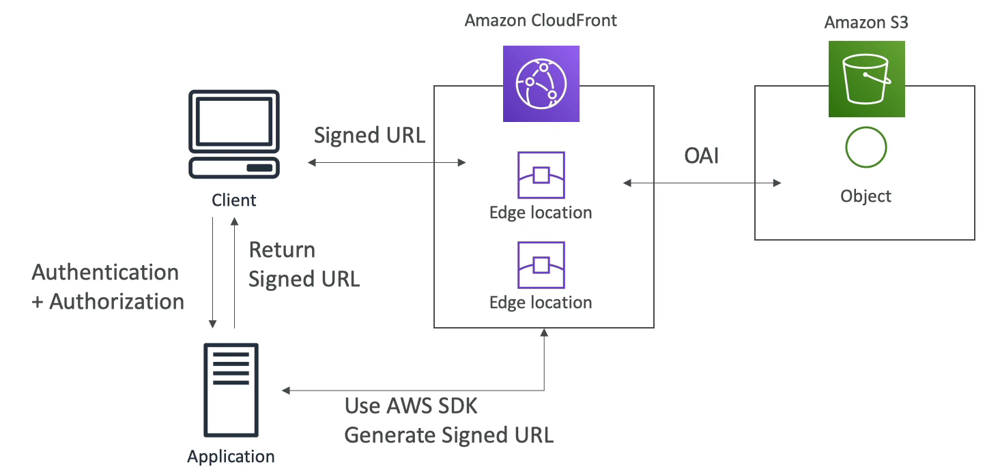

# Signed URL & Signed Cookies

- 누가 어떤 클라우드 프론트에 액세스 하는지를 알기 위해서 서명된 URL 이나 서명된 쿠키를 사용할 수 있다.
- 서명된 URL 이나 쿠키를 생성할 때는 정책을 연결해야 한다.
  - 해당 URL 이나 쿠키가 언제 만료되는지 지정한다.
  - 이 데이터에 액세스할 수 있는 IP 주소 범위는 어디까지 인지를 지정한다.
  - 어떤 AWS 계정이 서명된 URL 을 생성할 수 있는 지, 서명자도 지정해야 한다.
- 영화나 음악 같은 컨텐츠를 공유할 때는 유효 기간이 분 단위로 좀 짧아도 상관 없을 것이다.
- 오랫 동안 액세스해야 하는 경우 서명된 URL 이나 쿠키가 수 년 동안 지속되도록 할 수도 있다.
- 서명된 URL 은 개별 파일에 대한 액세스 권한을 준다. 만약 100 개의 파일이 있다면 100개의 URL 이 있는 것이다.
- 서명된 쿠키는 여러 개의 파일에 액세스를 준다. 해당 쿠키는 재사용이 가능하다. 

### CloudFront Signed URL Diagram

CloudFront 와 여러 개의 엣지 로케이션이 있다. OAI 를 통해 S3 버킷에 액세스한다.

오직 클라우드 프론트를 이용해서 S3 버킷 내의 객체에 액세스할 수 있는 것이다.

이제 사용자는 애플리케이션에 이미지나 동영상 같은 정적 파일들을 달라고 요청을 한다. 

개발자들은 애플리케이션을 개발할 때 AWS SDK 를 다운받아 클라우드 프론트로부터 직접 서명된 URL 을 생성하고 클라이언트에게 반환해준다.

클라이언트는 이 URL 을 통해 클라우드 프론트에서 데이터, 파일, 객체 등을 얻을 수 있게 된다.

서명된 쿠키도 동작하는 방식은 동일하다.

### CloudFront Signed URL vs S3 Pre-Signed URL

- CloudFront Signed URL
  - Signed URL 이란 CloudFront 로 배포되는 파일의 사용을 제한하는 기능이다.
  - 클라우드 프론트의 서명된 URL 은 오리진에 상관 없이 입력받은 path 에 대해 액세스를 허용하기 때문에 S3 오리진 뿐만 아니라 모든 HTTP 백엔드 오리진에서도 작동한다.
  - 계정 내 키 페어를 갖기 때문에 private key 를 가진 루트 유저만 관리할 수 있다.
  - IP, 경로, 날짜, 만료 시간 등으로 필터링을 할 수 있으며, 클라우드 프론트의 모든 캐싱 기능을 사용할 수 있다.
  - 서명된 URL 을 사용하는 클라이언트가 있고 클라우드 프론트는 요청이 오면 오리진인 EC2 인스턴스로 통신을 보낸다.
- S3 Pre-Signed URL
  - S3 에서 모든 객체는 기본적으로 비공개이며, 객체 소유자만 이러한 객체에 액세스할 수 있다.
  - 그러나, 객체 소유자는 필요할 경우 자신의 보안 자격 증명을 사용하여 일정 기간 동안 객체 다운로드를 허가하는 사전 서명된 URL 을 만들어 다른 사용자와 객체를 공유할 수 있다.
  - 객체 소유자가 IAM 룰을 만들고 그 룰을 사전 서명된 URL 에 부여해주면 해당 URL 을 갖는 사람은 IAM 룰에 해당하는 권한을 갖게 되는 것이다.