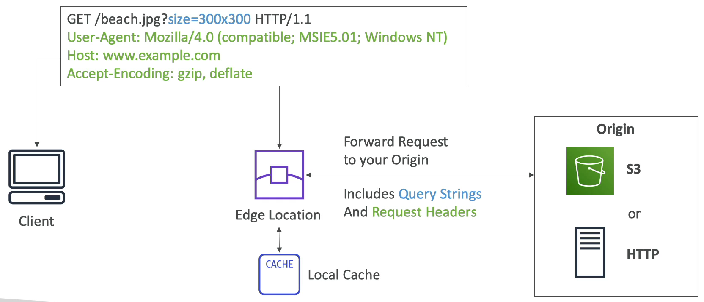
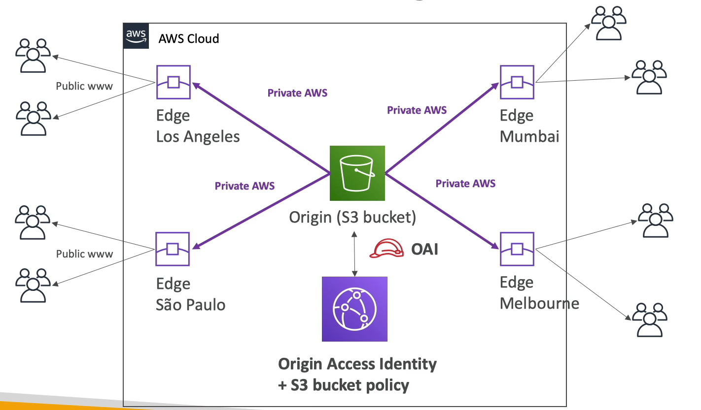

# CloudFront 개요

- Content Delivery Network, CDN 의 약자로 엣지 로케이션에서 데이터가 분배 및 캐싱되기 때문에 속도가 굉장히 빠르다.
- 현재 지속석으로 새로운 엣지 로케이션이 추가되고 있다.
- 클라우드 프론트는 엣지 로케이션에서의 캐싱 외에도 DDoS 공격을 보호해주는 웹 애플리케이션 방화벽을 제공해준다.
- SSL 인증서를 로드하여 외부 HTTPS 엔드 포인트를 노출하고 해당 트래픽을 암호화해야 하는 경우 내부 HTTPS 애플리케이션에 내부적으로 통신하게끔 한다.
- 예를 들어, 호주 S3 버킷이 있고 미국의 사용자가 호주 버킷으로 데이터를 액세스하려 하면 미국에서 가까운 엣지 로케이션에 액세스를 한 뒤, 해당 네트워크가 사설 AWS 네트워크를 통해 호주 버킷으로 전송이 된다. 그리고 해당 컨텐츠는 엣지 로케이션에 캐싱된다.
- 미국에서 호주 S3 버킷에 있는 데이터를 액세스하는 사용자가 많아질수록 똑같은 데이터를 읽어오는 케이스가 많아질 것이고 엣지 로케이션에 데이터들이 캐싱된다. 그렇게 되면 미국 사용자들은 데이터를 호주가 아니라 미국에서 제공되는 엣지 로케이션을 통해 얻게 된다.
- 메인 S3 버킷에서 지연 시간과 로드를 줄일 수 있다.

### CloudFront - Origins

- S3 bucket 
  - S3 에서 클라우드 프론트를 사용하는 경우는 전 세계에 정적 파일을 배포하고 엣지에서 캐싱할 때 아주 흔히 볼 수 있는 패턴이다.
  - Origin Access Identity(OAI) 를 사용하여 클라우드 프론트와 S3 버킷 사이의 보안을 강화해준다.
  - 클라우드 프론트를 사용하여 전세계 어느곳에서든 S3 에 파일을 업로드할 수 있는 입구로 사용할 수 있다.
- Custom Origin (HTTP)
  - HTTP 프로토콜을 준수하는 어떤 것이든 클라우드 프론트에 적용시킬 수 있다. 
  - 애플리케이션이나 로드 밸런서나 EC2 인스턴스거나 S3 웹사이트일 수도 있다.
  - 만약, S3 정적 웹사이트를 사용할 것이라면 정적 S3 웹사이트로 버킷을 활성화해야 하고 일반적인 S3 버킷과는 좀 다르다.
  - 예를 들어, 사내 인프라를 클라우드 프론트에 등록시킬 수도 있다는 것이다.

### CloudFront 동작 방식

전 세계 여러 곳에 엣지 로케이션이 있다. 이 엣지 로케이션들은 우리가 각자 정의한 오리진으로 연결되어 있다.

S3 버킷이 될 수도 있고 HTTP 엔드 포인트도 될 수 있다.

클라이언트가 내가 생성한 클라우드 프론트로 액세스하려 하는 경우 클라이언트는 클라우드 프론트에 직접 HTTP 요청을 보낼 것이다.

HTTP request 는 URL 과 쿼리 스트링 매개 변수 헤더 등으로 이루어져 있다. 엣지 로케이션이 전달받은 request 를 오리진으로 전달하고 이 request 에는 쿼리 스트링, 헤더가 포함될 것이다.

모든 내용이 오리진으로 전달되는 것이다.

오리진이 엣지 로케이션에 response 를 주고 엣지 로케이션은 정의된 캐시 설정에 따라 response 를 캐싱한다.

그리고 response 를 클라이언트에게 보내준다.

다음 번에 클라이언트가 비슷한 request 를 보내면 엣지 로케이션은 request 를 오리진으로 보내기 전에 우선 캐시부터 찾아보게 될 것이다.

위의 작업이 바로 CDN 의 목적이다.

### S3 가 Origin 인 경우

AWS Cloud 안에 오리진, 즉 S3 버킷이 있다.

엣지 로케이션은 로스앤젤레스에 있다고 가정한다. 이 엣지 로케이션으로부터 데이터를 읽으려 하는 몇몇 유저가 있다.

엣지 로케이션이 사설 AWS 네트워크를 통해 S3 버킷에서 데이터를 가져오고 엣지 로케이션에 데이터들을 캐싱한다.

그리고 결과물을 유저들에게 보내준다.

중요한 점은 클라우드 프론트의 엣지 로케이션이 S3 버킷에 액세스하려면 클라우드 프론트 오리진에 대한 IAM 역할인 OAI, 즉 Origin Access Identity 가 필요로 하다는 것이다.

IAM 역할을 이용해 S3 버킷에 액세스한 뒤 버킷 정책이 이 역할의 액세스를 허용하면 파일을 클라우드 프론트로 전달하게 되는 것이다.

이런 방식으로 브라질의 상파울루나 뭄바이나 멜버른과 같은 다른 엣지 로케이션이 S3 버킷에 액세스할 수 있게 된다.

### ALB 나 EC2 가 Origin 인 경우

EC2 인스턴스들의 보안 그룹이 엣지 로케이션의 IP 를 허용하도록 설정을 해야 한다.

이를 위해서는 엣지 로케이션들의 IP 를 알아야 하는데 AWS 에서 엣지 로케이션들의 IP 정보를 찾을 수 있다.

ALB 를 오리진으로 사용하는 경우 EC2 인스턴스들은 private 서브넷에 존재해도 상관없다. ALB 만 public 서브넷에 있으면 된다.

EC2 인스턴스의 보안 그룹은 ALB 보안 그룹만 허가하면 되고 public 하게 접근하는 엣지 로케이션을 ALB 에서 접근 허용을 해주면 된다.

다시 말해서 ALB 의 보안 그룹은 엣지 로케이션의 public IP 를 허용해주고 로드 밸런서에 연결된 인스턴스들의 보안 그룹은 ALB 가 접근할 수 있도록 접근 허용을 해주면 된다.

### CloudFront Geo Restriction(지역 제한)

- 클라우드 프론트의 기능 중 하나로 지역 제한을 거는 기능이다.
- 화이트리스트라는 것을 제공해주는데 이 리스트에 적힌 국가의 사용자들만 클라우드 프론트에 액세스 할 수 있도록 하는 것이다.
- 블랙리스트를 만들어서 특정 국가의 사용자들이 아예 액세스를 할 수 없도록 막아버릴 수도 있다.
- 예를 들어, 미국 컨텐츠에 프랑스가 저작권 협의에 걸려서 프랑스가 미국 컨텐츠에 접근을 막아야 하는 경우에 블랙리스트에 올려서 접근을 아예 막아버리는 것이다.

### CloudFront vs S3 Cross Region Replication

클라우드 프론트와 S3 리전 간 복제 사이에 어떤 차이가 있을까?

- CloudFront
  - 전 세계에 엣지 로케이션이 존재
  - TTL 에 맞춰서 파일이 캐싱된다.
  - 정적인 컨텐츠에 적합하다. 즉, 컨텐츠가 조금 오래 방치되어도 괜찮은 경우 사용하면 좋다.
- S3 Cross Region Replication
  - 복제가 일어나도록 할 각 리전에 설정되야 하고 파일이 실시간으로 업데이트 된다.
  - 읽기 전용이기 때문에 읽기 성능이 매우 좋다.
  - 선택된 리전에 낮은 지연 시간으로 데이터를 읽어들여야 하는 동적인 컨텐츠에 적합하다.