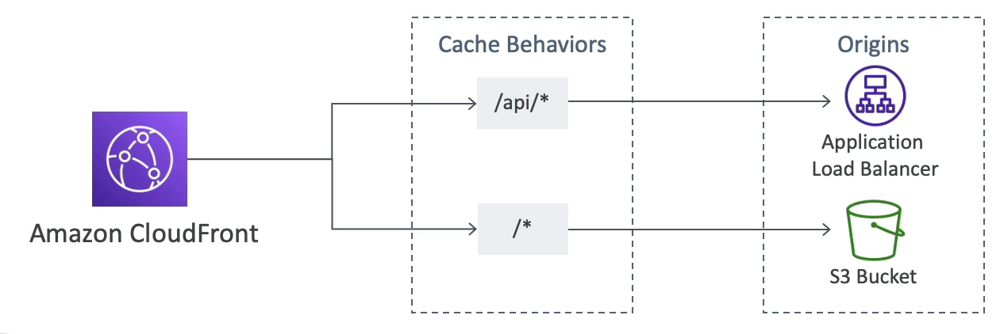
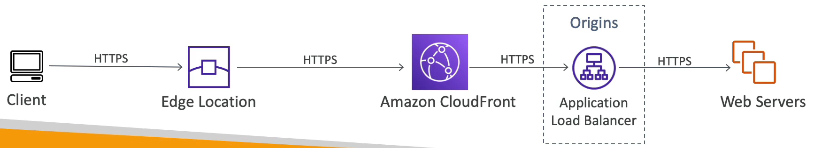

# CloudFront 고급 개념

### CloudFront - Pricing

- 클라우드 프론트 엣지 로케이션이 전 세계에 퍼져 있기 때문에 엣지 로케이션에 따른 데이터 전송 비용도 다르다.
- 즉, 엣지 로케이션이 위치한 Region 에 따라 요금이 달라지는 것이다.

### CloudFront - Price Classes

- 클라우트 프론트에 사용할 엣지 로케이션 개수를 줄여 가격을 낮출 수 있따.
- 가격 등급에는 총 세 가지가 있다.
  - Price Class All : 모든 지역의 엣지 로케이션을 사용하는 방식으로 최상의 성능을 보여주지만 비싸다.
  - Price Class 200 : 가장 비싼 지역을 제외한 대부분의 지역의 엣지 로케이션을 사용하는 방식이다.
  - Price Class 100 : 가장 저렴한 지역의 엣지 로케이션만 사용하는 방식이다.

### Multiple Origin

- 컨텐츠 유형이나 path 에 따라 클라우드 프론트를 거치는 라우트나 경로를 리다이렉팅해 다른 오리진으로 라우팅할 수 있다.
- 예를 들어 이미지용 path(/images/\*) 와 API 용 path(/api/\*), 루트 경로(/\*)가 있다고 가정한다.
- 정해진 path 를 통해서 다양한 캐싱 작업을 설정할 수 있다. /api/\* 경로를 사용 중인 경우 애플리케이션 로드 밸런서가 되는 오리진으로 리다이렉트 해야 하고, /\* path 가 오면 S3 버킷으로 리다이렉트 해줘야 한다.
- 이런 식으로 클라우드 프론트에서 사용되는 경로를 기반으로 다중 오리진이 정의된다.

### Origin Groups

- 가용성을 높여서 한 오리진에서 장애가 발생한 경우 그에 따른 장애 조치가 가능하도록 한다.
- 오리진 그룹은 하나의 주 오리진과 하나의 보조 오리진으로 구성된다.
- 주 오리진에 장애가 발생하면 클라우드 프론트가 보조 오리진을 승격시켜서 주 오리진으로 사용하게끔 한다.
- 예를 들어, 클라우드 프론트가 주 오리진인 A EC2 인스턴스로 request 를 보내고 에러가 반환되면 보조 오리진인 B 인스턴스로 request 를 다시 보낸다.
- 만약, 클라우드 프론트와 S3 를 오리진 그룹과 함께 사용한다면 지역 단위의 고가용성과 재해 복구가 가능해진다.
- 두 개의 S3 버킷으로 구성된 오리진 그룹이 있다. 이 버킷들이 다른 지역에 있을 때, 이 버킷들 사이에 복제를 설정할 수 있다.
- A 오리진의 모든 컨텐츠가 B 오리진으로 복제가 되는 것이다. 클라우드 프론트가 request 를 보냈는데 지역 단위의 정전 등의 이유로 주 오리진으로부터 오류를 반환받았다면 클라우드 프론트는 동일한 request 를 보조 오리진으로 보낸다.
- 보조 오리진은 주 오리진으로부터 복제를 했기 때문에 주 오리진의 모든 데이터를 갖고 있고 클라우드 프론트로 okay status code 를 보내준다.

### Field Level Encryption

- 애플리케이션 스택을 통해 민감한 정보를 보호하는 기능으로 HTTPS 암호화와 더불어 추가적인 보안을 더해 준다.
- 사용자가 민감한 정보를 전송할 때 마다 엣지 로케이션이 이를 암호화하고 개인 키를 가진 사용자만 해당 데이터를 복호화할 수 있는 개념이다.
- 당연히 비대칭키를 사용하여 암호화를 한다.
- 작동 원리
  - 클라우드 프론트로 데이터를 보내는 POST 요청의 경우 최대 10개의 필드를 암호화할 수 있다. 신용 카드를 예로 들 수 있을 것이다.
  - 이 필드를 해독할 공용 키도 함께 보내진다.

HTTPS 로 데이터를 암호화하여 엣지 로케이션으로 전달하는 클라이언트가 있다고 가정한다.

엣지 로케이션은 다시 HTTPS 방식으로 데이터를 클라우드 프론트로 전달하고 오리진인 애플리케이션 로드 밸런서에 전달된다. 

로드 밸런서는 이를 웹서버에 분산시켜 준다.

전송 과정에서 모든 데이터는 HTTPS 로 암호화 되어 있으나, 필드 레벨 암호화를 설정할 수가 있다.

예를 들어, 한 사용자가 신용 카드 정보를 웹서버에 보내야 되는 상황이다.

이 신용카드 정보에 대한 필드 레벨 암호화를 설정하면 엣지 로케이션이 공용 키를 이용해 신용 카드 정보에 대한 필드를 암호화한다.

그럼 엣지 로케이션을 지나 클라우드 프론트의 오리진인 로드 밸런서로 신용카드 정보가 전달되고 해당 정보는 공용키에 의해 암호화되어 있는 상태이다.

암호화된 정보는 로드 밸런서에 의해 부하 분산되어 웹서버로 전달되었고 웹서버의 개인키로 복호화를 하여 신용 카드 정보를 얻을 수 있게 된다.