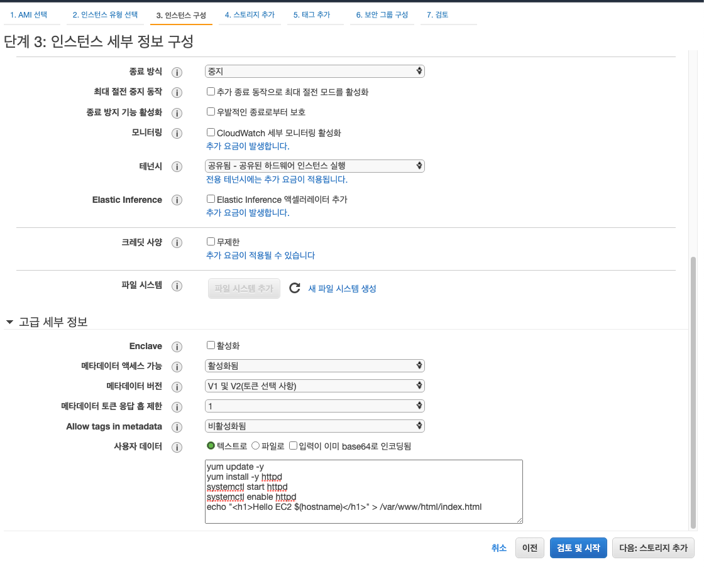
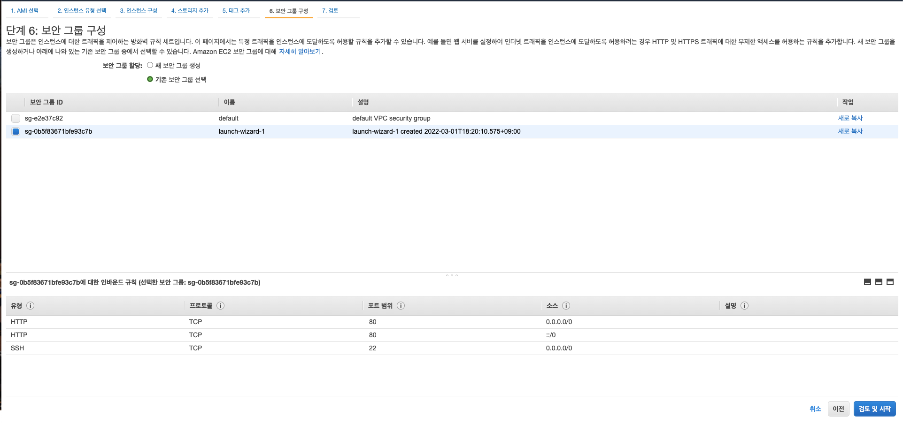
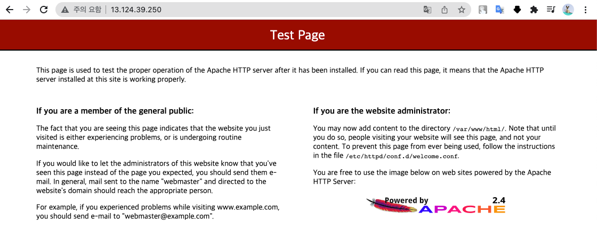
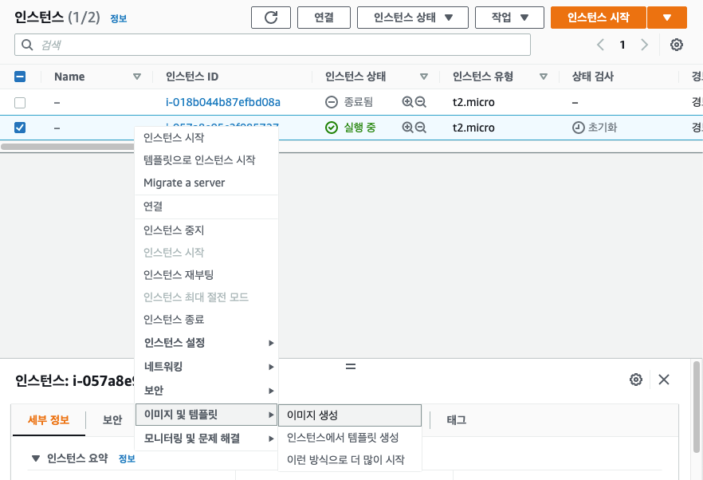
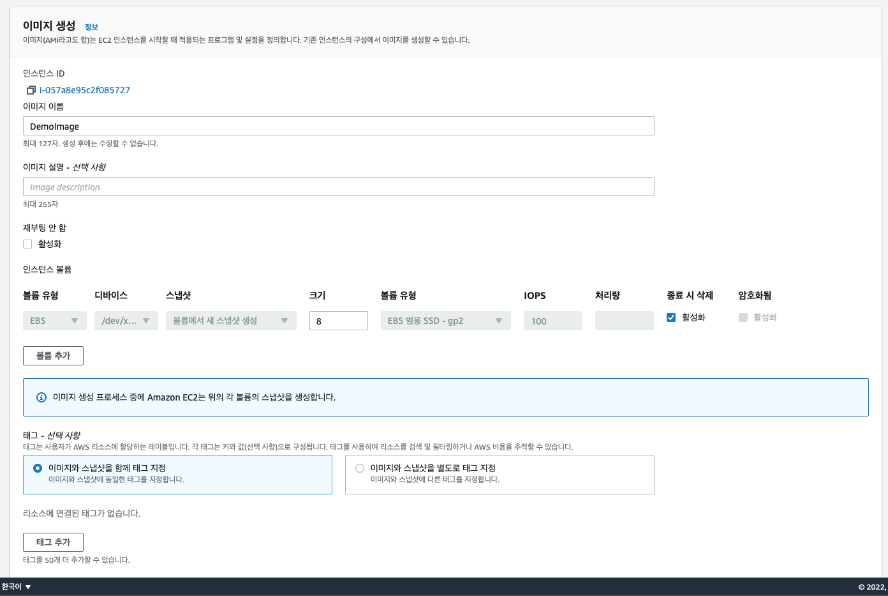
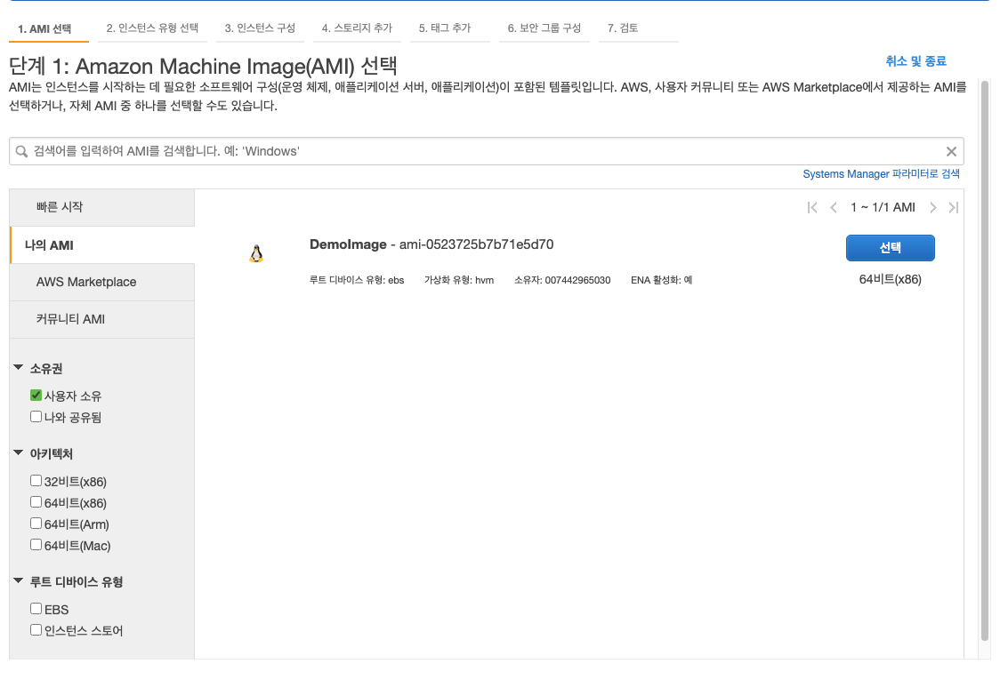
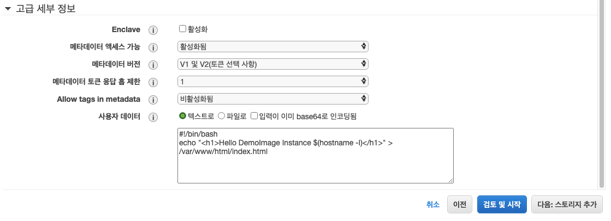

# AMI 실습

AMI 를 생성하기 위해서는 새로운 EC2 인스턴스를 만들어야 한다.

Amazon Linux 2 이미지, t2.micro 인스턴스 유형을 선택한 다음

인스턴스 세부 정보 구성에서 고급 세부 정보의 사용자 데이터 란에 아래와 같이 입력해준다.

```bash
sudo yum update -y
sudo yum install -y httpd
sudo systemctl start httpd
sudo systemctl enable httpd
```

리눅스 명령어들로 yum 은 패키지를 다운 받는 명령어이고, 맨처음 업데이트를 해준다. -y 옵션은 모든 물음에 대해 yes 로 처리하겠다는 뜻이다.

yum install -y httpd 는 httpd 패키지를 다운받는 것이며 -y 옵션은 모든 질문에 대해 yes 로 처리하겠다는 뜻이다.

systemctl start httpd 명령어로 httpd 서비스를 시작하고, systemctl enable httpd 명령어로 httpd 를 활성화 시킨다.

httpd 를 설치하고 실행하는 이유는 AMI 를 생성하기 위해 httpd 서비스를 사용하기 때문이다.

해당 사진처럼 하지말고 위에 적은 것처럼 꼭 모든 명령어 앞에 sudo 를 붙여줘야 한다.



보안 그룹에선 다음과 같이 구성한다. 모두 인바운드 규칙에 대한 것이고 모든 IP 주소에 대해 접근을 열어놓은 것이다.



키 페어를 생성해야 하는데 기존에 생성한 키 페어가 있다면 사용하면 되고 

키 페어가 없으면 새로 만들자, 만드는 것은 새 키 페어 생성을 드롭다운에서 선택하고 RSA 유형으로 키 페어를 생성한 다음 키 페어 다운로드 한 후에 인스턴스 시작 버튼을 클릭하면 된다.

해당 키페어는 ssh 로 인스턴스에 접근할 때 필요한 비밀키 개념이다.

public IPv4 로 접속을 하면 접속이 되지 않는다. EC2 인스턴스의 부트 스트랩이 아직 되지 않아서 작동이 되지 않은 것이다.
 
시간이 좀 지나면 httpd 패키지가 다운로드가 완료되고, 시작될 것이다.

그러면 apache 에서 제공해주는 테스트 페이지가 나온다.



이제 할 일은 인스턴스 AMI 를 생성하는 것이다.

이미지로 만들고 싶은 인스턴스를 클릭하고 우클릭한다. 이미지 및 템플릿에 이미지 생성을 클릭한다.



이미지 이름, 이미지 설명, 재부팅 활성화, 볼륨 추가 등 다양한 옵션을 설정할 수 있다.

여기서는 이미지 이름만 설정하고 이미지 생성을 클릭한다.



AMI 를 생성했고, 해당 이미지를 사용해서 EC2 인스턴스를 생성할 수 있다.

인스턴스 생성을 클릭하고 나의 AMI 를 들어간다.

AMI 가 생성되는데 시간이 좀 걸려서 바로 생성한 AMI 가 나오지 않는다. 이미지가 나오면 선택 버튼을 클릭한다.



t2.micro 를 선택하고 인스턴스 세부 정보 구성에서 사용자 데이터 부분을 조금 수정한다.

```bash
#!/bin/bash
echo "<h1>Hello DemoImage Instance $(hostname -I)</h1>" > /var/www/html/index.html
```

<h1>Hello DemoImage Instance $(hostname -I)</h1> 의 내용이 /var/www/html 디렉토리에 index.html 파일로 저장된다.

$(hostname -I) 는 해당 호스트의 주소를 알아내는 리눅스 명령어이다.

앞서서 설정했던 httpd 를 다운받고 실행하는 과정이 생략됐다.



나머지는 이전과 동일하게 세팅을 하고 인스턴스를 시작한다.

인스턴스가 실행되고 나서 해당 인스턴스의 public IPv4 주소로 접속하면 httpd 를 다운받고 시작, 활성화 상태로 변경하지 않았음에도 http 를 통해 서버가 열렸고 index.html 을 작성할 수 있다.


이를 바탕으로 환경 설정이 되어 있는 인스턴스를 이미지로 만들어서 EC2 인스턴스를 세팅하는데 얼마나 쉬운지 알 수 있게 됐다.