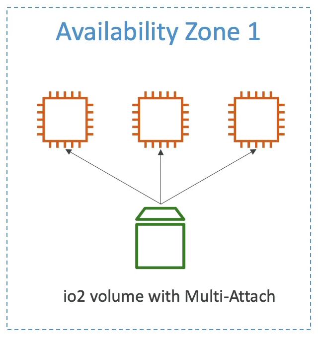

# EBS 다중 연결 (EBS Multi-Attach)

EBS 다중 연결은 io1 과 io2 를 위한 것이다.

EBS 볼륨은 딱 하나의 EC2 인스턴스에만 연결할 수 있다고 했는데, 사실 EBS 다중 연결을 제외하고는 사실이다.

이 특성은 같은 가용 영역에 존재하는 EC2 인스턴스에 똑같은 EBS 볼륨이 여러군데 부착될 수 있다는 것이다.

세개의 인스턴스가 있고 다중 연결이 가능한 io2 볼륨이 존재한다.

이 볼륨을 하나 또는 둘 또는 세개의 인스턴스에 부착시킬 수 있다.

각 EC2 인스턴스는 볼륨에 대해 읽고 쓸 수 있는 권한을 갖는다.

고성능 아카이브를 가져야 하는 클러스터 리눅스 애플리케이션에 사용한다, Teradata 같은 것에..

특정한 EBS 볼륨 유형에서만 사용할 수 있고, XFS, EX4 같은 파일 시스템이 아닌 cluster-aware 파일 시스템을 사용해야만 한다.

 