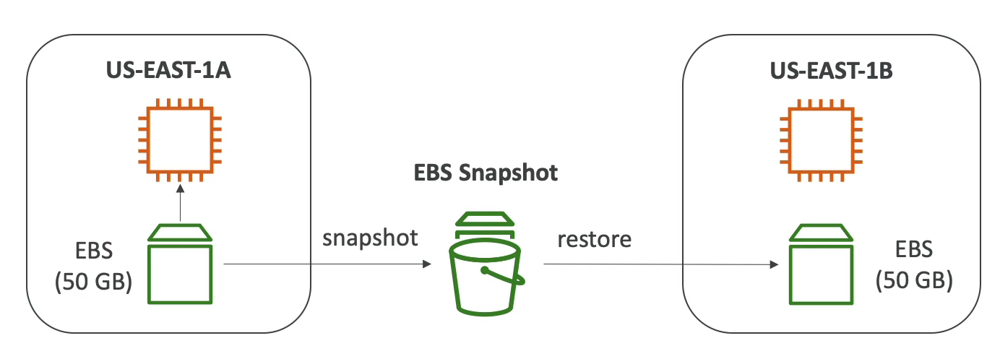

# EBS 스냅샷

EBS 볼륨을 원하는 시점에서 언제든지 스냅샷을 찍을 수 있다.

스냅샷을 쉽게 말하자면 백업과 같은 말이다. 

즉, EBS 볼륨 스냅샷을 찍는 것은 해당 시점에서 백업을 만드는 작업인 것이다.

EBS 볼륨 스냅샷을 찍으면 해당 볼륨이 삭제되도 나중에 스냅샷 찍은 것을 가져와 복원할 수 있다.

그렇다면 왜 스냅샷을 찍는 걸까?

us-east-1a 에서 사용한 데이터를 us-east-1b 로 옮겨야 하는 경우에 해당 볼륨을 스냅샷을 찍고, us-east-1b 가용 영역에 스냅샷을 찍은 볼륨을 가져오는 것이다.

그리고나서 해당 볼륨을 인스턴스에 연결하면 us-east-1b 에서 데이터를 사용할 수 있다.

하지만, 해당 스냅샷이 오류가 없는지, 또는 충돌날 여지가 있는지에 대해서는 미리 확인 작업을 진행해야 한다.

EC2 인스턴스에서 어떻게 작업을 진행했는지도 매우 중요하다.

하여튼 이런 작업을 통해 새로운 EBS 볼륨으로 복원될 수 있다.

