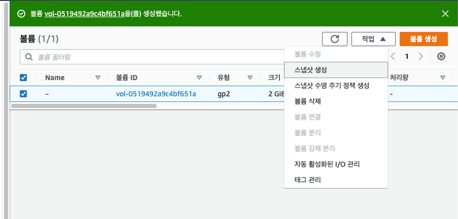
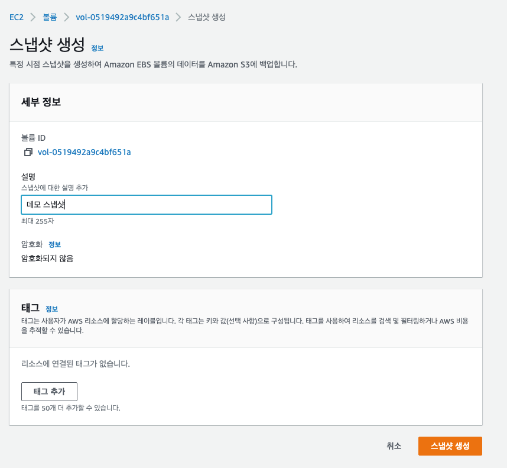
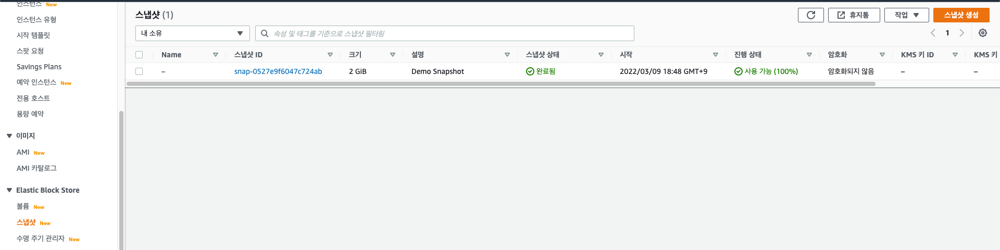
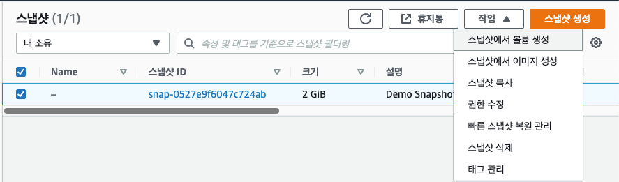
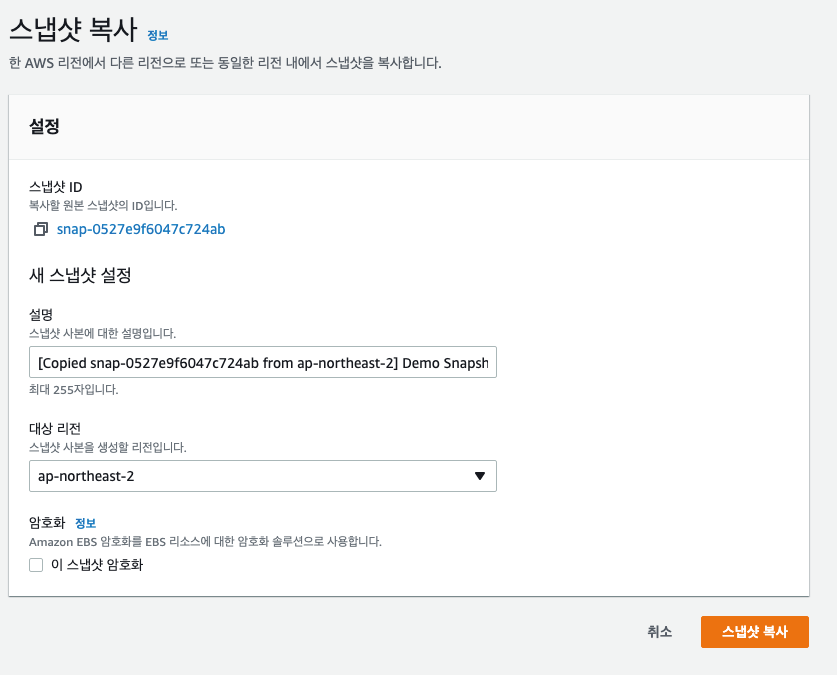
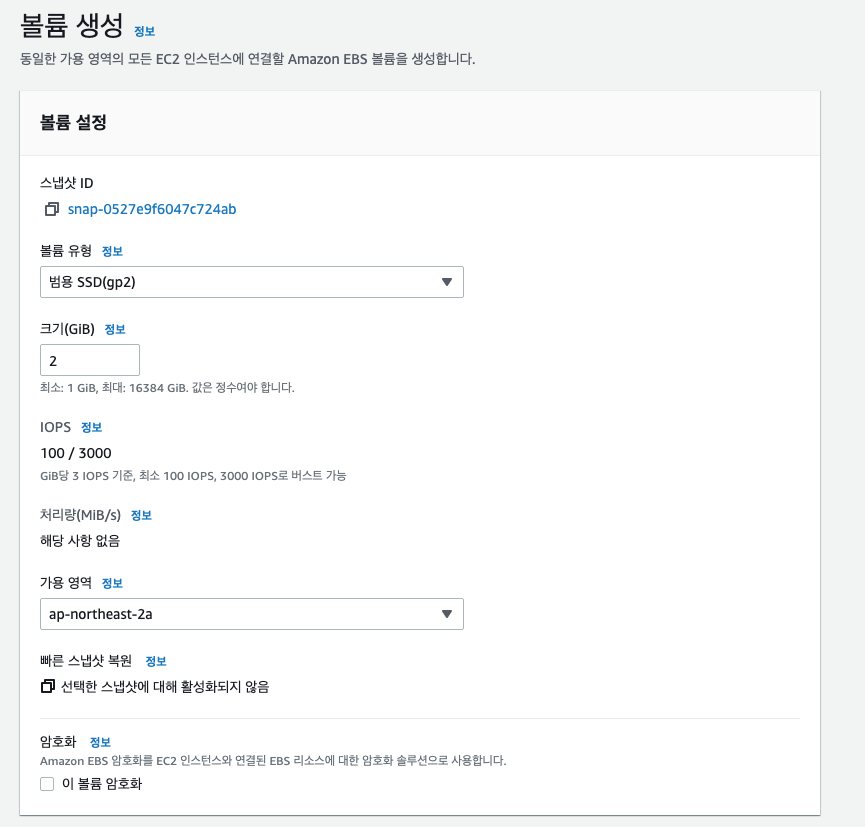
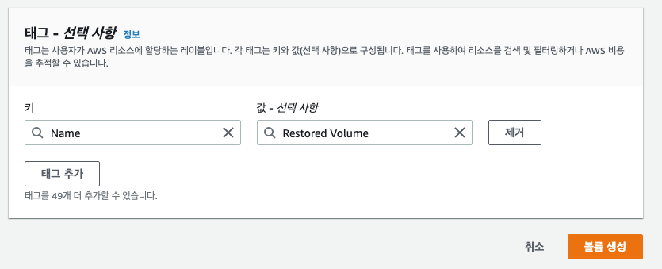
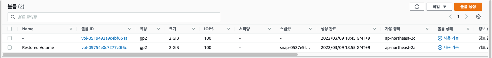

# EBS 스냅샷 실습

EC2 볼륨을 하나 생성하고 클릭한 뒤 작업에서 스냅샷 생성을 클릭한다.

특정 시점의 스냅샷 이름 설정과 태그를 추가해 줄 수 있으며 스냅샷한 EBS 볼륨은 Amazon S3 에 백업이 된다.

Elastic Block Store 의 스냅샷을 클릭하면 EBS 볼륨 스냅샷들을 확인할 수 있다.

해당 스냅샷은 모든 AZ 에서 사용이 가능하다.

또한 스냅샷을 클릭하고 작업 버튼을 클릭하여 여러가지 작업들을 수행할 수 있다.

### 스냅샷 복사

스냅샷을 복사할 수 있고, 스냅샷 사본을 생성할 리전을 정해줄 수 있다!!!

자연 재해나, 데이터 센터의 파괴로 인한 복구를 하기 위해 다른 지역에 스냅샷을 복사시켜 놓는 것이다!

### 스냅샹에서 볼륨 생성

스냅샷의 내용을 포함하고 있는 EBS 볼륨을 생성할 수 있다. 

일반적인 EBS 볼륨을 생성하는 것과 동일하지만 다른 점은 볼륨이 비어있는 것이 아니라 스냅샷의 내용을 가진 채로 생성된다는 점이다!

태그로는 Name : Restored Volume 을 추가해줬다.

볼륨을 가보면 Name 태그로 붙인 값이 이름으로 설정된 것과 어떤 스냅샷을 통해 생성된 것인지 확인 가능하다. 

또한, 원본과 다르게 가용 영역도 ap-northeast-2a 로 설정했는데, 이런 식으로 다른 가용 영역으로 볼륨을 확장시킬 수 있다.

그래서 ap-northeast-2a 에 있는 인스턴스로 ap-northeast-2c 의 볼륨 컨텐츠를 가진 녀석들을 복사해서 붙여줄 수 있다.

