# EBS 실습

EC2 인스턴스를 클릭하면 스토리지를 찾을 수 있다.

루트 디바이스 세부 정보를 확인할 수 있고, 루트 디바이스 이름과 루트 디바이스 유형을 확인할 수 있다.

이름은 /dev/xvda 이고, 유형은 EBS 이다.

블록 디바이스를 보면 선택한 인스턴스와 연결된 EBS 볼륨에 대한 자세한 정보들을 확인할 수 있다.

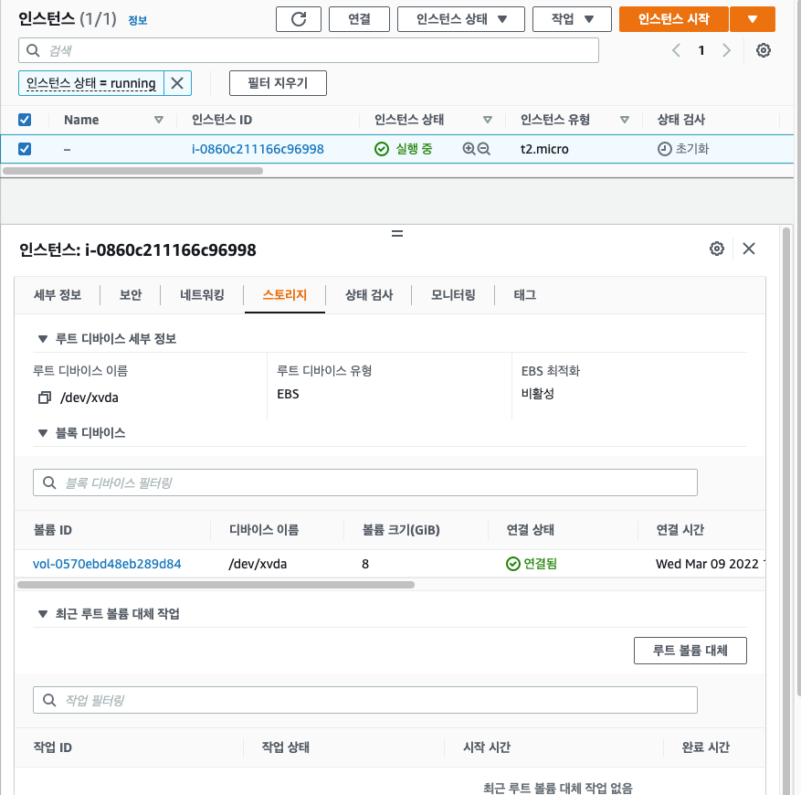

볼륨 아이디를 클릭하면 EBS console 로 넘어간다. 

EBS console 로 넘어와서 필터 지우기를 눌러 필터링을 제거하자, 그러면 계정에서 사용하는 모든 EBS 볼륨을 확인할 수 있다.

현재는 인스턴스 하나에 연결된 볼륨 하나 밖에 존재하지 않는다.

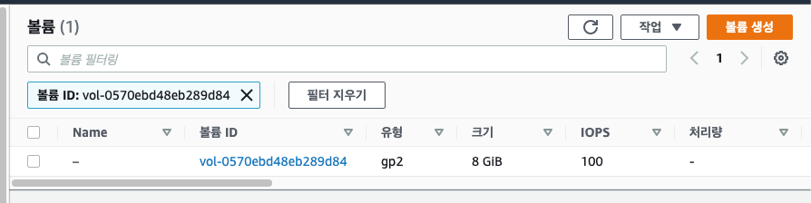
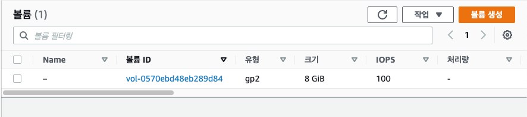

이 콘솔 창에서 EBS 볼륨을 생성할 수 있다. 

볼륨 생성 버튼을 클릭한다.

볼륨 유형을 정할 수 있는데, 여기서는 범용 SSD gp2 를 사용한다. gp2 는 낮은 성능을 가진 스토리지 유형이다. 그래서 IOPS, 처리량을 설정할 수 없다.

다음으로 가용 영역, 크기를 설정한다.

가용 영역은 인스턴스가 생성된 가용 영역과 같은 가용 영역으로 변경해서 사용해야 한다.

그래서 ap-northeast-2c 로 변경했다.

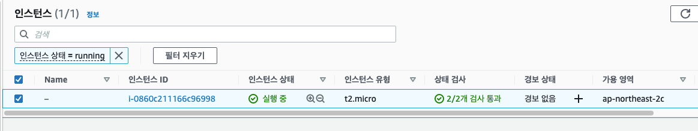

EBS 를 암호화하거나 태그를 달 수도 있지만 여기서는 선택하지 않고 볼륨을 생성한다.

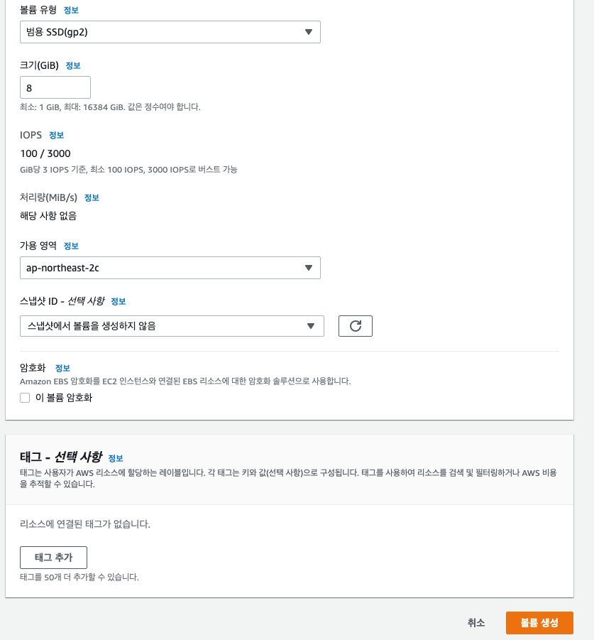

현재 볼륨 상태를 보면 하나는 EC2 인스턴스에서 사용 중이고, 하나는 사용중이 아니다.

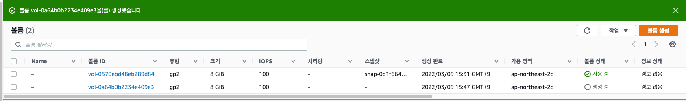

사용 중이지 않은 볼륨은 같은 가용 영역에 존재해서 EC2 인스턴스에 연결할 수 있다.

방금 생성한 볼륨을 우클릭하고 볼륨 연결을 클릭한다.

그리고 연결하고자하는 인스턴스를 클릭한 후에 볼륨 연결 버튼을 클릭하면 된다.

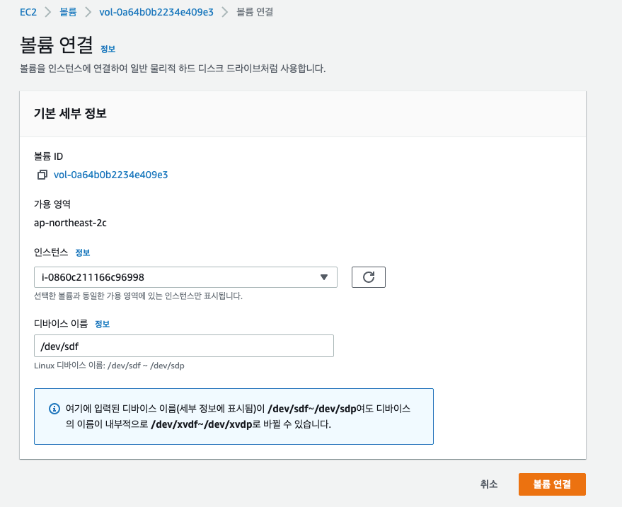

볼륨 상태가 사용 중으로 변경된 것을 확인할 수 있다.

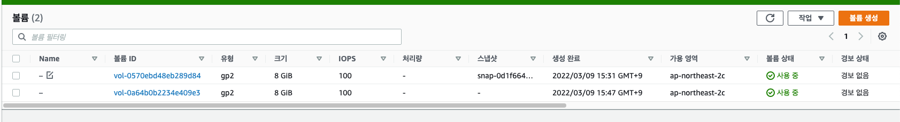

다시 EC2 인스턴스로 돌아와서 스토리지의 블록 디바이스를 확인하면 두개의 볼륨이 연결된 것을 볼 수 있다.

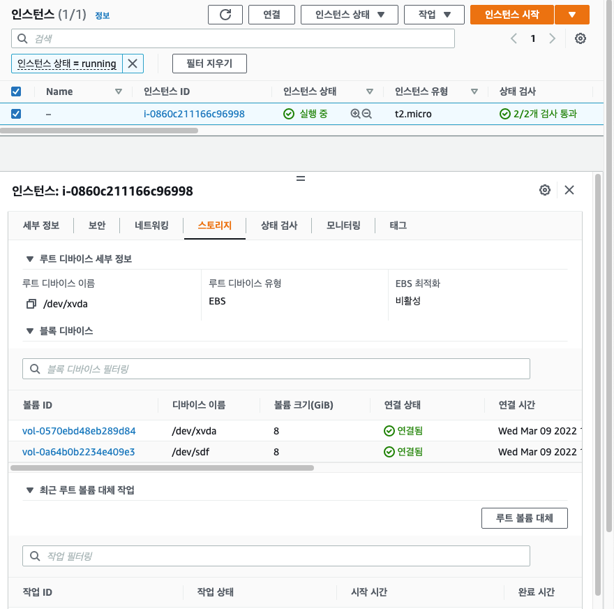

EC2 인스턴스를 종료하면 EBS 루트 볼륨은 바로 삭제된다. EC2 인스턴스 옵션 중에 EBS 볼륨을 인스턴스 종료 시 삭제 기능을 활성화했기 때문이다.

그러나 EBS console 에서 생성한 EBS 볼륨은 EC2 인스턴스 종료시 삭제 기능을 활성화 한적이 없기 때문에 EC2 인스턴스가 종료되도 삭제되지 않는다.

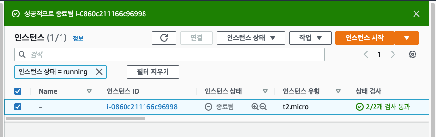
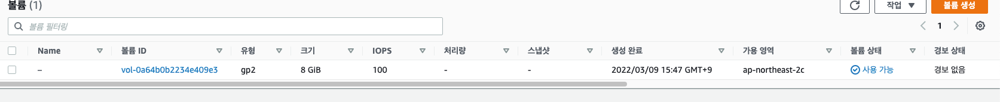

EBS 볼륨은 클라우드 상에서 매우 쉽고 빠르게 저장 장치를 늘리고 줄일 수 있기 때문에 매우 유용하다.