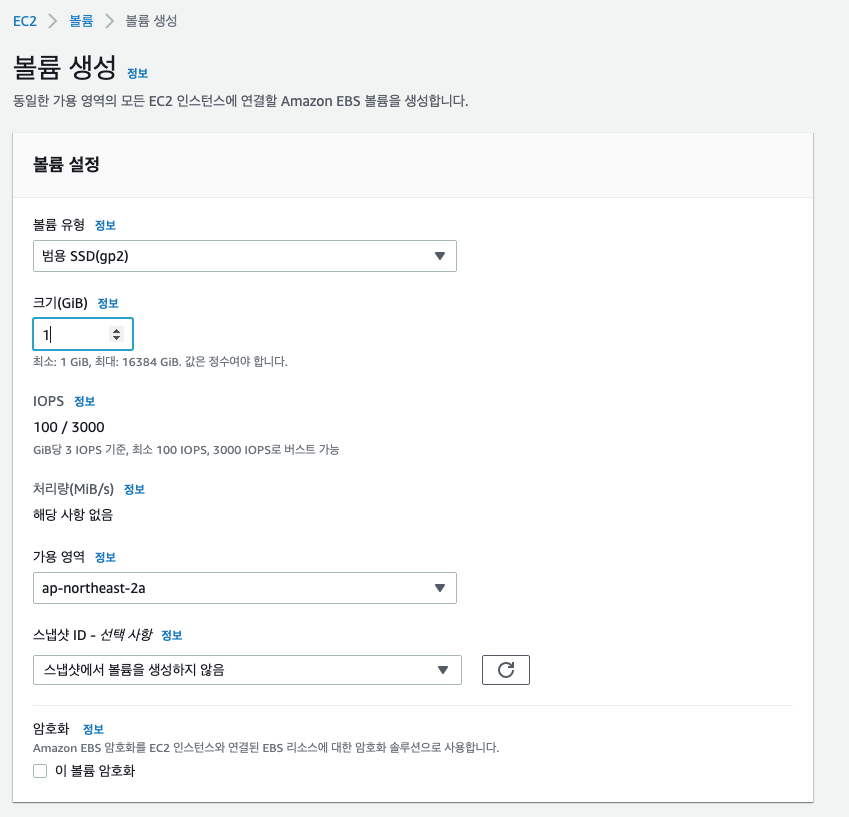
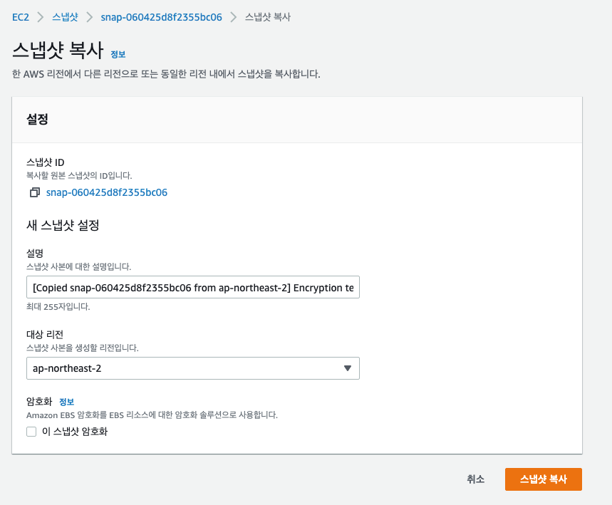
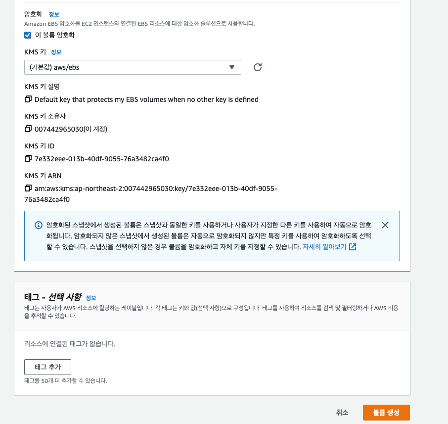

# EBS 암호화

### EBS Encryption

- EBS 볼륨을 암호화하면 볼륨 내의 저장된 데이터가 암호화되고, 인스턴스와 볼륨 사이에 이동 중인 모든 데이터가 암호화 되고, 모든 스냅샷도 암호화되고, 스냅샷에서 생성된 모든 볼륨도 암호화된다. 즉, 모든 곳에서 암호화가 된다.
- KMS(AES-256) 키를 사용해서 암호화를 한다.
- 암호화는 지연율에 아주 적은 영향을 끼친다.
- 암호화 되지 않은 스냅샷을 복사 했을 때 해당 볼륨을 암호화할 수 있다.

### 암호화 되지 않은 EBS 볼륨을 암호화 하기

- EBS 스냅샷에서 볼륨을 생성한다.
- EBS 스냅샷을 복사 기능을 사용하여 암호화한다.
- 스냅샷에서 새로운 볼륨을 생성하면 그 볼륨도 암호화된다.
- 암호화된 볼륨을 원래 인스턴스에 연결한다.

EBS 암호화를 실습하기 위해서 EBS 볼륨을 생성한다.

사이즈는 1Gib 로 하고, 가용 영역은 ap-northeast-1a 로 설정한다.

암호화하지 않고 생성한다.

이제 이 볼륨을 암호화하 해보자.

일단 스냅샷을 찍어야 한다. 암호화되지 않은 볼륨의 스냅샷은 당연하게도 암호화되지 않는다.

생성한 볼륨 선택하고 우클릭으로 스냅샷 생성을 누른다. 

Encryption Test 라는 이름으로 스냅샷을 찍는다.

스냅샷 콘솔로 이동해서 Encryption Test 로 된 스냅샷을 찾고 선택, 우클릭하여 스냅샷 복사를 누른다.

그럼 아래와 같이 스냅샷 복사에 대한 설정을 하는 부분이 나타난다.

여기서 이 스냅샷 암호화를 클릭한다.

KMS 키로는 aws 에서 기본으로 제공해주는 aws/ebs 키를 사용하고 스냅샷 복사를 누른다.

복사된 스냅샷은 KMS 를 이용하여 암호화 된 스냅샷이다.

암호화된 스냅샷으로부터 볼륨을 생성할 수 있고 이렇게 생성된 볼륨은 암호화된다.

두번째 방법으로 암호화 되지 않은 스냅샷을 선택하고 우클릭 하여 스냅샷에서 볼륨 생성을 클릭한다.

암호화에서 이 볼륨 암호화를 활성화하고 KMS 키를 설정한 다음 볼륨을 생성하면 해당 볼륨은 암호화 된 볼륨이 된다.

