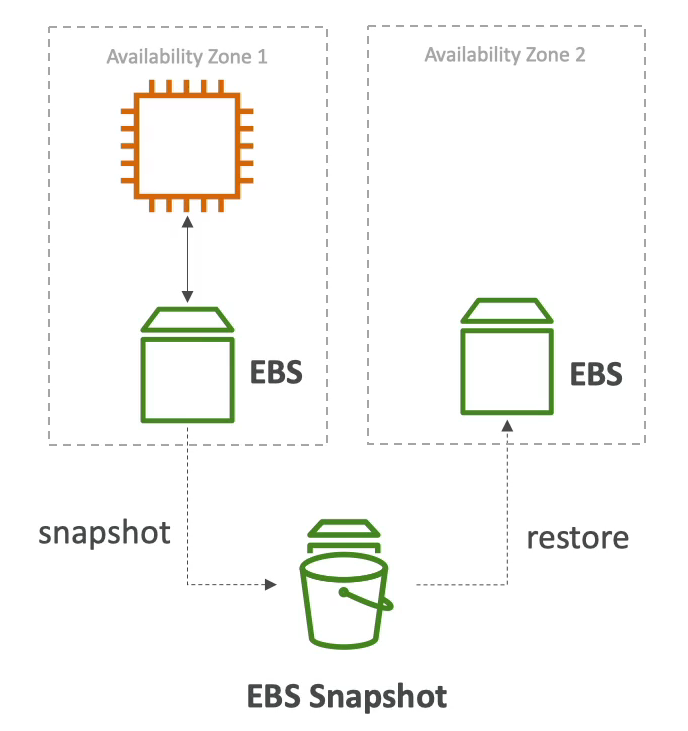

# EFS vs EBS

### EBS
- EBS 볼륨은 오직 하나의 인스턴스에만 연결될 수 있고 특정 가용 영역에서만 사용 가능하다.
- gp2 : 볼륨의 크기가 커지면 IO 도 커진다.  
- io1 : 볼륨의 크기와 상관없이 IO 를 키울 수 있다.
- EBS 볼륨을 다른 가용 영역으로 옮기고(마이그레이션) 싶다면 스냅샷을 사용해서 옮겨야 한다.
  - 스냅샷을 찍고, 해당 스냅샷을 이용해서 옮기고 싶은 가용 영역으로 설정한 뒤에 볼륨을 생성한다.
  - EBS 의 스냅샷을 찍고, 재구성하는 동안은 해당 볼륨이 사용되지 않도록 해야 한다.
- EBS 루트 볼륨은 기본적으로 EC2 인스턴스가 종료될 때 자동으로 종료된다. 옵션을 통해 인스턴스가 종료되도 볼륨은 유지되도록 설정을 바꿀 수 있다.

### EFS
- 여러 가용 영역에 있는 인스턴스가 동시에 접속하여 사용할 수 있다.
- Linux 인스턴스에서만 사용이 가능하다.
- EFS Mount Target 을 사용하여 NFS 에 마운트할 수 있다. 그러면 EFS 드라이브를 EC2 인스턴스에 설치할 수 있다.
- EFS 를 웹사이트 파일을 공유하기 위해 사용한다.
- EFS 는 EBS 보다 3배 더 비싸다. 비용을 절약하고 싶으면 EFS Infrequent Access(IA) 에 데이터를 저장하면 된다.
- 요금을 절약하기 위해 수명 주기 관리를 사용하여 자주 사용하지 않는 파일들을 IA 로 옮길 수 있다.
- EFS 는 다중 인스턴스에서 파일들을 공유하고 사용할 수 있게 하는 파일 시스템인 것이 중요하다!

