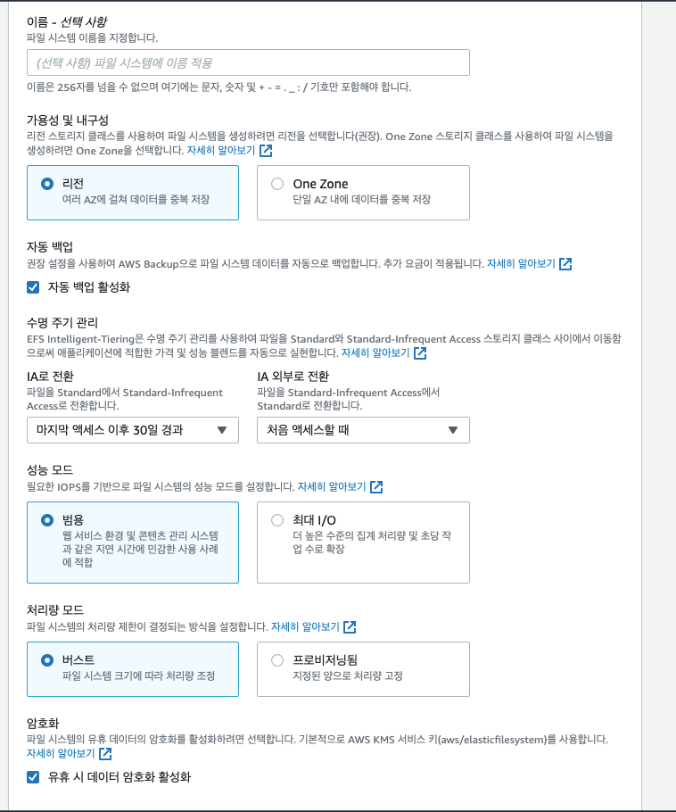
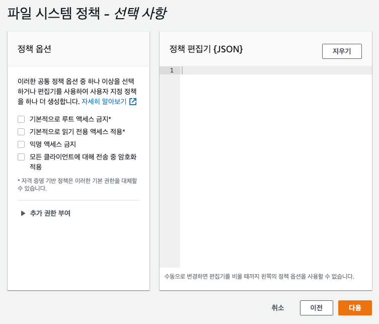
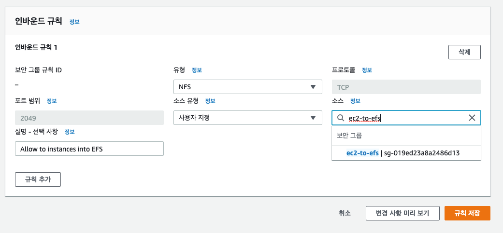

# EFS 실습

AWS 검색창에서 EFS 를 검색한다.

파일 시스템 생성을 클릭한다.

아래와 같은 화면이 나올텐데 사용자 지정 버튼을 클릭해서 옵션을 확인한다.

이름은 선택사항이기 때문에 비워둔다.

AWS Backup 으로 파일 시스템을 자동 백업시킬 수 있다. 요금이 발생하는 옵션이다.

수명 주기 관리 탭이 존재한다.

EFS Intelligent-Tiering 은 수명 주기 관리를 사용하여 파일을 Standard와 Standard-Infrequent Access 스토리지 클래스 사이에서 이동함으로써 

애플리케이션에 적합한 가격 및 성능 블렌드를 자동으로 실현한다.

쉽게 말해서 파일에 30일 동안 접근이 없으면 이건 자주 사용하지 않는 파일이니까 돈을 아끼기 위해서 EFS-IA 저장 공간으로 보내겠다. 이런 말이다.

일 수는 드롭다운을 클릭하면 7일 부터 90일에 이르기 까지 여러 옵션이 존재한다. 또한, EFS-IA 저장공간을 벗어나는 옵션도 존재한다. 여기서는 처음 파일에 접근하면 EFS-IA 저장공간을 벗어나도록 했고 드롭다운을 보면 없음 옵션도 존재하는데 이를 통해 EFS-IA 저장공간으로 파일이 이동하면 더이상 다른 저장공간으로 이동하지 못하고 IA 에 저장되는 것을 알 수 있다.

성능 모드와 처리량 모드가 존재하고, 

성능 모드의 범용 모드는 웹 서비스 환경 및 콘텐츠 관리 시스템과 같이 파일에 접근하는 데 걸리는 시간이 오래 걸리면 안되는 경우에 사용한다.

성능 모드의 최대 I/O 의 경우에는 더 높은 수준의 집계 처리량 및 초당 작업수가 높아야 하는 경우에 사용한다. 파일을 처리하는데 약간의 지연율이 존재하지만 데이터 용량이 크거나, 미디어의 경우 유용하다.

처리량 모드의 버스트는 파일 시스템 크기에 따라 처리량이 조정된다. 즉, 처리량이 파일 시스템 크기에 따라 확장될 수 있다는 뜻이다.

처리량 모드의 프로비저닝 모드는 파일 시스템의 용량에 상관없이 지정된 양으로 처리량을 고정한다.

EFS 파일 시스템을 KMS 키를 사용하여 암호화 할 수도 있다.

다음으로는 네트워크 액세스 세팅이다.

EC2 인스턴스를 파일 시스템에 연결하고자 하는 VPC 를 선택할 수 있고 각각의 가용 영역에 Amazon EFS 파일 시스템을 탑재할 수 있는 NFSv4 엔드포인트를 제공할 수 있다. 가용 영역마다 탑재 대상을 한 개씩 생성하는 것이 좋다.

각각의 가용 영역에 보안 그룹을 설정해줄 수 있다.

일단 보안 그룹을 만들기 위해 EC2 서비스로 가서 보안 그룹 콘솔로 이동한 뒤에 보안 그룹을 생성한다.

이름은 my-efs-demo, 설명은 간단히 SG for EFS 로 지었다.

인바운드 규칙과 아웃바운드 규칙은 설정하지 않는다.

각각의 가용 영역에 할당된 보안 그룹을 지우고 방금 생성한 my-efs-demo 보안 그룹을 세팅한다.

다음으로는 파일 시스템 정책을 설정할 수 있는데 선택 사항이고 여기서는 건너뛴다.

다음으로는 내가 설정한 것들에 대해 리뷰 형식으로 확인할 수 있다.

설정한 것들이 맞는지 마지막으로 확인하고 생성을 누른다.

그러면 파일 시스템이 생성된 것이다.

일단 EFS 콘솔에서 생성한 파일 시스템을 클릭하면 자세한 정보를 확인할 수 있는데 측정 크기를 보면 6kb 를 사용하고 있는 것을 알 수 있고 사용한 용량에 대해서 요금을 낼 것이다.

어떤 파일들이 EFS 의 IA 로 이동할 것인지 살펴보는 것도 유의미하다. 왜냐하면 IA 는 요금이 비교적 낮기 때문이다.

이제 두개의 EC2 인스턴스를 생성할 것이다.

인스턴스 시작을 누르고 Amazon Linux2, t2.micro 를 선택하고 인스턴스 세부 정보 구성에서 서브넷은 ap-northeast-2a 로 설정한다.

아래로 내리다보면 파일 시스템을 추가할 수 있는데 일단은 설정하지 않고 건너뛴다.

다음 스토리지를 눌러 넘어간다.

보안 그룹 구성에서 새 보안 그룹을 생성한다.

보안 그룹 이름은 ec2-to-efs 로 짓는다. ssh 만 설정하고 검토 및 시작을 클릭

그리고 키 페어로 인스턴스를 생성한다. 키 페어가 존재하지 않으면 키 페어를 RSA 유형으로 생성하고, 키 페어 파일을 저장한 뒤 인스턴스를 생성하면 된다.

인스턴스 한개를 더 생성하기 위해 방금 생성한 인스턴스를 클릭하고 이미지 템플릿 -> 이런 방식으로 더 많이 시작을 클릭한다.

인스턴스 세부 사항 편집을 누르고 가용 영역을 ap-northeast-2b 에서 ap-northeast-2c 로 변경하고 EC2 인스턴스를 생성한다.

이제 이 두 개의 인스턴스가 EFS 네트워크 파일시스템에 접속할 수 있게 해야 한다.

그래서 인스턴스 보안 그룹에 인바운드 규칙으로 SSH 에 대한 설정을 넣어줬다. 

이제 SSH 로 각각의 인스턴스에 접속해야 한다. 

EC2 키 페어 파일이 있는 디렉토리에서 접속을 진행한다.

$ ssh -i [EC2 키 페어 파일 명] ec2-user@[ec2 public IPv4 주소]

각각의 인스턴스들은 서로 다른 가용 영역에 존재하고 있고, 이 인스턴스들에 EFS 를 설치해야 한다.

가장 쉬운 방법으로는 EFS 콘솔창으로 가서 연결하고자 하는 EFS 파일시스템을 클릭하고 우측 상단의 연결 버튼을 클릭한다.

어떻게 EC2 인스턴스에 EFS 를 설정할 것인지에 대한 설명이 적혀있다.

DNS 나 IP 를 통해 EFS 파일 시스템을 설정할 수 있다.

여기서는 DNS 를 통해 마운트를 할 것이다.

이걸 사용하기 위한 설명서를 읽기 위해 하단의 사용 설명서를 클릭한다.

EC2 인스턴스에 amazon-efs-utils package 를 설치해야 한다.

Manually installing the Amazon EFS client. 를 클릭하고 스크롤을 조금 내리면 Installing the Amazon EFS client on Amazon Linux and Amazon Linux 2 이 나온다.

$ sudo yum install -y amazon-efs-utils 명령어를 사용하여 다운로드 받는다.

파일 시스템을 설정하기 전에 마운트할 디렉토리를 생성해야 한다.

mkdir 명령어를 사용해서 디렉토리를 생성할 수 있다.

$ mkdir efs 로 마운트할 efs 디렉토리를 생성한다.

이제 해당 efs 디렉토리를 tls 를 사용해서 마운트한다. 

해당 명령어 sudo mount -t efs -o tls fs-0f36efa01f32f0df4:/ efs 를 복사하여 붙여넣는다.

명령어를 붙여 넣으면 타임 아웃이 난다. 

왜냐하면 해당 명령어는 nfs 파일 시스템에 접근하는 것으로 EFS 네트워크 접속 시에 각 가용 영역들마다 보안 그룹을 세팅했었다.

해당 보안 그룹에 대한 인바운드 규칙에 문제가 있기 때문에 타임 아웃이 발생하는 것이다.

보안 그룹 설정을 수정해야 한다.

EC2 콘솔로 가서 보안 그룹을 수정한다. 

파일 시스템 네트워크 접속 설정을 할 때 모든 가용 영역에서 my-efs-demo 보안 그룹을 사용 하도록 세팅했다.

보안 그룹 콘솔창에서 my-efs-demo 를 선택, 인바운드 규칙을 아무것도 허용하고 있지 않기 때문에 해당 EC2 로 접근하는 모든 패킷들을 쳐내고 있는 것이다.

NFS 유형에 대한 인바운드룰을 추가해준다.

인바운드 규칙 편집 클릭

유형은 NFS, 소스에 ec2-to-efs 보안그룹을 추가해준다. 

이제, EFS 에 EC2 인스턴스를 허락한 것이다.

인바운드 룰을 추가해주면 이제 타임 아웃이 걸리지 않고 제대로 실행이 될 것이다.

마운트 된 efs 폴더로 이동한 후에 a 인스턴스에서 hello-world.txt 파일을 만들었는데 그 파일이 b 인스턴스의 efs 폴더에 그대로 생성된 것을 확인할 수 있다.

EFS 파일 시스템을 사용하여 하나의 폴더를 여러 인스턴스가 공유할 수 있게 된 것이다. 해당 디렉토리에서 파일을 쓸 수 있고 읽을 수 있다.

공유된 네트워크 파일 시스템이며 이것이 EFS 의 전부다!

일종의 공유 폴더임 셈이다.

테스트가 끝났으므로 EFS 파일 시스템을 삭제하고 EC2 인스턴스도 종료하자.