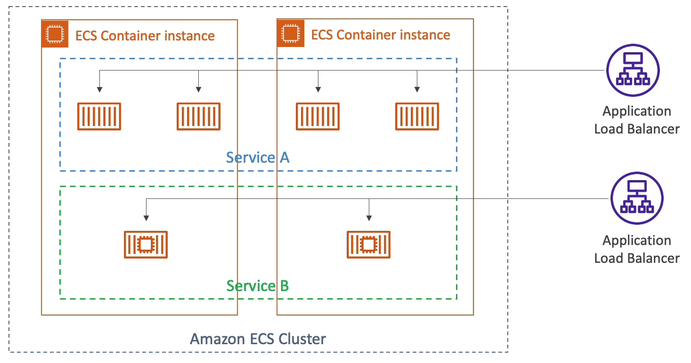
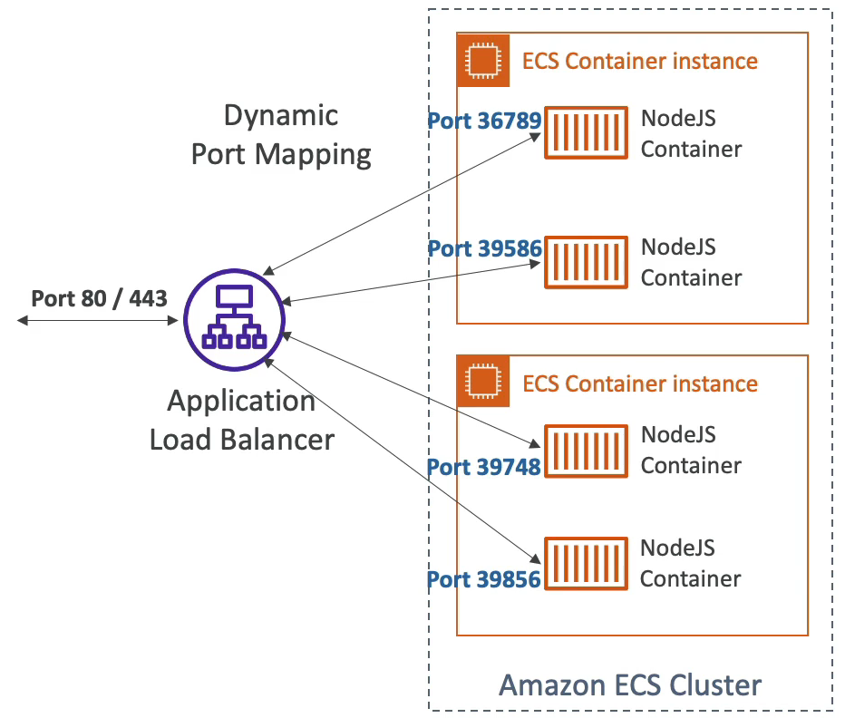
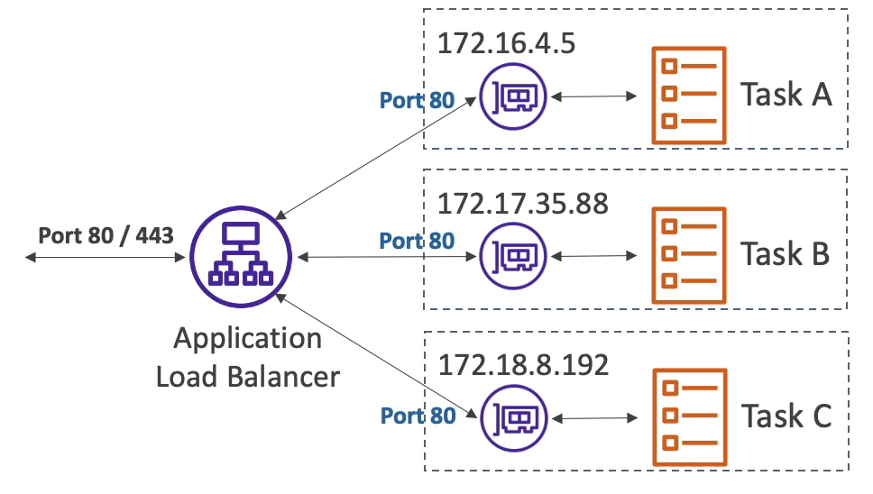

# ECS Services & Tasks

Amazon ECS 클러스터가 있다. ECS 컨테이너들은 EC2 인스턴스 위에서 동작한다.

여러 개의 가용 영역에서 여러 개의 태스크를 실행할 수 있다.

여러 개의 태스크를 여러 대의 EC2 인스턴스에 걸쳐 실행하는 서비스 A가 있다.

이 태스크를 사용자들에게 노출시키고 싶다면 애플리케이션 로드 밸런서를 생성해서 태스크에 통합시킬 수 있다.

혹은, 사용자들에게 애플리케이션 로드 밸런서의 DNS 나 URL 만 주는 방법도 있다.

로드 밸런서는 컨테이너에 오는 모든 요청을 포워딩한다. 

ECS 클러스터에서 여러 개의 서비스를 실행할 수 있다.

만약, 서비스 B라는 또 다른 서비스를 생성하고 태스크를 가동한다고 가정한다.

이 서비스 B는 두개의 태스크만 실행시키고 있고, 서비스 A 와 똑같이 애플리케이션을 노출시키려면 로드 밸런서를 연결해야 한다.

컨테이너 인스턴스에서 컨테이너를 실행시키면 컨테이너에 무작위로 포트 번호가 지정된다.

그래서 로드 밸런서에서 해당 컨테이너로 오는 모든 요청을 받아서 올바른 곳으로 트래픽을 보내준다.

alb 에 컨테이너가 등록되면 즉, 특정 ECS 서비스가 등록되면 태스크를 찾아서 자동으로 올바른 포트를 통해 통신하게 된다.

하나의 EC2 인스턴스안에서 원하는 만큼 많은 수의 컨테이너를 실행하고 ALB 를 통해 외부로 노출시킬 수도 있다.

일단 이를 위해서는 보안 그룹을 집고 넘어가야 한다.

일단 EC2 인스턴스의 인바운드 규칙으로 ALB 보안 그룹으로부터 오는 모든 트래픽들을 허용하도록 하면 된다.

Fargate 의 경우는 EC2 인스턴스와는 조금 다르다.

Fargate 는 우리가 실행하고 있는 모든 태스크에 대해 ENI 를 생성한다. ENI 는 고유의 IP 가 있지만 포트는 변하지 않는다.

각각의 태스크의 IP 는 모두 다르지만 포트 번호는 모두 80으로 동일하다. 

eni 의 보안 그룹에서 인바운드 규칙으로 alb 로드 밸런서에서 오는 모든 트래픽을 허용하도록 하면 된다.

