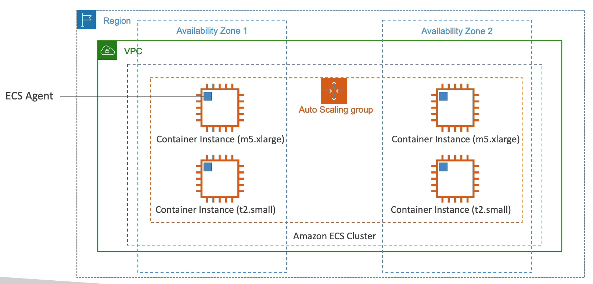
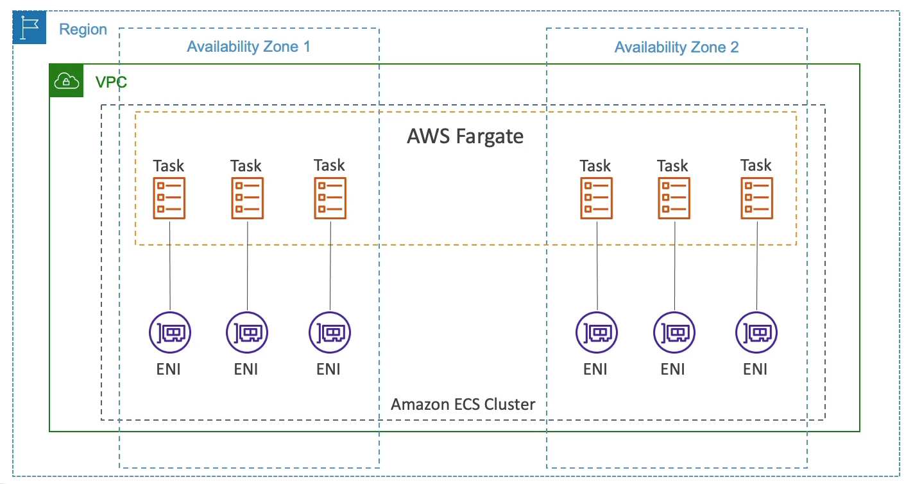
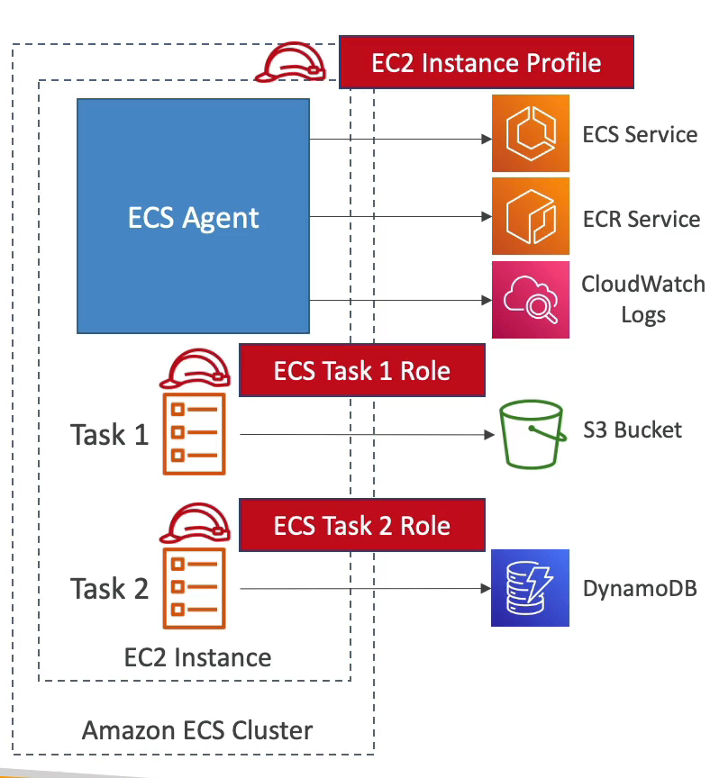

# ECS

- ECS = Elastic Container Service 를 뜻하며, AWS 에서 도커 컨테이너를 실행하게 해주는 서비스이다.
- 인프라를 유지하기 위해서 프로비저닝이 필요하고 EC2 인스턴스가 ECS 클러스터를 지원해준다.
- ECS 는 한 번 컨테이너를 생성하게 되면 로드 밸런서와 합쳐지고 서비스와 태스크를 노출시킨다.
- ECS 서비스는 새 도커 컨테이너를 어떤 EC2 인스턴스에서 띄울지 찾는다.
- 도커 컨테이너를 띄우기 위해서는 특정값 이상의 CPU 와 RAM 용량을 필요로 한다.

### Amazon ECS Launch Type for ECS

- ECS 에는 두 가지 실행 유형이 있고 첫 번째로 Amazon EC2 실행 유형이다.
- 리전과 VPC 두 개의 가용 영역에 Amazon ECS 클러스터가 존재한다.
- 클러스터는 두 개의 가용 영역에 걸쳐진 multi AZ 이고 오토 스케일링 그룹을 생성하여 EC2 인스턴스와 컨테이너 인스턴스들을 생성한다.
- 각각의 가용 영역에 컨테이너 인스턴스들의 타입으로 m5, t2 타입을 사용할 것이다.
- 이 컨테이너 인스턴스들은 모두 오토 스케일링 그룹에 속해 있고 이 녀석들을 전부 Amazon ECS Cluster 에 등록하고 싶다.
- ECS 에이전트를 인스턴스들에서 수동으로 운영하지 않고 ECS 를 위해 만들어진 AMI 를 사용하면 ECS 에이전트가 사전 구성되고 ECS 클러스터에 등록할 수 있게 된다.
- 해당 컨테이너들 위에서 ECS Tasks 가 작동하게 된다. 따라서 컨테이터 인스턴스의 타입이 좋을수록 ECS 태스크를 더 많이 실행할 수 있다.
- 다시 설명하자면 multi AZ 에서 Amazon ECS Cluster 를 사용하려 한다. ECS 를 사용하기 위해서는 각각의 인스턴스들에 ECS 에이전트가 깔려 있어야 하는데 이를 ECS 전용 AMI 를 통해 해결할 수 있고 ECS 에이전트를 통해 ECS 클러스터에 등록이 가능하게 된다는 것이다.

### Fargate

- Fargate 는 EC2 인스턴스에서 도커 컨테이너를 띄우는 것이 아니라 따로 서버를 생성하지 않고 도커 컨테이너를 띄우는 방식이다.
- 즉, 인프라를 따로 프로비저닝할 필요가 없기 때문에 EC2 인스턴스를 따로 관리하지 않아도 되서 매우 편리하며 서버리스 오퍼링이라고 불린다.
- 서버를 관리하지 않기 때문에 도커 컨테이너를 실행하기가 더 쉽다.
- AWS 는 내가 선택한 CPU 와 RAM 에 따라 알아서 서버를 만들어주고 거기에서 도커 컨테이너를 띄워준다.
- Fargate 클러스터에서 새 ECS 태스크가 실행돼야 한다면 EC2 인스턴스를 따로 만들 필요 없이 CPU, RAM 만 세팅해주면 된다.

### Fargate Launch Type for ECS

ECS 를 위한 Fargate 실행 유형에서는 위의 예제와 똑같은 상황이다.

두 개의 가용영역, vpc, 리전, 클러스터가 있다.

이번에는 Fargate 서비스가 태스크를 실행할 것이고 EC2 인스턴스를 생성할 필요가 없기 때문에 훨씬 간단하다.

Fargate 태스크에 액세스하려면 ENI 가 필요한데 태스크를 VPC 의 IP 주소에 바인드 해준다.

태스크가 늘어나면 늘어나는 만큼 ENI 도 생성된다. 태스크마다 전부 다른 ENI 가 생성된다.

ENI 별로 별개의 IP 가 할당되기 때문에 VPC 에 사설 IP 가 충분한지 확인하는 작업이 필요하다.

### IAM Roles for ECS Tasks

ECS 태스크들은 AWS 서비스(DynamoDB, Amazon S3..)에서 작업을 할 수 있다. 이를 위해서는 IAM 역할이 필요로 하다.

ECS 태스크에도 IAM 역할이 존재한다.

EC2 인스턴스가 ECS 클러스터를 가동하는 예시를 살펴 본다.

EC2 인스턴스에 ECS 에이전트가 있고 인스턴스를 ECS 클러스터에 등록해서 ECS 서비스에 API 를 호출하기 위해서 ECS 에게 Amazon EC2 인스턴스에 연결되게 해주는 역할을 준다.

ECS 에이전트가 CloudWatch Logs 로 컨테이너 로그들도 보내고 Amazon ECR 에서 도커 이미지를 내려 받거나 업로드할 수 있다.

ECS 태스크를 생성하면 태스크 역할을 연결할 수 있다. 즉, 각각의 태스크가 특정 역할을 갖게 되는 것이다.

EC2 인스턴스 별로 새로운 ECS 태스크 역할을 생성하는 것이 좋고 여러 개의 ECS 서비스에서 태스크를 실행할 것이라면 ECS 서비스마다 다른 ECS 태스크 역할을 주는 것이 좋다.

ECS 태스크에 태스크 역할이 부여되면 해당 역할에 맞는 서비스에만 접근이 가능하기 때문에 보안이 세분화된다.

태스크의 유형이 많을 수록 태스크 역할도 많아진다.

특정 AWS 서비스에 액세스해야 하는 ECS 서비스의 태스크가 필요하다면 ECS 태스크 역할을 새로 만들고 태스크에 연결해주면 된다.

### ECS Data Volumes - EFS File System

ECS 서비스들은 데이터를 어떻게 공유할까?

ECS 태스크들에 대한 데이터 볼륨은 어떻게 만들까?

ECS 는 EFS 파일 시스템과 통합된다는 점을 알아두자. 

EC2 인스턴스가 있고 태스크가 여러개가 존재한다면 EFS 파일 시스템을 생성해서 파일 시스템에 ECS 태스크를 직접 마운트하는 것도 가능하다.

태스크에 EFS 볼륨을 마운트하면 데이터를 공유할 수 있다.

EFS 는 Multi AZ 에서 사용할 수 있기 때문에 어느 가용 영역에서든 태스크가 EFS 에 접근이 가능하다.

Fargate 와 EFS 를 함께 사용하면 서버리스 태스크 관리와 데이터를 저장하는 EFS 를 사용하게 되는데 서버리스 서비스로서 작동하게 된다. 즉, 내가 직접 관리하는 서버가 하나도 없다는 뜻이다.