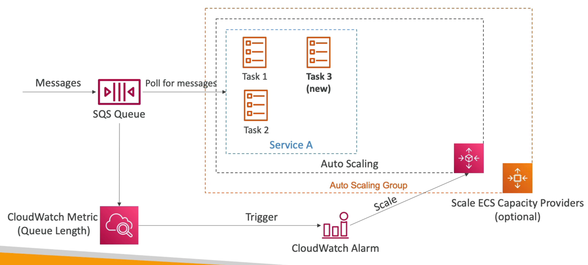

# ECS 스케일링

- 오토 스케일링 그룹에서 처럼 임계값을 설정하고 해당 임계값을 넘어가는 순간 오토 스케일링이 되도록 설정할 수 있다.
- CloudWatch metric 을 사용하여 사용 중인 ECS 서비스 전체 CPU 의 평균 사용량을 체크하여 오토 스케일링 할 수도 있다.
- Fargate 와 EC2 인스턴스 모두 동일하게 작동한다.
- EC2 인스턴스의 ECS 클러스터를 스케일링하려면 ECS Capacity Provider 를 사용하여 스케일링을 진행한다. EC2 인스턴스 실행 유형에서만 선택할 수 있는 옵션이다.
- 위 과정을 다시 설명하자면, ECS 스케일링은 태스크를 실행할 충분한 용량이 없을 경우 오토 스케일링 그룹을 실행하고 ECS 클러스터에 EC2 인스턴스를 추가한다.
- 즉, 일반적인 ECS 스케일링과 ECS Capacity Provider 를 사용한 오토 스케일링이 있고 EC2 인스턴스를 스케일링 하고 싶을 때는 ECS Capacity Provider 를 사용한다.