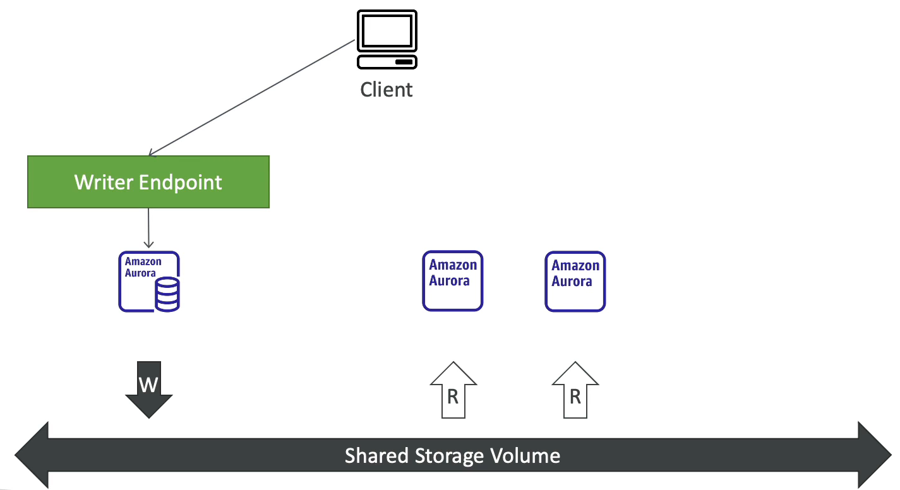
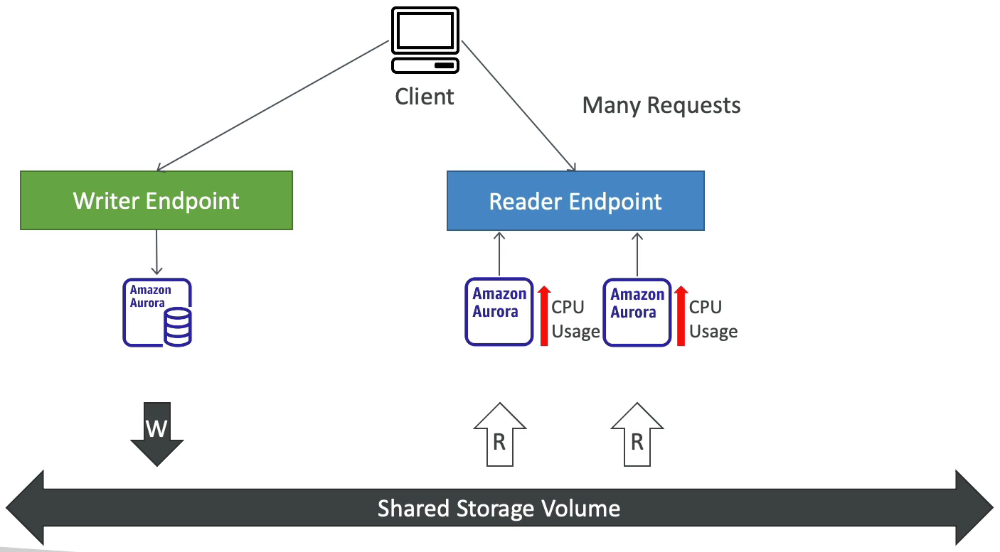
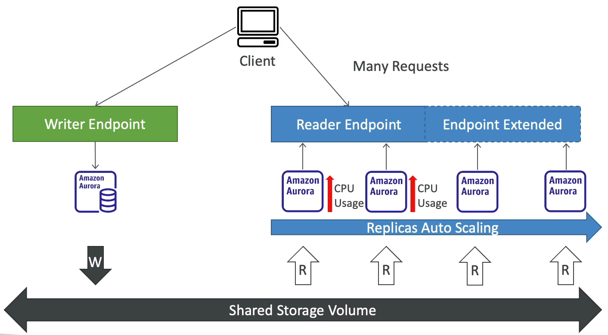
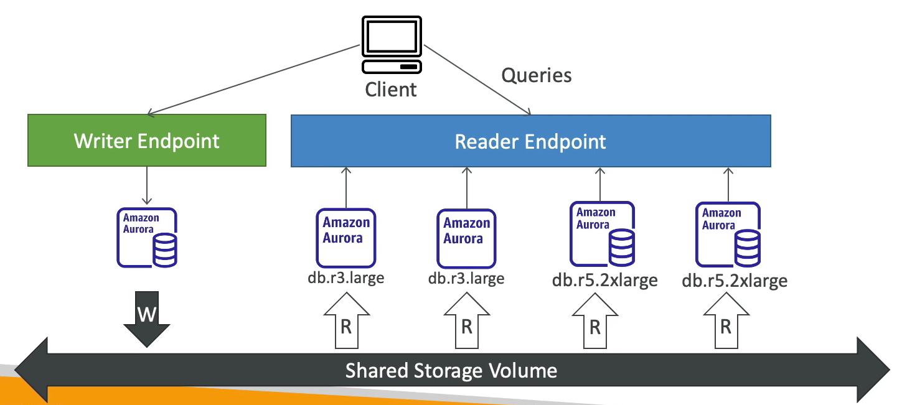
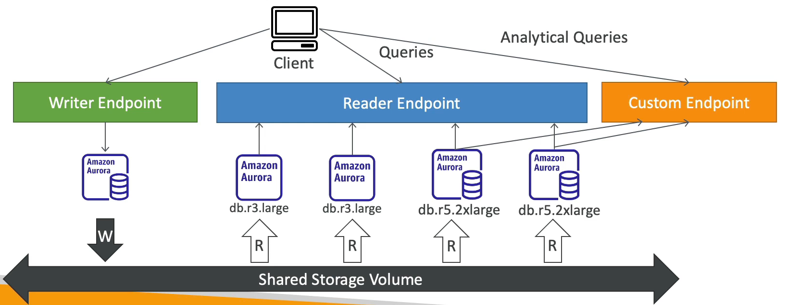

# Aurora - Advanced Concepts

### Aurora Replicas(오로라 복제본) - Auto Scaling

클라이언트가 있고 오로라 인스턴스가 세 개 있다고 가정해본다.

하나는 writer endpoint 를 통해 write 하고 다른 두 개는 reader endpoint 를 통해 read 한다.

reader endpoint 에서 엄청 많은 읽기 요청이 발생하여 오로라 데이터베이스의 CPU 사용률이 증가했다고 가정한다.

이 경우 오토 스케일링 복제본을 설정할 수 있다.

자동으로 오로라 복제본이 추가되고 reader endpoint 가 새 복제본을 포함할 수 있도록 확장된다.

새 복제본은 트래픽을 수신하기 시작하고 전체 CPU 사용률을 낮추기 위해 좀 더 분산되는 방식으로 읽기를 수행한다.

이것이 오토 스케일링 복제본이다.

### Aurora - Custom Endpoints(사용자 지정 엔드포인트)

위와 동일한 예시이지만 이번에는 db.r3.large 와 db.r5.2xlarge 두 종류의 복제본이 있다고 가정한다.

일부 읽기 전용 복제본은 다른 복제본보다 용량이 크다.

오로라 인스턴스의 서브셋을 사용자 지정 엔드포인트로 정의하기 위해서다.

두 개의 더 큰 오로라 인스턴스에서 용량이 더 큰 오로라 인스턴스를 사용자 지정 엔드포인트를 정의할 것이고 해당 인스턴스의 성능이 좋기 때문에 

해당 복제본은 데이터 분석을 위한 커스텀 엔드포인트로 돌릴 것이다.

이렇게 하면 사용자 지정 엔드포인트로 변경된다. 하지만, reader endpoint 에 해당 인스턴스 자체는 사라지지 않는다. 다만 사용되지 않을 뿐이다.

실무에서는 다양한 워크로드에 대해 사용자 지정 엔드포인트를 설정하여 오로라 복제본의 하위 집합만을 쿼리할 수도 있다.

### Aurora Serverless

기본적으로 오로라 서버리스의 목적은 lamda 의 콘셉과 같다고 생각하면 된다.

로켓처럼 들어오는 트래픽에 대해, DB에 대한 부하도를 오로라 서버리스가 관리하고 운영할테니 쓴 만큼 비용을 내라는 것이다.

아마존은 오로라 서버리스가 필요한 이유를 아래처럼 설명하고 있다.

오로라 서버리스는 오토 스케일링과 다르게 중간에 연결이 끊겨 애플리케이션을 수정하는 그런 불상사가 발생하지 않는다.

즉, 애플리케이션을 수정하지 않아도 되고 연결도 끊기지 않는다.

어떻게 가능하게 했을까에 대한 답은 Proxy fleet 이 있다.

기본적으로 애플리케이션은 DB 서버에 바로 연결되는 것이 아닌, Proxy Layer 에 있는 서버와 연결을 유지하게 된다.

이를 통해, 오로라 서버리스에 DB 인스턴스에 대한 자유로운 오토 스케일링이 가능하게 되는 것이다.

오로라 서버리스 DB 클러스터에 할당된 용량은 클라이언트 애플리케이션에서 생성된 부하(CPU 사용률 및 연결 수)에 따라 원활하게 확장 및 축소된다.(마치 EC2 오토 스케일링과 같아 보인다.)

오토 스케일링과 같이 최소 용량과 최대 용량을 지정하게 되고 이때의 단위는 ACU(오로라 용량 단위)로 지정한다.

Amazon은 기본적으로 각 Region별로, Aurora Serverless의 Warm Pool을 운영하게 된다.

이를 통해 Aurora Serverless가 판단하기에, 현재 컴퓨팅 파워가 부족하다고 판단되면 Warm Pool에 있는

더 좋은 리소스의 인스턴스로 변경하고, "Proxy Fleet"에서 기존의 연결을  신규 인스턴스로 넘겨주기 때문에 애플리케이션 수정 없이, 빠른 시간 안에 로켓 같은 DB Event를  처리할 수 있는 것 이다.

단 세상에 매직은 없고, 디비는 중요하다.

아래와 같은 상황에는 Auto Scale Event가 잠시 보류된다.

- 장기간 쿼리 또는 트랜잭션이 진행 중인 경우
- 임시 테이블 또는 테이블 잠금이 사용 중인 경우

### Amazon Aurora Serverless라  가능한, 미사용시 일시정지, 다시 시작

Aurora Serverless의 특징이라고 하면 유연한 인스턴스 활용이다.

이벤트가 적은 시간대 혹은 없는 시간 (5분 이하 연결이 없는 경우) 용량이 0으로 지정되고,

이벤트가 넘치는 시간대에는 자동으로 필요한 만큼 확장이 된다.  

어느 정도 수준에서는 비용도 아끼고, 높은 서비스 품질을 제공한다.

Aurora Serverless의 기본 일시정지 시간은 최소 5분에서 최대 1440분이며, 기본 값은 5분으로 설정된다.

물론, 일시정지는 사용하지 않을 수도 있다.

일시정지가 되었을때 컴퓨팅 자원 (Cpu, Memory)에 대해서는 지불하지 않고, 스토리지 사용 비용만 측정되게 된다.

### Amazon Aurora Serverless 사용 사례

(1) 데일리 배치를 사용해야 합니다.

내가 쇼핑몰 서비스를 하고 있고, 하루에 한 번 데일리 정산을 진행하는데 약 30분간 CPU를 10개 사용해야 한다.

하지만, 실제 서비스 운영 중에는 2개의 CPU를 사용하는 상황이다.

그래서 개발자 Y 씨는 하루에 한 번 AWS API를 통해 작업을 시작할 때, 서버 티어를 높이고, 낮추고 진행하게 됐다.

하지만 이 모든 것이 관리적인 포인트로 들어가고, 개발을 해야 한다.

하지만 서버리스를 사용하여 최대 ACU만 지정해둔다면,

개발자는 인프라를 위한 로직을 고민하지 않고, Application만 개발하면 되는 것이다.

(2) 우리 서비스는 특정 시간에 튑니다.

요즘 "코로나 19" 때문에, 관련된 서비스들이 많아지는데 아무래도 요청량이 불규칙하게 튀는 경우가 많다.

그래서 서비스 중단이 생기면 안 되기 때문에 미리 큰 인스턴스로 올려뒀는데,

이런 실제 사용은 10%도 안 했지만 비용은 다 지불해야 한다.

하지만, Serverless를 사용한다면, 특정 이벤트가 발생했을 때 짧은 시간으로 스케일이 조정되어 서비스에 대한 품질은 높여주고 비용적인 부분도 이용한 만큼만 지불 하면 되는 것 이다.

### Amazon Aurora Serverless의 제약사항

- PUBLIC IP를 할당 할 수 없습니다. Aurora DB 자체의 PUBLIC IP를 할당 할 수 없습니다.

- DB 인스턴스 별 파라미터를 지정할 수 없고, 클러스터 파라미터만 적용할 수 있다. (READ 인스턴스에선 특정 값을 조정한다 던 지 등의 액션은 불가능합니다.)

- Multi AZ를 지원하지 않는다. 
  - 특정 Zone에서 DB 클러스터가 생성되게 된다. 
  - 이는 해당 Zone 장애 발생 시, 자동으로 다른 Zone에 failover는 되지만, 그 시간이 오래 걸리고 서비스 중단의 문제가 있다는 뜻이다. 
  - 단, Aurora는 아키텍처상 스토리지와 컴퓨팅을 분리하여 운영하고 있기 때문에 데이터는 문제없이 사용할 수 있다.

- Aurora MySQL Cluster에는 아래와 같은 파라미터 제약 사항이 있다.
character_set_server

collation_server

general_log

innodb_file_format

innodb_file_per_table

innodb_large_prefix

innodb_lock_wait_timeout

innodb_monitor_disable

innodb_monitor_enable

innodb_monitor_reset

innodb_monitor_reset_all

innodb_print_all_deadlocks

lc_time_names

log_output

log_queries_not_using_indexes

log_warnings

long_query_time

lower_case_table_names

net_read_timeout

net_retry_count

net_write_timeout

server_audit_logging

server_audit_events

server_audit_excl_users

server_audit_incl_users

slow_query_log

sql_mode

time_zone

tx_isolation

해당 값들만 수정이 가능하고, 그 외에는 기본값으로만 사용이 가능하다.