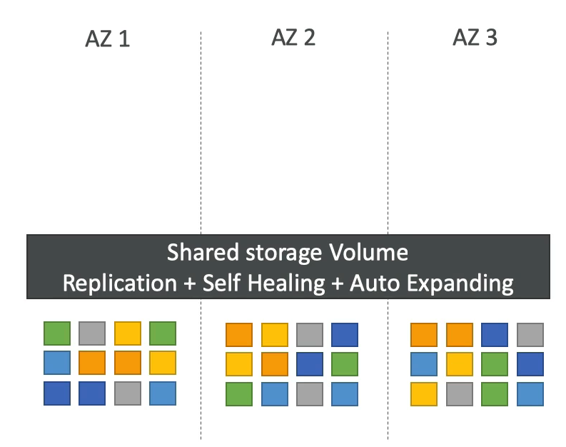

# Aurora 개요

- 오로라는 AWS 에서 자체적으로 만든 기술이다.
- Aurora 데이터베이스에는 호환 드라이버가 존재하여 PostgreSQL 과 MySQL 과 호환된다.
- 오로라는 클라우드에 최적화되어 MySQL 이나 PostgreSQL 에 비해 각각 5배, 3배 성능이 더 좋다.
- 다른 방식으로도 오로라의 성능을 향상시킬 수 있다.
- 오로라의 스토리지는 10GB 로 시작하여 128TB 까지 자동으로 증가된다.
- 읽기 전용 복제본의 경우 최대 15개까지 가질 수 있으며 복제하는 속도도 MySQL 에 비해 훨씬 빠르다.
- MySQL 보다 장애 조치 속도가 훨씬 빠르다.(multi AZ 등..) 기본적으로 클라우드 네이티브라서 가용성이 높기 때문이다.
- 비용이 20% 정도 비싸지만 규모 면에서 더 효율적이어서 비용을 많이 절약할 수 있다.

### High Availability and Read Scaling(고가용성과 읽기 스케일링)

- 3개의 가용 영역에 총 6개의 데이터 복제본을 저장할 수 있다.
- 자가 복구, 자동 확장 등의 기능을 수행할 수 있다.

예를 들어보자, 1~3 의 AZ가 존재하고 파란색 데이터를 오로라 데이터베이스에 저장하면 3개의 가용 영역의 저장 볼륨에 2개씩 파란색 데이터를 저장한다.

즉, 각 AZ 에 총 6개의 복제본이 생긴 것이다. 주황색 데이터를 데이터베이스에 저장하면 위와 같이 3개의 AZ 에 총 6개의 복제본이 생긴다. 

이런식으로 계속해서 데이터를 저장하면 각각의 가용영역의 저장 볼륨에 데이터가 복제되어 쌓이게 된다.

이런 식으로 하면 좋은 점이 서로 다른 저장 볼륨에서 스트라이프 되고 잘 실행된다는 점이다.

실제로 기록을 하는 데이터베이스 인스턴스는 한 개만 존재하고 오로라 마스터 데이터베이스가 작동하지 않으면 30초 안에 장애 조치가 실행된다.

오로라에서 기억해야 할 것은 하나의 마스터와 여러 개의 읽기 전용 복제본이 존재하며 자동으로 스토리지가 복제되어 작은 블록별로 자가 복구와 자동 확장 기능이 실행된다는 것이다.

### 오로라 DB 클러스터

마스터 데이터베이스만 스토리지에 쓸 수 있고 변경과 장애 조치가 가능하기 때문에 오로라는 Writer Endpoint 로 항상 마스터 데이터베이스를 가리킨다. 

Writer Endpoint 는 DNS 이름으로 마스터에 장애가 생겼을 시 Writer Endpoint 를 통해 올바른 인스턴스로 자동으로 리다이렉션 시켜준다.

Writer Endpoint 를 사용하기 때문에 읽기 전용 복제본을 많이 갖는 것이다.

오토 스케일링을 통해 최대 15개의 읽기 전용 복제본을 가질 수 있지만 오토 스케일링으로 애플리케이션이 읽기 전용 복제본과 URL 을 추적하는 것이 어려워지고 연결하기도 어려워졌다.

이를 해결하기 위해 나온 방법이 Reader Endpoint 이다.

리더 엔드포인트는 라이터 엔드포인트와 동일한 기능이 있다.

기본적으로 로드 밸런싱의 연결을 돕고 모든 읽기 전용 복제본에 자동으로 연결시켜준다.

클라이언트가 리더 엔드 포인트에 연결할 때마다 읽기 전용 복제본 중 하나가 연결되는 식으로 로드 밸런싱을 해준다.

