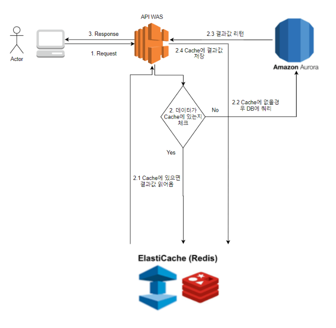
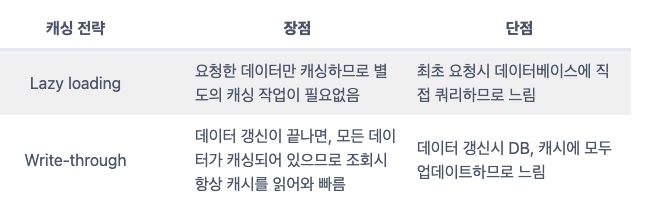
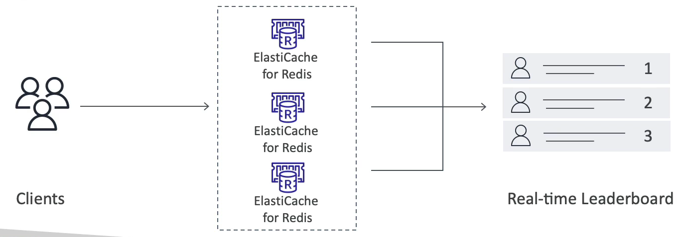

# ElastiCache for Solution Architecture

- 모든 ElastiCache 는 IAM 인증을 지원하지 않는다.
  - ElastiCache 의 IAM 정책들은 AWS-API 수준의 보안에만 사용된다.(캐시 생성, 삭제 등의 작업, 캐시 내의 모든 작업은 IAM 을 사용하지 않는다.)
- 레디스를 인증하려면 Redis AUTH 를 사용해야 한다.
  - 레디스 클러스터를 생성할 때 비밀번호나 토큰을 사용하여 로그인할 수 있다.
  - Redis AUTH 는 캐시에 사용할 수 있는 보안 그룹에 대한 추가적인 수준의 보안이다.
  - 전송 중 암호하를 위해 SSL 보안을 지원한다.
- Memecached
  - 더 높은 수준의 SASL 기반 인증을 지원한다.

### ElastiCache 캐싱 전략

ElastiCache 캐싱 전략은 3가지가 존재한다.

- Lazy Loading : 지연 로딩으로 데이터 요청이 있을 때만 캐싱된다. 즉, 최소 1번은 데이터를 조회해야만 캐싱이 되고, 최초 조회시 DB에 직접 요청하므로 느리다는 점이 단점이다. 반면에, 데이터가 갱신되었을 때 기존에 캐싱된 데이터만 무효화 시키면 되는 점은 장점이다.
- Write Through : 데이터 갱신시 캐시와 DB에 모두 업데이트하는 방식이다. DB가 업데이트 될 때 마다 별도로 캐시도 업데이트 해줘야 하는 수고로움은 단점이지만, 이 작업이 끝나면 데이터 조회시 항상 캐시에서 조회하므로 속도가 빠르다.

해당 전략들에 Add TTL(Time To Live) 속성을 추가하여 캐싱된 데이터를 만료시킬 수도 있다.

### ElastiCache - Redis 사용 사례

매우 복잡한 게임 리더보드 생성에서 사용한다.

어느 시점에서 누가 1위고 누가 2위고 누가 3위인지 가려내야 할 때...

레디스에는 고유성과 원소의 순서를 모두 보장해주는 정렬된 집합(Redis Sorted sets)이라는 기능이 있다.

원소가 추가될 때 마다 실시간으로 순위가 매겨지고 올바른 순서로 추가가 된다.

레디스 클러스터가 있는 경우 실시간으로 1위, 2위, 3위 플레이어가 있는 실시간 리더보드를 생성한다는 개념이다.

그래서 모든 레디스 캐시는 동일한 리더보드를 사용할 수 있다.

즉, 레디스로 ElastiCache 와 통신할 때 클라이언트는 실시간 리더보드에 액세스할 수 있고, 애플리케이션 측에서 이 기능을 프로그래밍할 필요가 없다.

