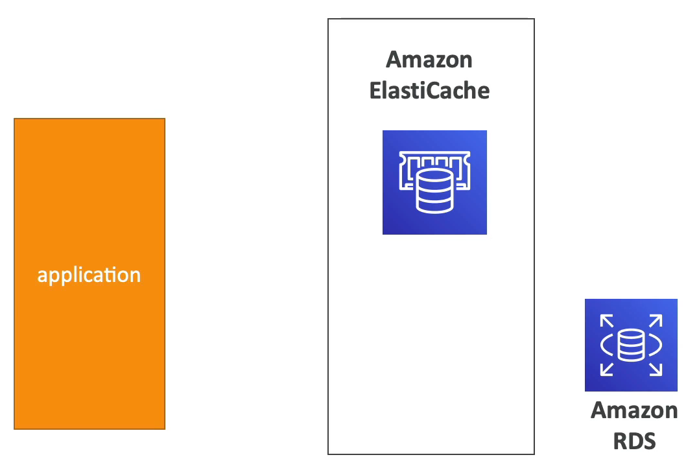
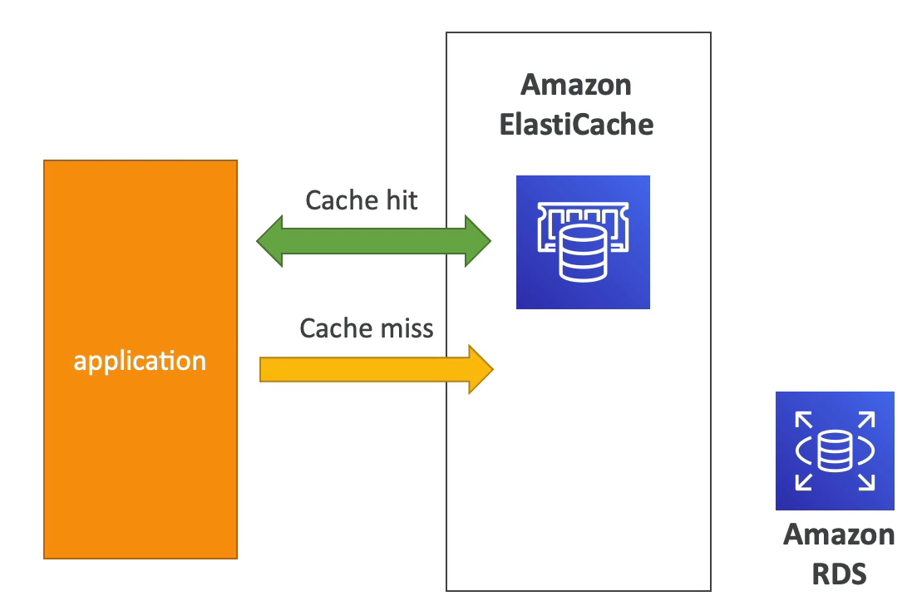
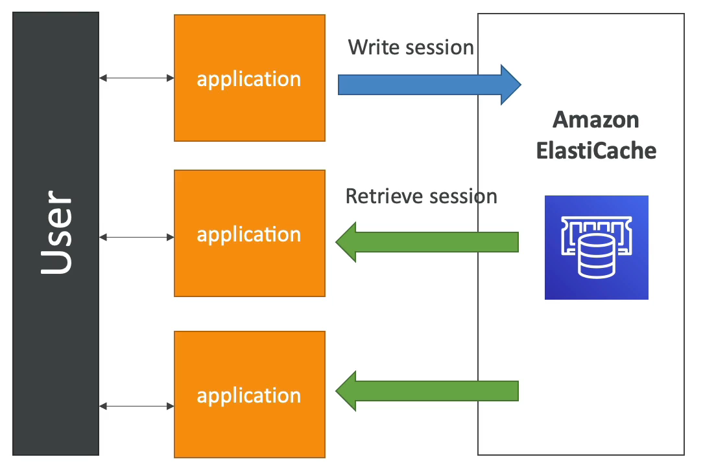
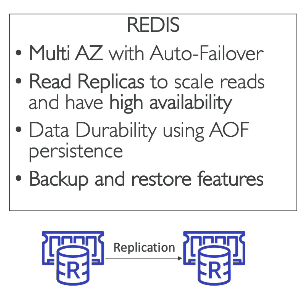
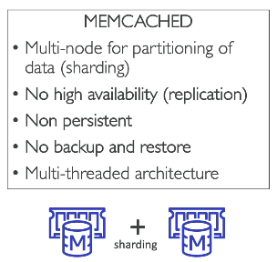

# ElastiCache 개요

- RDS 와 똑같은 관계형 데이터베이스이다.
- ElasticCache 는 Redis 나 Memcached 같은 캐시 기술을 관리할 수 있도록 하는 서비스이다.
- 캐시는 높은 성능과 낮은 지연 시간을 갖는 인메모리 데이터베이스이다.
- ElastiCache 를 사용하면 데이터베이스에서 읽는 것에 특화되어 읽는 것의 부하를 줄일 수 있다.
- RDS 와 동일한 장점을 갖는다.(설정, 구성, 모니터링, 장애 회복, 백업, 운영 체제 패치, 최적화 등...)
- ElastiCache 를 사용할 때 애플리케이션에게 코드 변경을 요구할 수도 있다. 즉, 데이터베이스 쿼리 후에는 캐시를 쿼리하도록 코드를 변경해야 한다는 뜻.

### ElastiCache Solution Architecture - DB Cache

ElastiCache 와 RDS 데이터베이스 그리고 애플리케이션이 있다고 가정한다.

애플리케이션은 ElastiCache 를 쿼리한다. 쿼리문에 해당하는 값이 캐시에 존재하고 있을 경우 이를 cache hit 라고 한다.

만약 이전에 쿼리한 값이 있다면 cache hit 작업을 통해 캐시에 쿼리한 값이 저장되고 똑같은 쿼리를 애플리케이션이 날리면 ElastiCache 에서 바로 응답을 줘서 데이터베이스까지 가지 않게 해준다.

cache miss 는 데이터에 처음 접근시 캐시에 데이터를 올리기 위한 작업을 뜻한다.

 
즉, 동일한 쿼리가 발생하는 경우 캐시 히트를 얻도록 해준다.

이는, RDS 데이터베이스에서 부하를 줄이는데 도움을 준다.

데이터를 캐시에 저장하기 때문에 캐시 무효화 전략이 있어야 하며 가장 최근 데이터들만 사용하는지도 확인해야 한다.

예를 들어 집주소가 변경되어 저장됐는데 캐시에는 예전 집주소가 저장되어 있는 경우 새로 쿼리문을 날려도 캐시가 있다고 판단해서 예전 집주소를 날려준다.

이것이 캐싱 기술 사용의 어려움이라고 할 수 있다.

### ElastiCache Solution Architecture - User Session Store

사용자 세션을 저장해 애플리케이션을 stateless(비연결형) 상태로 만드는 것이다.

사용자가 애플리케이션의 모든 계정에 로그인하면 애플리케이션이 ElastiCache 에 세션 데이터를 기록한다.

사용자가 애플리케이션의 다른 인스턴스로 리다이렉션 되면 애플리케이션은 ElastiCache 에서 직접 세션 캐시를 검색할 수 있다.

그래서 사용자는 또 다시 로그인할 필요가 없이 로그인한 상태를 유지할 수 있다.

즉, 사용자의 세션 데이터를 캐시에 기록해서 애플리케이션을 stateless 상태로 만든 것이다.

### ElastiCache - Redis vs Memcached

Redis
- 레디스는 자동 장애 조치인 multi AZ 를 수행하는 기술이다.
- 읽기 전용 복제본은 읽기 스케일링에 사용되며 가용성이 높다.
- RDS 와 비슷하다.
- 지속성으로 인해 데이터 내구성도 있으며 백업과 복원 기능도 존재한다.

  
Memcached
- 샤딩이라 불리는 데이터 분할을 위한 멀티 노드를 사용한다.
- 가용성이 높지 않고 복제도 되지 않는다.
- 백업과 복원 기능도 존재하지 않는다.
- 다중 쓰레드 아키텍쳐이다.
- 데이터를 손실하지 않는 분산 캐시이다.

