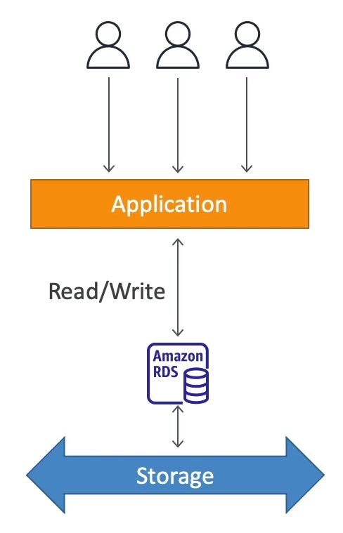

# RDS 개요

RDS 는 관계형 데이터베이스 서비스를 나타내며 SQL 문을 언어로 사용하는 Relational Database Service 의 약자이다.

SQL 언어를 사용하여 클라우드에 데이터베이스를 생성할 수 있고, 해당 데이터베이스는 AWS 상에서 관리되는 이점을 갖는다.

AWS 에서 관리하는 데이터베이스 엔진에는 PostgreSQL, MySQL, MariaDB, Oracle, Microsoft SQL Server, Aurora 등이 있다.

### EC2 인스턴스에 데이터베이스 서비스를 배포하지 않고 독립된 서비스인 RDS 를 사용하는 이유는 뭘까?

1. RDS 는 관리형 서비스로 AWS 가 데이터베이스 뿐만 아니라 여러 기타 서비스를 제공하기 때문이다!
   - 데이터베이스의 프로비저닝이 완전 자동화되어 있고, 운영 체제의 패치 또한 자동화되어 있다.
   - 지속적으로 백업이 되고, 특정 타임스탬프로 복구할 수 있다. 이를 지정 시간 복구(PITR) 이라고 한다.
   - 대시보드를 통해 모니터링을 하여 데이터베이스 성능을 확인할 수 있다.
   - 읽기 성능 향상을 목적으로 하는 읽기 전용 복제본을 만들 수 있다.
   - 재해 복구 시에 유용하게 사용되는 Multi AZ 를 설정할 수 있다.
   - 업그레이드를 위한 유지 보수도 존재한다.
   - 수직 / 수평 확장이 가능하다.
   - 백업본은 EBS 에 저장된다.(gp2 또는 io1)
2. RDS 인스턴스는 SSH 로 접근할 수 없다.

### RDS 백업

- 백업은 RDS 에서 자동으로 활성화되며 자동으로 생성된다.
- Automated Backups:
  - 매일 모든 데이터베이스를 백업
  - 5분마다 트랜잭션 로그를 백업
  - 위 두 가지를 함께 사용하여 그 어떤 지정 시점으로 데이터베이스를 복원할 수 있다. 
  - 자동 백업은 기본적으로 7일간 보관되지만 최대 35일까지 보관 기간을 설정할 수 있다.
- 데이터베이스 스냅샷이 존재

### RDS Storage Auto Scaling

RDS 데이터베이스를 생성할 때는 원하는 스토리지 용량을 지정해야 한다.

데이터베이스의 사용량이 많아지고 사용 가능한 공간이 부족해지는 경우 RDS 가 자동으로 스토리지에 대한 스케일링을 수행한다.

따라서 스토리지 확장을 위해 데이터베이스를 중단하는 등의 작업을 따로 수행할 필요가 없다.

즉, 애플리케이션이 RDS 데이터에 다량의 읽기 및 쓰기 작업을 수행할 때 자동으로 특정 임계값을 확인해서 스토리지가 오토 스케일링이 된다.

데이터베이스 스토리지를 수동으로 확장하지 않는 것이 핵심이다.

이를 위해서는 스토리지 임계값을 설정해야 한다. 무한한 확장이 불가능하기 때문에 스토리지 확장에 대한 최댓값도 필요로 하다.

예를 들어, 사용 가능한 스토리지의 저장 용량이 10% 미만 남은 상태에서 5분 이상 지나고 수정된지 6시간이 지났을 경우에 자동으로 용량을 확장한다.

워크로드를 예측할 수 없는 애플리케이션의 경우 아주 유용하다.