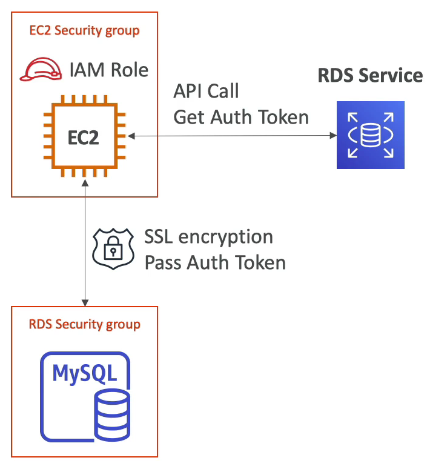

# RDS 암호화 및 보안

### RDS 암호화
- 사용중이지 않은 데이터 암호화
  - AES 256비트 암호화를 사용하는 AWS 키 매니지먼트 서비스인 AWS KMS로 마스터 데이터베이스와 읽기 전용 복제본을 암호화할 수 있다.
  - 마스터 데이터베이스를 암호화하지 않으면 복제본도 암호활 수 없다.
  - Oracle 과 SQL Server 에서 TDE 라고 부르는 투명 데이터 암호화를 활성화할 수 있다. 데이터 베이스 암호화의 대안이라고 할 수 있다.
- 데이터 전송 암호화
  - RDS 에서 데이터를 전송할 때 암호화하기 위해서는 SSL 인증서가 필요하다.
  - 데이터베이스에 연결 시 신뢰할 수 있는 인증서를 제공하면 SSL 을 연결할 수 있다.
  - 모든 클라이언트가 SSL을 사용하도록 하려면 PostgreSQL 에서는 rds.force_ssl=1 인 콘솔 매개변수 그룹을 설정해야 하고, MySQL 사용 시에는 GRANT USAGE ON *.* TO 'mysqluser'@'%' REQUIRE SSL; 명령문을 실행해야 한다.

 ### RDS 백업 암호화
- 암호화되지 않은 RDS 데이터베이스에서 스냅샷을 생성하면 해당 스냅샷은 암호화되지 않는다.
- 암호화 된 RDS 데이터베이스에서 스냅샷을 생성하면 해당 스냅샷은 암호화되어 있다.
- 암호화되지 않은 RDS 데이터베이스에서 스냅샷을 생성하여 해당 암호화되지 않은 스냅샷을 암호화된 스냅샷으로 복제할 수 있다. 그러면 쉽고 빠르게 암호화 된 스냅샷을 얻을 수 있다.

### Network & IAM
- Network Security
  - 네트워크 보안의 RDS 데이터베이스는 public 서브넷이 아닌 private 서브넷에 배포된다. 따라서 데이터베이스가 www 에 노출되지 않도록 해야 한다.
  - RDS 보안은 RDS 인스턴스에 연결되어 있는 보안 그룹을 통해 실행된다. EC2 인스턴스와 동일하다. RDS 데이터베이스 인스턴스 인 바운드 규칙과 아웃 바운드 규칙을 설정할 수 있다.
- Access Management(사용자 관리)
  - IAM 정책
    - AWS RDS 를 관리하는 사람만 데이터를 생성하고 삭제하고 읽기 전용 복제본을 생성하는 등, RDS 전반을 관리하게 할 수 있다.
  - 사용자 이름과 패스워드를 사용하는 기존의 방식으로 데이터베이스에 연결할 수 있다.
  - RDS MySQL 이나 PostgreSQL 에서는 IAM 기반의 인증을 사용해 데이터베이스에 로그인할 수 있다.

### IAM Authentication
- IAM 인증을 사용한 RDS 연결방법이다.
- MySQL 과 PostgreSQL 에서만 사용 가능하다.
- 암호는 필요하지 않고 인증 토큰이 필요하며 RDS API 호출을 사용해 IAM 을 직접 얻을 수 있다.
- 인증 토큰은 수명이 15분으로 매우 짧다.

예를 들어, EC2 보안 그룹과 RDS 보안 그룹이 있고 RDS 보안 그룹에는 MySQL RDS 데이터베이스가 있다. EC2 인스턴스에는 IAM 역할이 생성되고 EC2 인스턴스가 IAM 역할 덕분에 RDS 서비스에 API 호출을 실행해서 인증 토큰을 받을 수 있게 된다.

이 토큰을 사용하면 MySQL 데이터베이스에 연결하는 동안 토큰을 끝까지 전달하는데 안전하게 잘 전달이 되면 MySQL 데이터베이스에 안전하게 연결된다.

이런 접근법의 장점은 네트워크 안팎이 SSL로 암호화된다는 점이다. IAM은 데이터베이스 내부에서의 사용자 관리 대신 중앙에서의 사용자 관리에 사용한다. 

조금 더 중앙 집중화 된 인증 유형이다.

