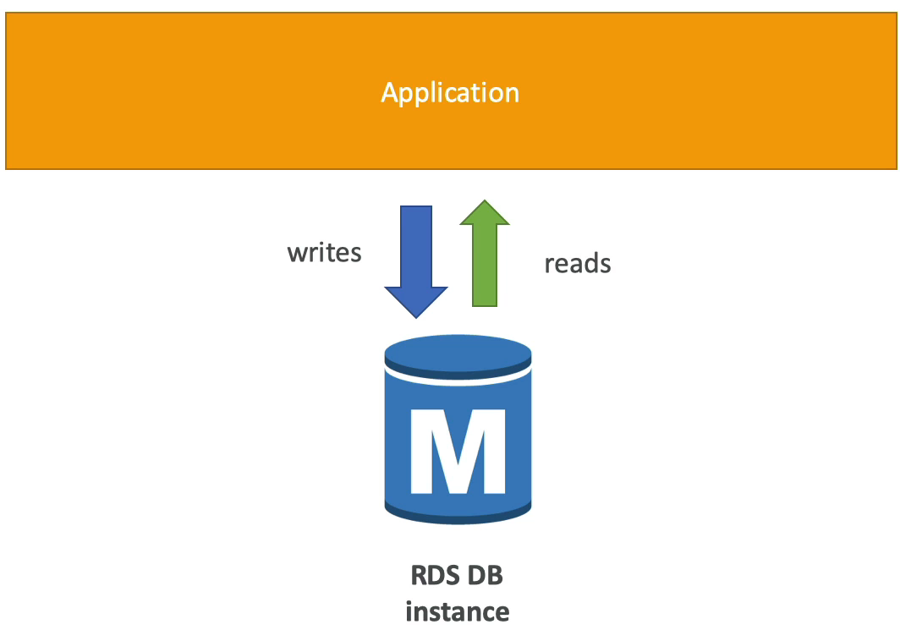
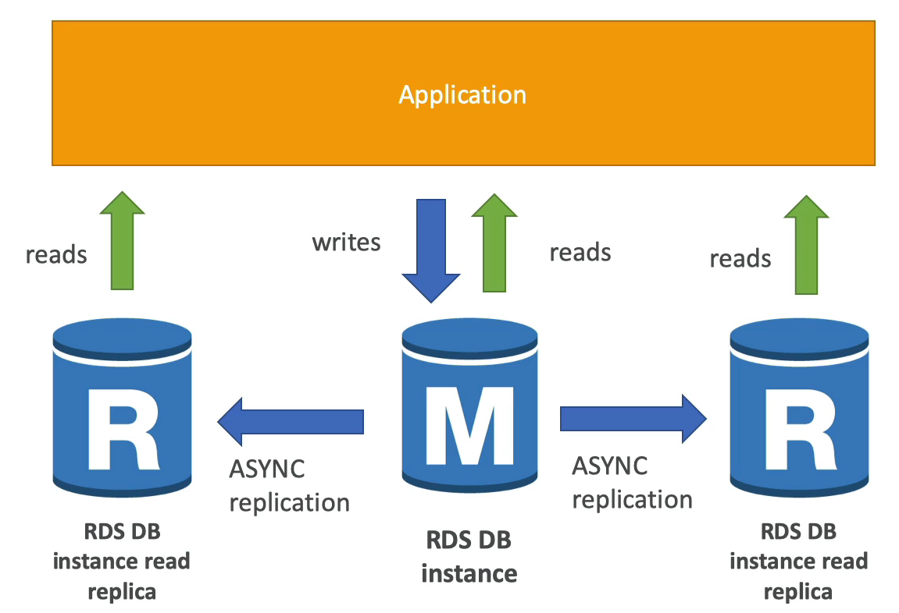
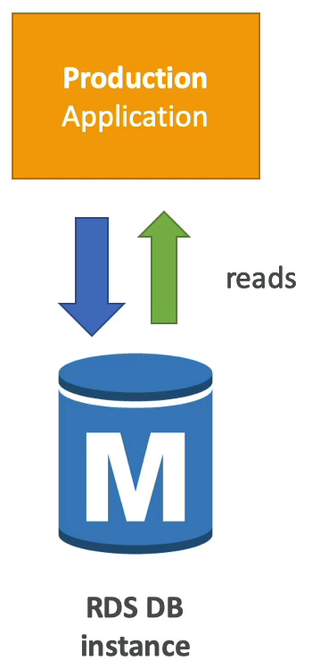
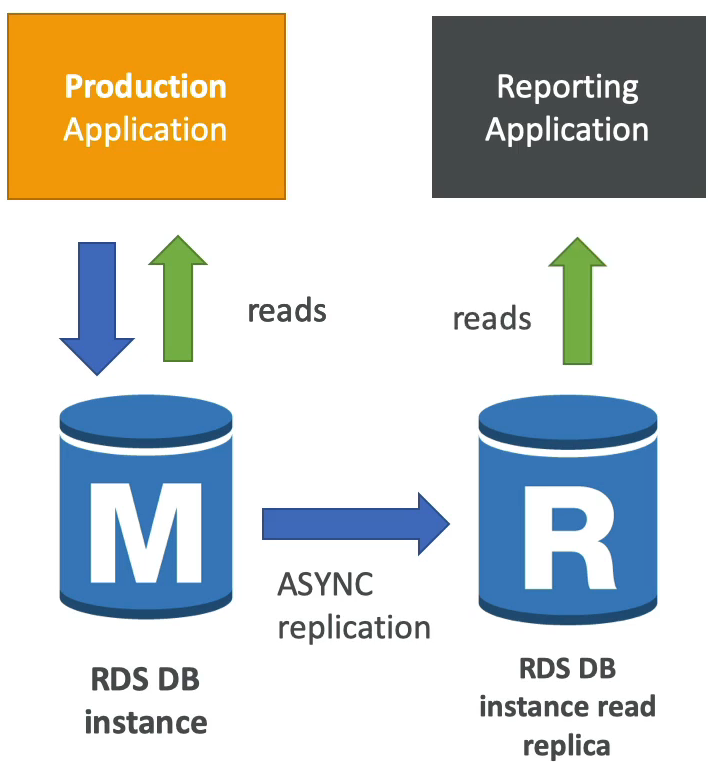
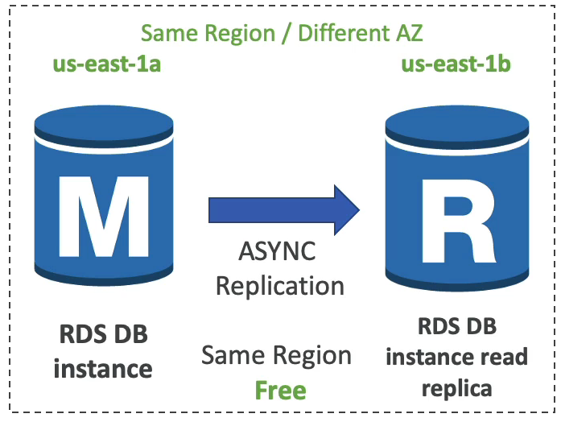
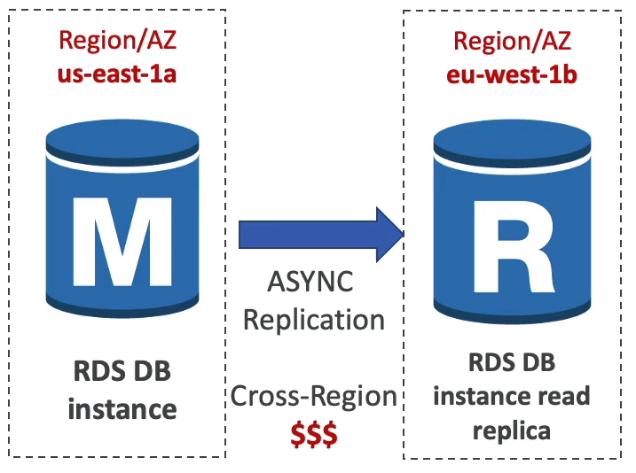
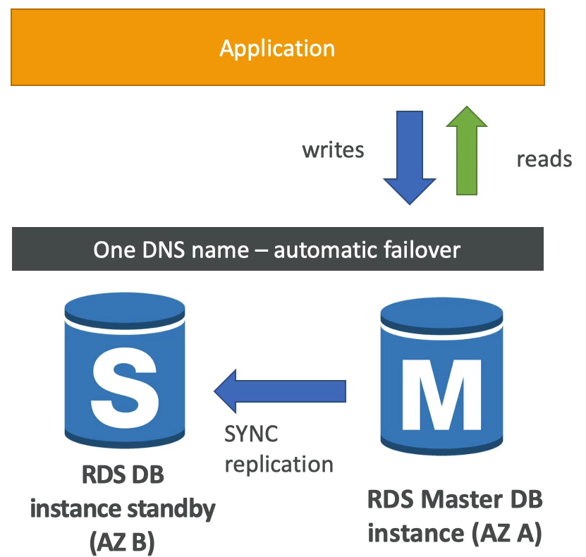

# RDS 읽기 전용 복제본 및 multi AZ

RDS 읽기 전용 복제본 및 multi AZ 둘의 차이를 이해하고 각각의 사용 사례를 제대로 알아놔야 한다.

### RDS Read Replicas fos read scalabilty

이름 그대로 읽기에 특화된 데이터베이스 복제본을 만드는 것이다.

예를 들어 애플리케이션과 RDS 데이터베이스 인스턴스가 있다.

애플리케이션은 데이터베이스 인스턴스에 대해 읽기와 쓰기를 수행한다.

데이터베이스 인스턴스가 너무 많은 요청이 쏠려서 스케일링이 필요로 하다.

특히, 읽기에 해당하는 요청이 너무 많아 읽기만 전용으로 처리해주는 인스턴스가 필요로 한 경우에 읽기 전용 복제본을 만들면 된다.

읽기 전용 복제본은 최대 5개 까지 생성할 수 있으며 동일한 가용 영역 뿐만 아니라 다른 가용 영역에도 생성할 수 있다.

두 개의 읽기 전용 복제본을 만들었다고 가정한다.

두 개의 읽기 전용 복제본과 원본 사이에 비동기식(ASYNC) 복제가 발생한다. 

해당 복제본을 데이터베이스로 승격시켜 사용할 수 있다. 즉, 복제본 중 하나를 데이터베이스로 사용하고 싶으면 권한을 얻어 데이터베이스로 승격시킬 수 있다는 뜻이다.

승격된 녀석은 복제본에서 완전 탈피하게 된다.

### 사용처

읽기 전용 복제본의 흔한 사례를 알아보자

일반적인 로드(트래픽)를 갖는 데이터베이스 인스턴스가 있다. Production 애플리케이션과는 읽기 및 쓰기 작업이 수행되고 있다.

이 때, Reporting 애플리케이션이 데이터베이스 인스턴스의 데이터를 기반으로 몇 가지 분석을 하려고 한다.

Reporting 애플리케이션을 데이터베이스 인스턴스에 연결을 하면 오버로드가 발생하고 Production 애플리케이션의 속도가 느려질 것이다.

이를 막기 위해서 새로운 워크로드에 대한 읽기 전용 복제본을 생성하는 것이다.

읽기 전용 복제본을 생성하면 원본 데이터베이스 인스턴스와 비동기식 복제가 이뤄져서 읽기 전용 복제본은 항상 원본과 같은 데이터를 갖게 된다.

그 다음 Reporting 애플리케이션은 읽기 전용 복제본에서 데이터를 읽어들여 분석을 하게 된다.

읽기 전용 복제본은 항상 SELECT 명령문만 사용한다.

### Network Cost(네트워크 비용)

AWS 에서는 하나의 가용 영역에서 다른 가용 영역으로 데이터가 이동할 때 비용이 발생한다.

하지만 RDS 읽기 전용 복제본을 사용할 때는 비용이 들지 않는다.

정확히 말하자면 us-east-1a 에 원본 데이터베이스 인스턴스가 있고 us-east-1b 에 읽기 전용 복제본이 있을 경우 이 때는 비용이 들지 않는다는 뜻이다. (Same Region, Different AZ)

아예 다른 Region 일 경우에는 비용이 발생한다.

### Multi AZ

Multi AZ 의 경우 주로 재해 복구에 사용되는 기능이다.

A 가용 영역에 데이터베이스 인스턴스가 존재하고 해당 인스턴스를 동기식(SYNC)으로 B 가용 영역에 스탠바이 인스턴스로 복제한다.

이는 애플리케이션의 마스터 데이터베이스에 쓰이는 모든 변경 사항이 스탠바이 인스턴스에도 그대로 복제된다는 뜻이다.

즉, 하나의 DNS 이름을 가져 애플리케이션 또한 하나의 DNS 이름으로 통신하여 원본 데이터베이스에 문제가 생길 때에도 스탠바이 데이터베이스에 자동으로 장애 조치가 수행된다.

그 이유는 바로 하나의 DNS 이름을 갖기 때문이다!!

이런 식으로 가용성을 높일 수 있기 때문에 다중 AZ 라고 불린다.

전체 AZ 또는 네트워크가 손실될 때 대비한 장애 조치이면서 원본 데이터베이스 인스턴스나 스토리지에 장애가 발생했을 때 스탠바이 데이터베이스가 새로운 원본 데이터베이스가 될 수 있도록 조치를 취하는 것이다.

따로 앱에 수동으로 조치를 취할 필요가 없고, 자동으로 데이터베이스에 연결이 되고 스탠바이 데이터베이스가 자동으로 원본 데이터베이스로 승격이 된다.

스탠바이 데이터베이스는 어떤 유저도 읽거나 쓰기가 불가능하다. 원본 데이터베이스에 문제가 발생할 경우를 대비한 장애 조치일 뿐이다.

이런 경우도 있다. 읽기 전용 복제본을 다중 AZ로 설정할 수도 있다.

단일 AZ에서 다중 AZ로 전환할 때는 데이터베이스를 중지할 필요가 없고 데이터베이스 옵션에서 다중 AZ 기능을 활성화 시키기만 하면 된다.