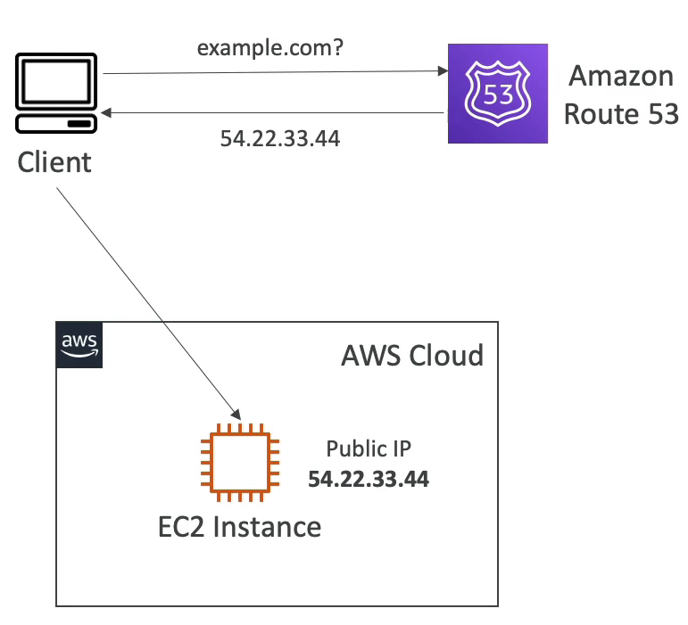
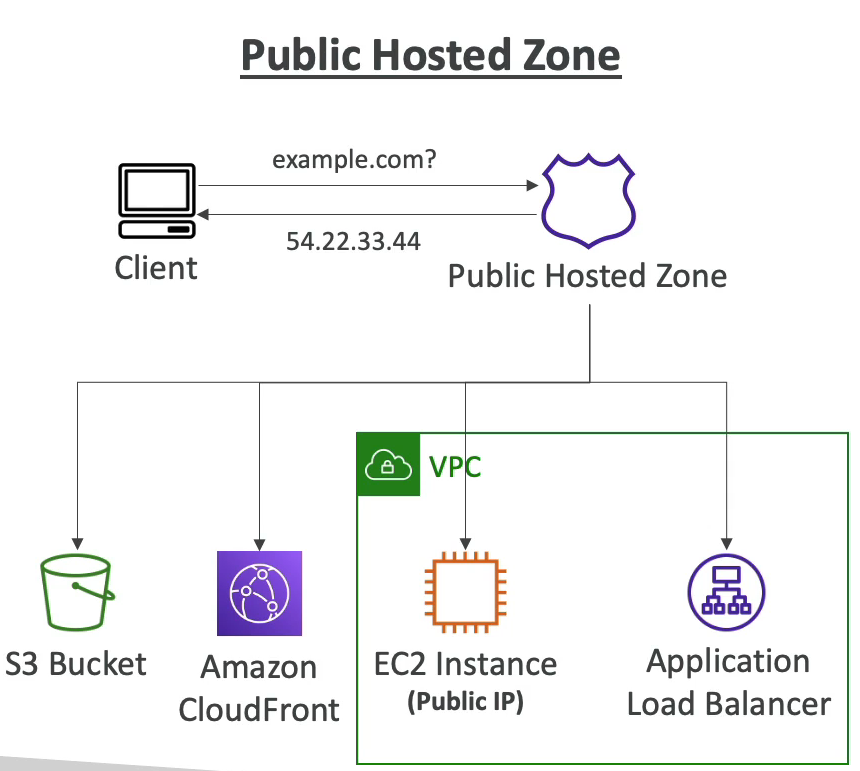
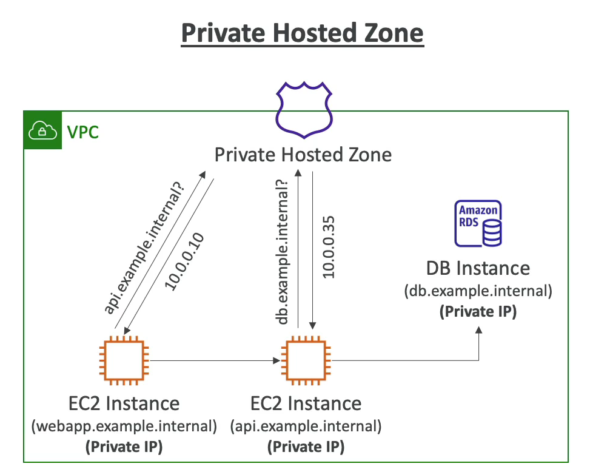

# Amazon Route 53 개요

Route53 은 고가용성, 확장성을 갖추고 사용자들이 DNS 레코드를 업데이트할 수 있는 서비스이다.

즉, DNS 를 완전하게 제어할 수 있다는 뜻이다.

### 예시

예를 들어, 클라이언트가 있고 클라이언트가 EC2 인스턴스 example.com 에 접근하려고 한다.

그러나 지금은 EC2 인스턴스에는 public IP, 54.22.33.44 만 있는 상태이다.

클라이언트가 example.com 에 접근을 하면 DNS 레코드를 아마존 Route 53의 호스팅 존에 write 하려고 한다.

그러면 Route53 에서 IP 54.22.33.44 를 찾는 중이라고 응답한다.

클라이언트는 바로 EC2 인스턴스에 접근을 하고 Route 53 은 Domain Registrar 이기 때문에 해당 주소의 대응되는 도메인 이름을 example.com 으로 등록한다.

100% SLA 가용성을 제공하는 유일한 AWS 서비스이다.

### 왜 Route 53 이라고 불리지..? 

- 53은 DNS 서비스 즉, 이름에서 사용되는 전통적인 DNS 포트이다. Route 53 에서 여러 DNS 레코드를 정의하고 레코드를 통해 특정 도메인으로 라우팅하는 방법을 정의한다.
- 각 레코드는 도메인이나 example.com 과 같은 서브 도메인 이름과 같은 정보를 포함한다.
  - A or AAAA 와 같은 레코드 종류가 존재
  - 레코드의 값은 123.456.789.123 과 같은 값을 같는다.
  - 라우팅 정책은 Route 53 이 쿼리에 응답하는 방식이다.
  - TTL 은 DNS 리졸버에서 레코드가 캐싱되는 시간이다. Time To Live 라고 부른다.
- Route 53 에서 지원하는 DNS 레코드 종류는 많다.
  - 반드시 알아야 하는 것들로는 A, AAAA, CNAME, NS 가 있다.
  - 고급 레코드들도 있다. CAA, DS, MX, NAPTR, PTR, SOA, TXT, SPF, SRV 가 있다.

### Route 53 의 레코드 종류

- A 레코드 : 도메인 이름을 IPv4 IP 주소에 라우팅한다. 예를 들어, example.com 은 1.2.3.4 로 바로 연결된다.
- AAAA 레코드 : 도메인 이름을 IPv6 IP 주소에 라우팅한다.
- CNAME 레코드 : 도메인 이름을 다른 도메인 이름에 라우팅한다. 
  - 대상이 되는 호스트 이름은 A 나 AAAA 레코드가 될 수 있다. 
  - Route 53에서 DNS 이름 공간의 상위 노드에 대해 CNAMES 를 생성할 수 없다.
  - 예를 들어, example.com 에 CNAME 을 만들 수는 없지만 wwww.example.com 에 대한 CNAME 레코드는 만들 수 있다.
- NS 레코드 : Name Servers for the Hosted Zone 으로 호스팅 존의 Name 서버이다. 
  - 호스팅 존에 대한 DNS 쿼리에 응답할 수 있다.
  - 트래픽이 도메인으로 라우팅 되는 방식을 컨트롤 할 수 있다.

### Hosted Zones

- 호스팅 존이란 레코드의 컨테이너로 도메인과 서브도메인으로 가는 트래픽의 라우팅 방식을 정의한다.
- 호스팅 존에는 두 가지 종류가 있다.
  - Public Hosted Zones
    - 특정 도메인(예: example.com)과 그 하위 도메인(acme.example.com, zenith.example.com)의 트래픽을 인터넷에서 라우팅하는 방식에 대한 정보를 담고 있는 컨테이너이다. 
    - Route 53에 도메인을 등록하면 호스팅 영역이 자동으로 생성된다.
    - 기존 도메인에 대한 DNS 서비스를 Route 53로 전송하는 경우 도메인에 대한 호스팅 영역 생성부터 시작한다.
  - Private Hosted Zones
    - Amazon VPC 서비스로 생성한 하나 이상의 VPC 내에 있는 도메인과 그 하위 도메인에 대하여 Amazon Route 53의 DNS 쿼리 응답 정보가 담긴 컨테이너이다.
    - 회사 내부에서만 접근할 수 있는 비공개 URL 이 필요로 할 때 사용한다.
    - 비공개 URL 이기 때문에 private DNS 레코드가 존재한다.
- AWS 에서 호스팅 존을 일단 만들면 월 500원을 내야 한다. 무료가 아니다!
- 도메인 이름을 등록하면 일 년에 최소 1300원 정도를 지불해야 한다.

### Public Hosted Zones vs Private Hosted Zones

퍼블릭 호스팅 존은 클라이언트로부터 온 쿼리에 응답을 할 수 있다.

웹 브라우저에서 example.com 을 요청하면 Route 53 이 해당하는 IP 주소를 리턴해준다.

프라이빗 호스팅 존의 경우 VPC 에서만 작동을 하고 비공개 도메인 명의 프라이빗 리소스를 식별할 수 있게 해준다.

예를 들어 EC2 인스턴스가 webapp.example.internal 이라는 도메인 명을 갖는다.

또 다른 EC2 인스턴스가 api.example.internal 도메인 명을 갖는다.

데이터베이스 인스턴스가 db.example.internal 도메인 명을 갖는다.

프라이빗 호스팅 존에는 현재 VPC 망 안에 존재하는 모든 private IP 들을 갖고 있는 상태이다.

그래서 webapp.example.internal 인스턴스가 api.example.internal 의 도메인 명을 쿼리하면 프라이빗 호스팅 존은 해당 도메인의 private IP 주소인 10.0.1.0 을 리턴해준다.

api.example.internal 인스턴스가 db.example.internal 의 도메인 명을 쿼리하면 프라이빗 호스팅 존은 해당 도메인의 private IP 주소인 10.0.0.35 를 리턴해준다.

그래서 각각의 인스턴스들에 보안 그룹 인바운드 규칙을 설정해놓으면 각각의 인스턴스에 서로 접근을 할 수 있다.

### Public/private Hosted Zones 정리 

퍼블릭 호스팅 존과 프라이빗 호스팅 존은 똑같이 동작하지만 퍼블릭 호스팅 존의 경우에는 누구나 내 레코드를 쿼리할 수 있다는 것이고, 프라이빗 호스팅 존은 VPC 내부에서 private IP 주소를 갖는 녀석들끼리 레코드를 쿼리할 때 사용한다는 점이다.