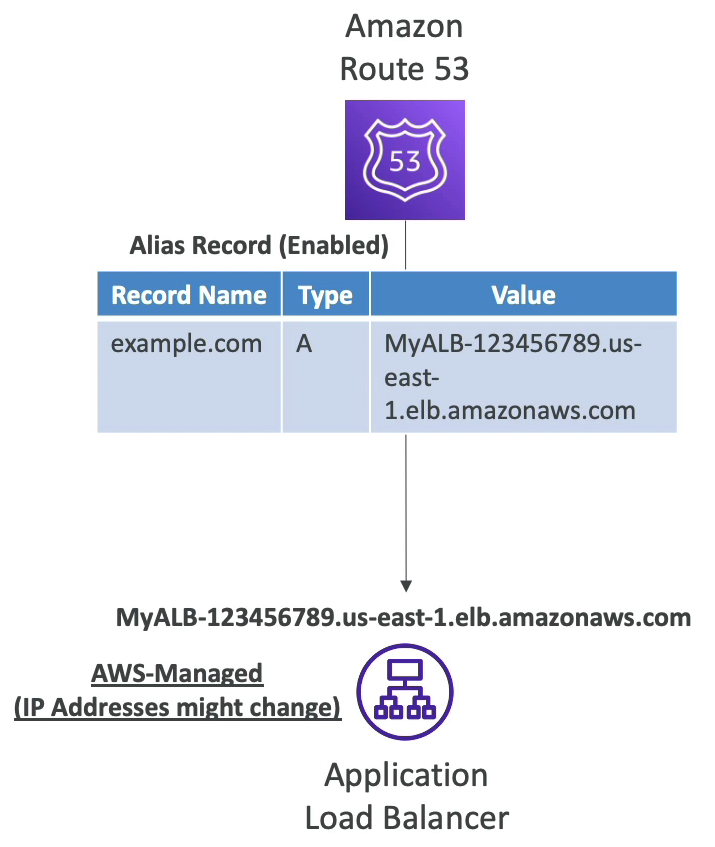

### CNAME vs Alias

### CNAME 과 별칭 레코드의 차이에 대해 알아보자.

- AWS 의 리소스(로드 밸런서, CloudFront...)를 사용하는 경우에 호스트 이름이 노출된다.
  - 보유한 도메인에 호스트 이름을 맵핑할 수 있다. 즉, myapp.example.com 을 로드 밸런서에 맵핑하는 것.
- CNAME : 호스트 이름이 다른 호스트 이름으로 라우팅 될 수 있다.
  - 예를 들어, app.example.com 도메인이 test.anything.com 으로 향할 수 있다.
  - 루트 도메인 이름이 아닌 경우에만 가능해서 example.com 앞에 뭔가가 붙어있어야 한다. 여기서는 app 이 붙어있다. 즉, example.com 은 CNAME 레코드를 사용하지 못한다. 
- Alias : 호스트 이름이 특정 AWS 리소스(로드 밸런서, CloudFront)로 라우팅 될 수 있다.
  - 별칭 레코드는 루트 및 비루트 도메인 모두 작동한다. example.com 을 별칭 레코드를 사용하여 AWS 리소스로 향하도록 할 수 있다. 아주아주 유용하다.
  - 무료이다.

### Alias Records(A 레코드)

- 오직 AWS 리소스에만 맵핑이 된다.
- 예를 들어, Route 53 에서 example.com 을 A 레코드를 사용하여 해당 레코드 명이 로드 밸런서의 DNS 이름(로드 밸런서의 도메인 이름)으로 지정한다. 만약 로드 밸런서의 IP 주소가 변결된다면 A 레코드는 바로 변경사항을 캐치한다.
- CNAME 과 달리 별칭 레코드는 Zone Apex 라는 DNS 네임스페이스의 상위 노드로 사용될 수 있다. example.com 에도 별칭 레코드를 사용할 수 있다는 뜻이다.
- AWS 리소스를 위한 별칭 레코드의 타입은 항상 A 또는 AAAA 인데, 리소스는 IPv4나 IPv6 둘 중 하나이다.
- 별칭 레코드를 사용하면 TTL 을 설정할 수 없다. Route 53 에 의해 자동으로 설정된다.

### Alias Records Targets(A 레코드 대상)

별칭 레코드의 대상은 누가 될 수 있을까?

- Elastic Load Balancer
- CloudFront Distributions
- API Gateway
- Elastic Beanstalk environments
- S3 버킷은 안되지만 버킷들이 웹사이트로 활성화 되는 S3 웹사이트는 가능하다.
- VPC Interface Endpoints
- Global Accelerator accelerator
- 동일한 호스트 존의 Route 53
- EC2 DNS 이름에 대해서는 별칭 레코드를 설정할 수 없다!!!! EC2 DNS 이름은 별칭 레코드의 대상이 아님!
