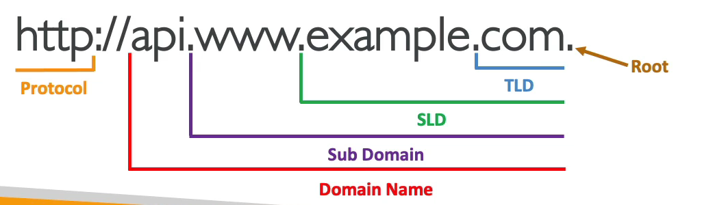
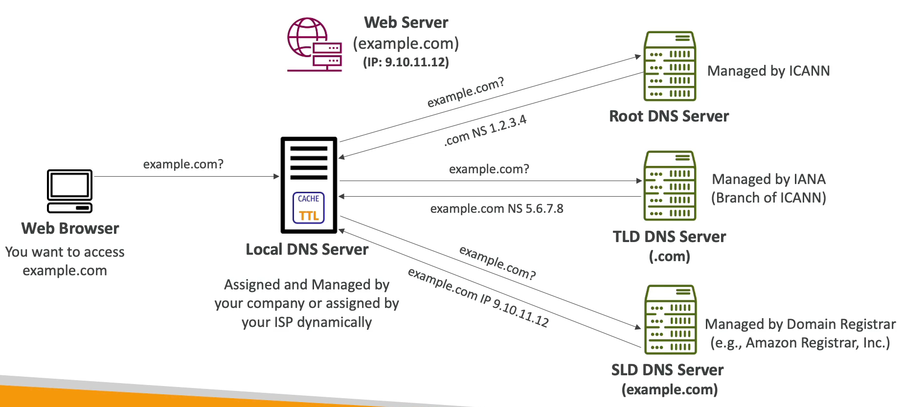

# DNS 개요

DNS 는 Domain Name System 으로 호스트 네임을 IP 주소로 번역해주는 시스템이다.

예를 들어 웹 브라우저에 www.google.com 을 입력하면 해당 도메인 명을 해석하여 172.217.18.36(예시) 라는 IP 주소를 준다.

DNS 는 인터넷의 중추로 URL 과 호스트 이름을 IP 주소로 변환해주는 친구다.

DNS 에는 계층적 이름 구조를 갖는다.

www.google.com 의 근원에는 .com 이 있고, 좀 더 정확하게 example.com 이 있다. 그리고 www.example.com

다시 나열해 보자면

```
           .com
     google.com
wwww.google.com
```

위 처럼 3가지 계층으로 구성된 것을 알 수 있다.

### DNS 용어

- Domain Registrar : Amazon Route 53, GoDaddy 등...구매한 도메인 명을 등록하는 곳이다.
- DNS Records : A, AAAA, CNAME, NS 등...
- Zone File : 모든 DNS 레코드를 포함하는 zone file 로 호스트 명과 IP 주소를 일치시키는 방법이다.
- Name Server : DNS 쿼리를 실제로 처리하는 서버다.
- Top Level Domain(TLD) : .com, .us, .in, .gov, .org 등... 최상위 도메인이다.
- Second Level Domain(SLD) : amazon.com, google.com, naver.com 등... 단어 사이에 . 이 있는 것을 볼 수 있다.
- FQDN : 예시를 들어보자면 http://api.www.example.com. 이 있는데 마지막의 . 을 루트라고 하고, .com 은 최상위 도메인(TLD) 이고, example.com 이 세컨드 도메인이고, www.example.com 이 서브 도메인이고, api.www.example.com 이 도메인 이름이다. HTTP 는 프로토콜이고, 전부 합친 것을 FQDN 이라 부른다.


### DNS 동작



example.com, IP는 9.10.11.12 를 갖는 웹 서버가 있다.

해당 도메인 명인 example.com 으로 접근을 하기 위해서는 DNS 용 서버에 해당 도메인을 등록해야 한다.

그래서 웹 브라우저에서 example.com 의 ip 주소를 아는지 로컬 DNS 서버에 묻는다. 로컬 DNS 서버는 보통 회사에 의해 할당되고 관리되거나 인터넷 서비스 제공자에게 동적으로 할당된다.

로컬 DNS 서버가 이 쿼리를 전에 본적이 없다면 ICANN 에 관리되는 ROOT DNS 서버에 example.com 주소를 아는지 묻는다.

그건 모르겠는데 .com 은 아는데요? 거기로 일단 연결해드릴게요 하고 보내준다.

.com 은 Name Server 레코드로 1.2.3.4 IP 주소로 가보라고 알려준다.

로컬 DNS 는 .com 도메인의 주소를 알고 있기 때문에 로컬 DNS 서버가 최상단 도메인(TLD)인 .com 도메인 서버에게 쿼리의 답을 요청한다.

로컬 DNS 서버는 IANA 에 관리되는 TLD DNS Server 에게 example.com 을 물어본다.

그러나 TLD DNS Server 는 example.com 이 뭔지 몰라서 답을 줄 수는 없지만 example.com 이라는 서버는 알고 있다.

그래서 로컬 DNS 서버에게 5.6.7.8 이라는 주소를 넘겨준다.

그러면 로컬 DNS 서버는 Domain Registrar 즉, Amazon Route53, GoDaddy, 가비아에 의해 관리되는 SLD DNS Server 에 example.com 의 주소를 아는지 질의한다.

해당 SLD DNS Server 에는 example.com 에 대한 항목이 존재한다.

example.com 은 A 레코드이고, 이것의 결과 IP 9.10.11.12 를 Local DNS Server 로 보내준다.

Local DNS Server 에는 example.com 의 주소가 저장되어 있고 다른 사람들이 example.com 으로 접속을 하면 바로 주소를 알려줘서 접속을 할 수 있게 한다.

