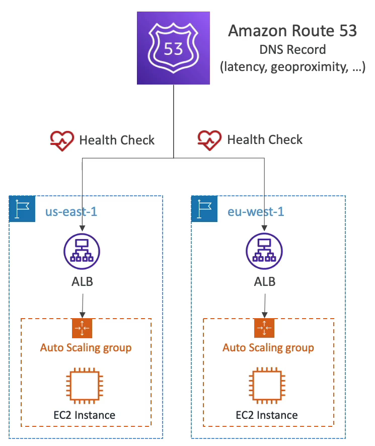
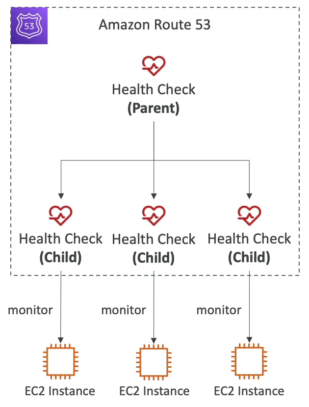
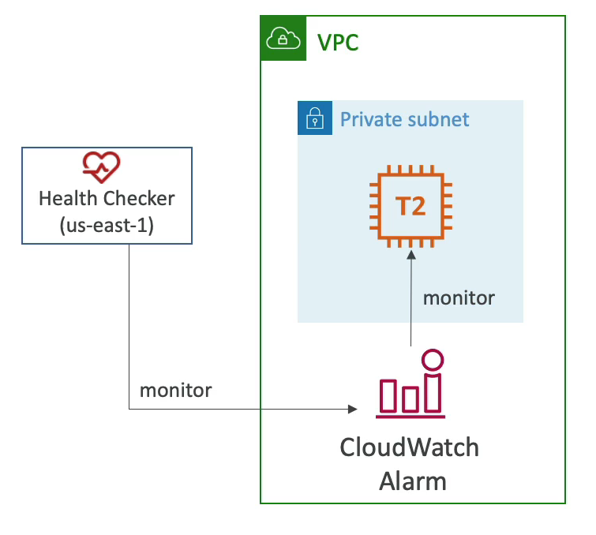

# Health Check

- 상태 확인은 주로 공용 리소스에 대한 상태를 확인하는 방법이다.
- 예를 들어, 서로 다른 두 지역에 각각 하나의 공용 로드 밸런서가 있고 EC2 인스턴스가 하나씩 맵핑되서 작동 중이다.
- Multi region 셋업이다. region 레벨에서 고가용성을 원하는 상황이어서 이처럼 셋팅했다.
- Route 53 을 이용하여 DNS 레코드를 생성한다. 유저가 mydomain.com 고 같은 URL 을 이용해 접속하면 가장 가까운 로드 밸런서로 연결될 것이다.(지연 시간 기반 정책)
- 만약에 한 지역이 사용 불가능한 상태가 되면 그 지역으로는 유저를 보내면 안된다. 그러기 위해서는 Route 53 에서 헬스 체크를 해야 한다.
- 각각의 리전에 헬스 체크를 생성하여 Route 53 과 연결해준다.
- DNS 의 장애 조치를 자동화하기 위한 조치로 세 가지 상태 확인이 가능하다.
  - 공용 엔드 포인트를 모니터링 할 수 있다.
  - 애플리케이션, 서버 혹은 다른 AWS 리소스들의 상태를 모니터링 할 수 있다.
  - CloudWatch 경보를 통해 상태를 모니터링 할 수 있다.
- 각각의 헬스 체크들은 지표를 사용한다.

### Monitor an Endpoint

헬스 체크가 특정 엔드 포인트에서 어떻게 작동할까?

- eu-west-1 리전의 ALB 에 대한 상태 확인을 한다고 하면 AWS 의 상태 확인이 전 세계로부터 올 것이다.
- 대략 15개 정도의 상태 확인이 전 세계로부터 오는데 이 상태 확인들은 내가 루트로 설정한 공용 엔드 포인트로 요청을 보낸다.
- 200 status OK 코드 또는 정상일 때 이런 코드를 보내겠다고 정의한 코드가 오면 리소스는 정상으로 체크된다.
- 전 세계에서 온 15개의 상태 확인이 엔드 포인트의 상태를 확인하고 정상인지 비정상인지 체크를 한다.
- 상태 확인 하는 시간 간격도 설정이 가능하다. 30초 마다 정기적으로 확인할 수도 있고, 그것보다 비용이 좀 더 들지만 10초 마다 확인할 수도 있다.
- HTTP, HTTPS, TCP 등 많은 프로토콜을 지원한다.
- 18% 이상의 상태 확인들이 엔드 포인트를 정상이라고 판단하면 Route 53 도 해당 상태가 정상이라고 체크한다. 그렇지 않으면 비정상으로 체크한다.
- 헬스 체크는 로드 밸런서로부터 2XX 나 3XX 코드를 받아야만 통과과 된다. 
- 상태 확인의 유용한 기능으로 텍스트 기반 응답일 경우 상태 확인은 처음 온 응답의 5120 바이트를 기반으로 정상인지 비정상인지 확인한다. 
- 네트워크 관점에서 아주 중요한 부분으로, 상태 확인의 작동이 가능하려면 상태 확인이 내 애플리케이션이나 로드 밸런서의 엔드 포인트에 접근 가능해야 한다는 점이다. 따라서 Route 53 의 헬스 체크 CIDR 주소에서 들어오는 모든 요청을 허용해야 한다.

### Calculated Health Checks

- 여러 개의 상태 확인 결과를 하나로 합쳐주는 기능이다.
- 예를 들어, EC2 인스턴스가 세 개 있으면 Route 53 에서 헬스 체크를 세 개 생성할 수 있다.
- 이 세 개의 헬스 체크들은 EC2 인스턴스의 상태를 확인해 주는 하위 헬스 체크가 될 것이다.
- 이 하위 헬스 체크를 바탕으로 상위 헬스 체크를 만들 수 있다.
- 하위 헬스 체크들을 합치는 조건 연산자로 OR, AND, NOT 을 사용할 수 있다.
- 하위 헬스 체크 최대 256개 까지 모니터링이 가능하다.
- 상위 헬스 체크를 통과하기 위해 몇 개의 헬스 체크를 통과해야 하는지도 지정할 수 있다.

### Private Hosted Zones

개인 리소스의 헬스 체크는 어떻게 할 수 있을까?

- 개인 리소스를 모니터링 하는 것은 어려울 수 있다.
- 모든 Route 53 의 헬스 체크가 Public Hosted Zones 에 있기 때문이다. 즉, Route 53 의 헬스 체크들은 VPC 바깥에 존재한다.
- 헬스 체크들은 private 엔드포인트에 접근을 할 수 가 없다.(private VPC 나 온프레미스 리소스)
- CloudWatch Metric 을 사용하여 CloudWatch Alarm 을 생성해 헬스 체크가 접근이 안되는 문제를 해결할 수 있다. CloudWatch Metric 을 사용해 private 서브넷 안에 있는 EC2 인스턴스를 모니터링 하는 것이다.
- 지표에서 이상한 점이 발생하면 CloudWatch 알람을 울리게 알람이 울렸으면 자동으로 비정상 상태로 변경된다. 