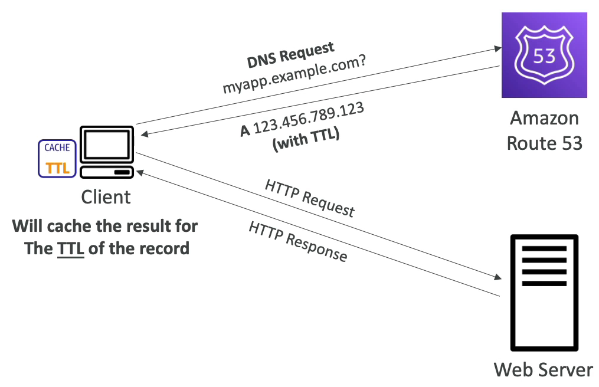

### Records TTL

예를 들어, 클라이언트가 myapp.example.com 도메인 명에 대해 Amazon Route 53 으로 쿼리를 보내면 DNS 로부터 응답을 받게 된다.

응답 내용으로는 A 레코드, 123.456.789.123 이라는 IP 주소, TTL 300 을 받았다.

TTL 300 의 뜻은 300초 동안 해당 쿼리를 DNS 에서 기억하겠다는 뜻이다. 즉, 캐싱하겠다는 뜻.

즉, 해당 클라이언트 같은 호스트 명으로 DNS 에 또 다시 쿼리를 보내지 않아도 300초 동안은 해당 호스트 명의 IP 주소를 기억하고 있어서 바로 이동할 수 있다는 뜻이다.

DNS 서버는 DNS 요청 쿼리를 자주 받는 상황을 원하지 않는다. 왜냐하면 레코드(www, api, test, dev...)는 자주 바뀌지 않기 때문이다.

이미 캐싱된 IP 주소를 통해 웹서버에 접속할 수 있게할 수 있다.

극단적인 예로 TTL 을 24시간으로 설정했다면 Route 53 으로 오는 트래픽의 양은 매우 적을 것이다.

그래서 클라이언트가 DNS 서버로 쿼리를 보내지 않을 것이다. 하지만 만약에 레코드가 중간에 변경되면 문제가 생긴다.

그래서 레코드를 변경하고자 하면 모든 클라이언트들이 새 레코드를 캐시에 저장할 때 까지 24시간 동안 기다려야 된다.

반대로 TTL 을 60초 정도로 짧게 설정한다면 DNS 서버 트래픽 양이 많아져서 비용이 많이 나오게 될 것이다.

Route 53에 들어오는 트래픽 양에 따라 비용이 청구되기 때문이다.

그러나 TTL 이 60초 정도 된다면 레코드의 보관 시간이 짧아져서 변경에 빠르게 대응할 수 있다는 장점이 있다.

어떤 TTL 설정이 더 적합할지는 상황에 따라 다르다.

TTL 은 레코드에게 필수적이다.