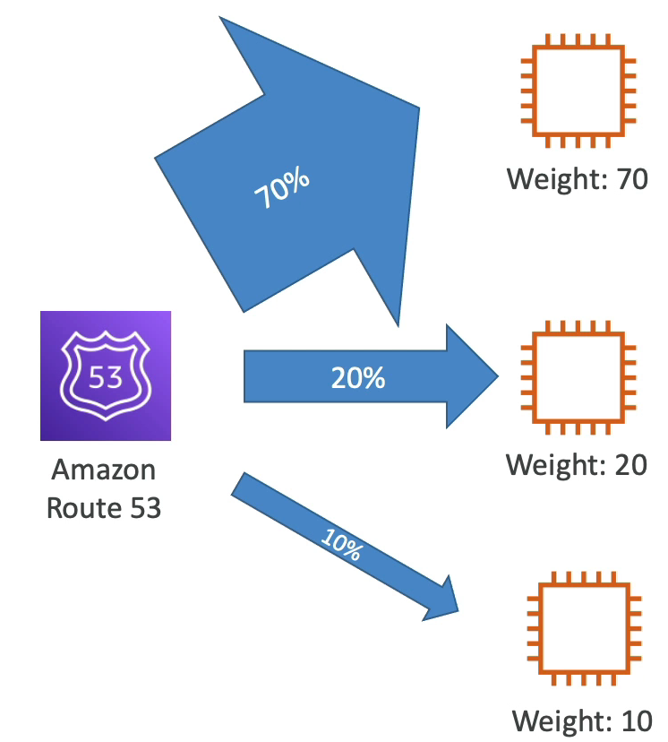

# 라우팅 정책 - 가중치

- 가중치를 활용해 요청의 일부 비율을 특정 리소스로 보내는 식의 제어가 가능하다.
  - 예를 들어, Amazon Route 53 이 있고 EC2 인스턴스 세 개가 있다. 각각의 인스턴스에 70, 20, 10 가중치를 둔다. 가중치의 합이 100이 되는데 실제로 이럴 필요는 없다.
  - Amazon Route 53 에서 오는 DNS 응답의 70%가 가중치 70을 갖는 인스턴스로 리다이렉팅 되고, 20%, 10% 확률로 리다이렉팅 된다는 뜻이다.
  - 각 레코드에 상대적으로 가중치를 할당하는 방식이다.
  - 이렇게 하면 각 레코드로 보내지는 트래픽의 양(%)은 해당 레코드의 가중치를 전체 가중치로 나눈 값이 된다.
- 가중치 정책을 사용할 경우 DNS 레코드들은 동일한 이름과 유형을 가져야 한다.
- 헬스 체크도 가능하다.
- 주로 서로 다른 지역(Region)들에 걸쳐서 로드 밸런싱을 할 때나 적은 양의 트래픽을 보내 새 애플리케이션을 테스트하는 경우에 사용된다. 가중치를 0으로 두면 특정 리소스에 트래픽을 보내는 것이 중단된다.
- 만약 모든 리소스에 가중치가 0일 경우에는 모든 리소스가 동일한 가중치를 가지게 된다.