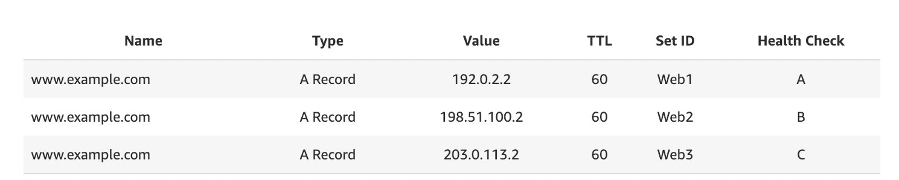

# 라우팅 정책 - 다중값 응답

- 트래픽을 다중 리소스로 라우팅할 때 사용하는 정책이다.
- Route 53이 DNS 쿼리에 대해 다수의 값(예: 웹 서버의 IP 주소)을 반환하도록 구성할 수 있다.
- 다중값은 거의 모든 레코드에 대해 지정할 수 있지만, 다중값 응답 라우팅을 사용하면 각 리소스의 상태를 확인할 수도 있으므로 Route 53은 정상 리소스(헬스 체크를 통과)의 값만 반환한다.
- 로드 밸런서를 대체하는 것은 아니지만, 다수의 상태 확인 가능한 IP 주소를 반환하는 기능은 DNS를 사용하여 가용성 및 로드 밸런싱을 개선하는 한 방법이다.
- 다중 값 쿼리에 최대 8개의 정상 레코드가 반환된다.
- 클라이언트 측의 로드 밸런싱이라고 볼 수 있다.

### 예시

www.example.com 에서 Multi-Value 정책으로 A 레코드를 설정했다.

클라이언트에서 Multi-Value 쿼리를 실행하게 되면 최소 1개에서 최대 8개의 레코드를 반환받게 되는데 그 중에 하나를 클라이언트가 고른다.

반환된 모든 레코드들은 헬스 체크에서 정상 상태인 레코드들이다. 안전한 쿼리인 것.

이래서 클라이언트 측의 로드 밸런싱이라고 볼 수 있는 것이다.

만약 단순 라우팅 정책이었을 경우에는 반환된 레코드가 비정상일 가능성이 있지만 Multi-Value 정책에서는 반환되는 레코드가 모두 정상이다.