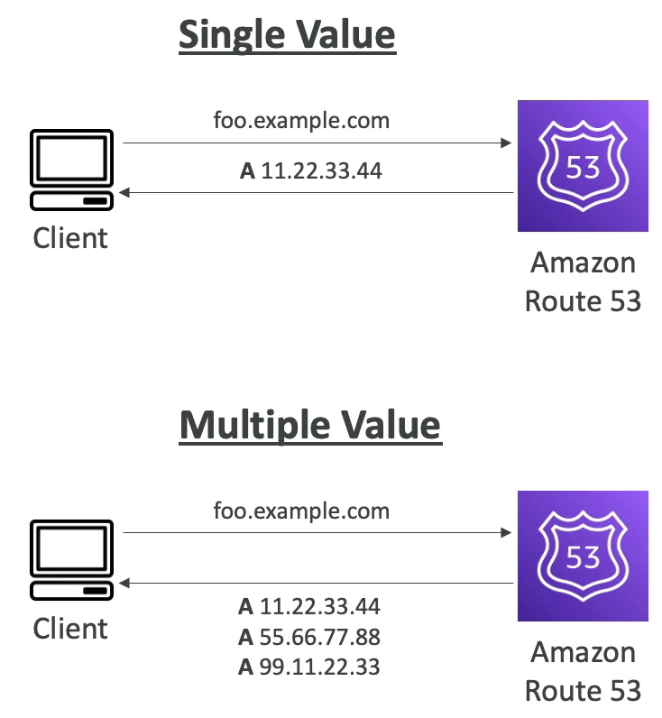

# 라우팅 정책 - 단순(Simple)

- 라우팅 정책은 Route 53 이 DNS 쿼리에 응답하는 것을 돕는다.
- 여기서 말하는 라우팅은 로드 밸런서가 트래픽을 EC2 인스턴스로 라우팅하는 것과는 다르다.
  - 여기서의 라우팅은 DNS 관점에서의 라우팅이다. DNS 는 트래픽을 라우팅하지 않는다. 트래픽은 DNS 를 통해 다른 곳으로 흩뿌려지지 않는다.
  - DNS 는 DNS 쿼리에만 응답하게 되고 클라이언트들은 이를 통해 HTTP 쿼디 등을 어떻게 처리해야 하는지 알 수 있게 되는 것이다.
  - 즉, DNS 는 호스트 이름들을 클라이언트가 실제 사용 가능한 엔드 포인트로 변환하는 것을 돕는다.
- Route 53 이 지원하는 라우팅 정책은 다음과 같다.
  - Simple
  - Weighted
  - Failover
  - Latency Based
  - Geolocation
  - Multi-Value Answer
  - Geoproximity

### Simple 라우팅 정책

- 일반적으로 트래픽을 단일 리소스로 보내는 방식이다.
  - 예를 들어, 클라이언트가 foo.example.com 으로 가고자 할 때 Route 53 이 A 레코드, 11.22.33.44 IP 주소를 응답하여 보내준다.(Single Value)
- 동일한 레코드에 여러 개의 값(IP 주소, 레코드, TTL 등..)을 지정하는 것도 가능하다.
- DNS 에 의해 여러 개의 값을 받은 경우에는 클라이언트가 그 중 하나를 랜덤하게 고르게 된다.(Multi Value)
  - 예를 들어, 클라이언트가 foo.example.com 으로 가고자 할 때 Route 53 이 A 레코드에 맵핑된 세 개의 IP 주소를 응답하여 보내준다. 그럼 클라이언트가 셋 중 하나를 골라서 라우팅에 적용한다.
- 헬스 체크(상태 확인)은 할 수 없다.

