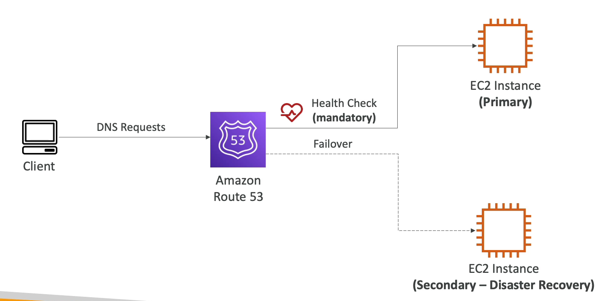

# 라우팅 정책 - 장애 조치(Failover)

Failover 정책은 장애 조치에 관한 정책이다.

마스터 EC2 인스턴스와 재해 복구용 EC2 인스턴스, Route 53 이 있다고 가정한다.

헬스 체크와 기본 레코드를 연결하고 헬스 체크를 했는데 상태가 비정상일 경우에 Route 53은 자동으로 재해 복구용 EC2 인스턴스로 라우팅을 하는 장애 조치를 취한다.

클라이언트가 보낸 DNS 요청은 Route 53 에서 헬스 체크를 하여 정상 상태로 여겨지는 리소스를 응답해준다.

정리하자면, 주 인스턴스와 재해 복구용으로 만든 보조 인스턴스가 있고 Route 53 이 헬스 체크를 통해 주 인스턴스에 상태가 비정상인 것을 체크했으면

Failover 정책에 의해 보조 인스턴스를 주 인스턴스로 처리해준다. 그래서 Route 53에 해당 도메인 명으로 DNS 요청이 들어왔을 경우에 상태가 비정상인 주 인스턴스 대신 보조 인스턴스의 IP 주소를 클라이언트에게 반환해주는 것이다.

매우 쉬운 정책이다.