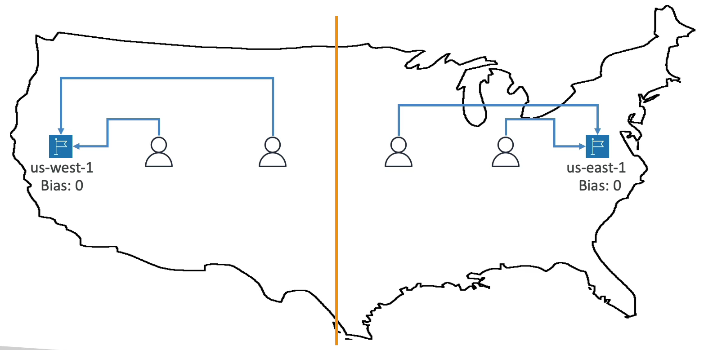
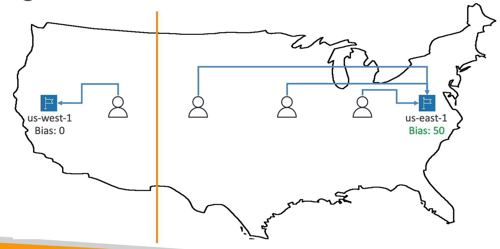

# 라우팅 정책 - 지리 근접

사용자와 리소스의 지리적 위치를 기반으로 트래픽을 라우팅해준다.

이 정책을 사용하여 특정 위치에 트래픽이 쌓이는 정도를 확인할 수 있다.

특히, 해당 정책에서는 바이어스라고 하는 값을 지정하여 해당 리소스로 라우팅하는 트래픽의 양을 늘리거나 줄일 수도 있다.

바이어스는 트래픽이 리소스로 라우팅되는 지리적 리전의 크기를 확장하거나 축소한다.

리소스에 트래픽을 줄이려면 바이어스를 음수로 축소시키면 된다.

리소스는 AWS 서비스가 될 수도 있고 온프레미스 환경이 될 수도 있다. 만약 AWS 리소스가 아니라 온프레미스 리소스일 경우에는 위도와 경도를 입력해줘야 한다.

지리 근접 라우팅을 사용하려면 Route 53 트래픽 흐름(traffic flow)을 사용해야 한다.

us-west-1, us-east-1 리소스가 있다. 각 리전의 바이어스는 0으로 설정됐다.

미국 전역의 사용자들이 해당 리소스에 접근을 할 때 us-west-1 에 가까운 사용자들은 해당 리소스로 접근하고 us-east-1 리소스에 가까운 사용자들은 해당 리소스 접근을 한다.

바이어스 값이 0이기 때문에 어느 한쪽으로 편향되지 않은 것이다.

만약, us-west-1 의 바이어스가 0 이고 us-east-1 의 바이어스가 50일 때 예를 들어보자.

바이어스가 많은 쪽 리소스로 사용자가 몰리게 되고 트래픽이 발생하게 된다.

왜냐하면 바이어스 값이 us-east-1 에서 더 많기 때문에 해당 리소스로 사용자가 편향되는 것이다.

***

정리하자면 특정 리전의 Bias 값을 증가시키면 더 많은 사용자가 접속하게 되고 트래픽이 쏠리게 된다.

시험 문제 대비해서 기억할 것은 지리 근접 라우팅은 편향을 증가시켜 한 리전에서 다른 리전으로 트래픽을 보낼 때 유용하다는 점이다.