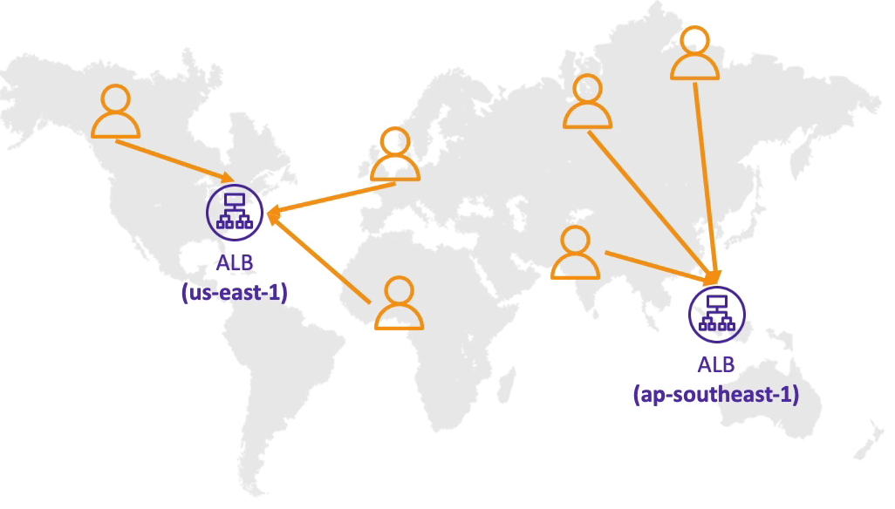

# 라우팅 정책 - 지연 시간(Latency based)

- 지연 시간이 가장 짧은, 즉 가장 가까운 리소스로 리다이렉팅을 하는 정책이다.
- 지연 시간에 민감한 웹사이트나 애플리케이션이 있는 경우에 아주 유용한 정책이다.
- 지연 시간은 유저가 레코드로 가장 가까운 식별된 AWS 리전에 연결하기 까지 걸리는 시간을 기반으로 측정된다.
- 예를 들어, 유저가 독일에 있고 미국에 있는 리소스의 지연 시간이 가장 짧다면, 해당 유저는 미국 리전으로 리다이렉팅 된다.
- 상태 확인 연결이 가능하다.
- 두 개의 다른 리전, ap-southeast-1 과 us-east-1 에 애플리케이션을 배포 한다. 유저들은 세계 각지에 있고 Route 53 이 지연 시간을 측정한 뒤 지연 시간이 가장 짧은 가까운 거리의 유저들을 각각의 리전으로 연결시켜준다.

