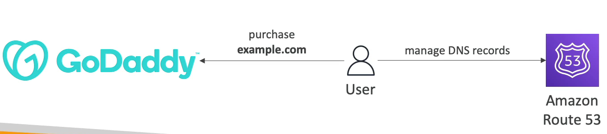
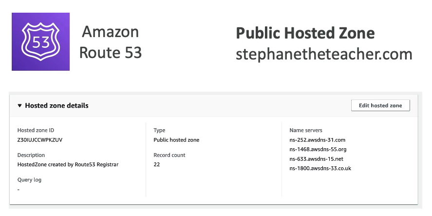

# 타사 도메인 및 Route 53

### Domain Registar vs DNS Service

도메인 이름 레지스트라와 DNS 서비스를 구별해보자.

도메인 이름 레지스트라를 통해 원하는 도메인 이름을 구매할 수 있고 매년 비용을 지불하여 사용할 수 있다.

Amazon Route 53 레지스트라 외에도 가비아, GoDaddy, Google 도메인 등이 있다.

레지스트라를 통해 도메인을 등록하면 DNS 레코드 관리를 위한 DNS 서비스를 제공한다.

그래서 Amazon 호스트 이름으로 도메인 이름을 등록했다면 자동으로 Route 53에서 DNS 레코드 관리를 위한 호스팅 존을 갖는다.

반대로 Route 53 에서 도메인 이름을 구입하지 않고 그 외 사이트에서 example.com 이라는 도메인 이름을 구매했다고 가정하자.

해당 도메인을 Route 53 에서 DNS 레코드로써 관리를 하면 된다.

레지스트라에서 도메인을 구매하면 NS 라는 Name Server 옵션이 생기는데 해당 옵션에 Route 53 에 등록한 호스팅 영역의 NS 를 입력하면 된다.

먼저, Amazon Route 53 에서 구매한 도메인 이름으로 public 호스팅 영역을 생성한다.

호스팅 영역에서 레코드들을 살피면 위와 같이 레코드 타입이 NS 인 녀석이 보이고 Name Servers 로 4개가 있는 것을 확인할 수 있다.

해당 네임 서버를 복사하여 도메인을 구매한 레지스트라에서 도메인의 NS 에 붙여넣어 주면 된다.

그러면 해당 도메인에 대한 쿼리의 Name Server 가 Amazon Route 53 의 이름 서버를 가리키게 된다.

***

정리하자면 도메인을 Route 53 외에서 구매해도 DNS 서비스 제공자로써 Route 53 을 사용할 수 있다.

사용하려면 Route 53에서 공용 호스팅 영역을 생성한 뒤 도메인을 구매한 사이트에서 도메인의 NS(Name Server)를 Route 53 호스팅 영역의 NS 를 가리키게 하면 된다.

