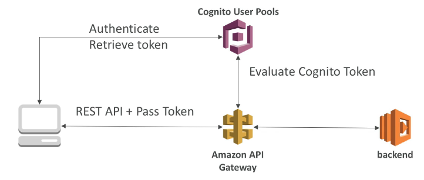

# API 게이트웨이 보안

### API Gateway Security IAM Permissions

- 사용자나 역할에 API 접근 권한을 주고 싶다면 IAM 정책을 사용자나 역할에 연결하면 된다. API 게이트웨이는 REST API 가 호출될 때 IAM 정보를 확인하게 된다.
- 인프라에서 API 접근 권한을 부여할 때 아주 유용하다.
- IAM 자격 증명은 복잡하지만 헤더로 권한을 확인할 수 있기 때문에 세팅만 된다면 아주 편하게 사용 가능하다. 그냥 헤더값을 넣어서 API 게이트웨이로 보내기만 하면 되기 때문이다.
- 클라이언트는 API 게이트웨이를 호출하는데 Sig v4 를 사용하고 API 게이트웨이가 IAM 을 사용자를 확인할 수 있게 된다.
- 추가적인 비용이 들지 않기 때문에 비용적으로 좋다. AWS 외부의 사용자에게 권한을 부여해야 하는 경우에 사용한다.

### API Gateway Security - Lambda Authorizer

- request 의 헤더로 토큰을 넣어서 Lambda 를 사용할 수 있게 해준다. 토큰을 확인하여 권한을 체크하는 것이다.
- 인증 결과를 캐시에 저장할 수 있어서 요청이 들어올 때 마다 인증을 또 할 필요 없다.
- OAuth, SAML 등 서드 파티 인증을 사용할 경우에 사용된다.
- 즉, 서드 파티 토큰을 사용하여 REST API 를 호출할 수 있고, API 게이트웨이가 Lambda Authorizer 를 호출해서 토크을 넘기게 되면 Lambda 는 IAM 정책을 부여하고 API 게이트웨이와 백엔드가 통신하게 된다.

### API Gateway Security - Cognito User Pools

- Cognito 가 사용자의 수명 주기를 전부 관리하고 API 게이트웨이는 AWS Cognito 에서 자동으로 신원을 증명한다.
- Cognito 는 무료이지만 인증에만 관여를 하고 권한을 부여하지는 못한다. 그냥 이 사용자가 진짜 사용자가 맞는지만 체크해주고 끝낸다.
- 클라이언트가 인증을 위해서 Cognito User Pools 를 호출하면 클라이언트에게 토큰을 반환해주고, API 게이트웨이가 해당 토큰을 확인하여 사용자 인증을 하게 된다. 사용자가 인증되면 그 후에 백엔드와 통신할 수 있게 된다.
- 백엔드는 클라이언트가 API 를 호출할 수 있는 권한이 있는지 확인을 해야 한다.

### API Gateway Security 요약

- IAM
  - AWS 계정에 이미 사용자나 역할이 있을 경우 사용한다. 
  - IAM 정책을 통해 인증 및 권한 부여를 관리한다. 
  - Sig v4 를 사용한다.
- Custom Authorizer
  - 서드 파티 토큰을 사용하여 인증을 할 때 사용한다.
  - 어떤 IAM 정책이 반환될 지 모른다.(아주 유연하다.)
  - 인증과 권한 부여를 다룰 수 있고 Lambda 를 호출할 때 마다 비용이 청구된다.
- Cognito User Pool
  - Facebook 이나 Google 로그인 등을 이용할 때 사용한다.
  - 인증 확인은 할 수 있지만 권한은 확인할 수 없기 때문에 백엔드에서 반드시 권한을 확인하는 절차를 밟아야 한다.