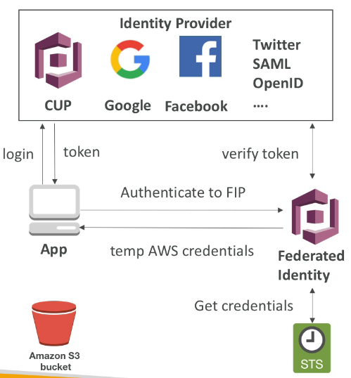

# Cognito 개요

- Cognito 는 사용자에게 자격 증명을 부여해 서버나 앱과 상호작용 할 수 있게 한다.
- Cognito User Pool 의 기능
  - 앱 로그인 기능
  - API 게이트웨이와 통합 기능
- Cognito Identity Pools(Federated Identity) 
  - AWS 자격 증명을 직접 앱 사용자에게 제공하여 AWS 리소스에 액세스하도록 한다.
  - Cognito 사용자 풀과 통합된다.
- Cognito Sync
  - 요즘은 잘 사용하지 않고 AppSync 를 사용한다.
  - 디바이스에서 Cognito 로 데이터를 동기화한다.

### AWS Cognito User Pools (CUP)

- 모바일 앱용 서버리스 인증 데이터베이스라고 할 수 있다.
- 사용자 이름이나 이메일 비밀번호를 조합해 로그인 할 수 있게 한다.
- 이메일이나 핸드폰 번호로 인증을 할 수 있게 한다. 
- 멀티팩터 인증을 추가하거나 비밀번호 정책을 만들수 있다.
- 사용자가 Facebook 이나 Google 같은 Federated Identity 를 활성화하여 로그인 할 수 있도록 한다.
- JWT 를 사용자에게 반환하여 JWT 를 통해 자격 증명을 할 수 있다.
- 인증을 위해 API 게이트웨이와 통합될 수 있다.

APP 에서 사용자가 로그인을 하면 CUP 에서 로그인 정보를 확인한 뒤 정상이면 JWT 를 사용자에게 반환한다.

JWT 를 통해 사용자는 자격 증명이 된다.

### AWS Cognito - Federated Identity Pools (FIP)

- 클라이언트 측에서 AWS 환경으로 프록시나 API 없이 직접 액세스하도록 한다.
- Facebook, Google 같은 Federated Identity Pool 에 로그인하거나 익명을 유지해도 된다.
- Federated Identity Pool 에서 AWS 자격 증명을 일시적으로 얻게 된다.
- Facebook 로그인을 한 후, S3 버킷에 임시적으로 쓰기 권한을 얻고 싶을 때 Federated Identity Pool 을 사용하여 잠시동안 Facebook 로그인 한 유저에게 권한을 부여할 수 있다.

사용자가 CUP, Google, Facebook, Twitter SAML, Kakao, Naver 로 로그인을 하면 사용자에게 토큰을 반환한다. 

이 토큰을 사용해서 Federated Identity Pool(FIP) 에서 정상적으로 인증이 확인 되면 이 토큰을 사용해서 AWS 에서 일시적으로 서비스를 사용할 수 있는 권한을 얻게 된다.

사용자는 이제 임시적으로 AWS 권한을 부여 받아 해당 서비스를 사용할 수 있게 된다.

### AWS Cognito Sync 

- 사용자 설정과 환경 설정, 앱의 상태를 저장한다.
- IOS, Android 등 디바이스 간 동기화 기능을 수행한다.
- Federated Identity Pool 을 사용해서 자격 증명을 진행해야 한다.
- 각각의 데이터 셋은 최대 1MB 까지 저장할 수 있다.
- 최대 20개의 데이터 셋을 동기화 할 수 있다.