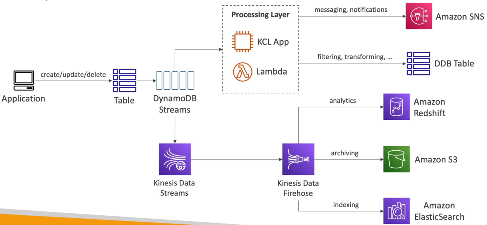

# DynamoDB 고급 기능

### DynamoDB Accelerator(DAX)

- DynamoDB Accelerator(DAX) 는 완전 관리형 서비스이다. DynamoDB 의 메모리 캐시이다.
- DAX 를 사용하면 가장 많이 읽은 데이터를 캐시에 저장해 읽기 혼잡을 해결할 수 있다.
- 애플리케이션 로직을 변경하지 않고도 캐시에 저장된 데이터 지연 시간을 마이크로초 까지 줄여준다. 즉, DynamoDB 에 쓰기를 하는 애플리케이션의 경우 동일한 API 를 사용하면 된다는 것이다.
- 여러 개의 캐시 노드로 구성된 DAX 클러스터를 만들고 애플리케이션은 데이터를 캐시에 저장하는 DAX 클러스터를 통해 DynamoDB 테이블에 액세스한다.
- 예를 들어, DynamoDB 의 데이터를 빠르게 저장하고 읽은 애플리케이션이 필요한데 애플리케이션의 로직을 변경하면 안되는 상황일 경우 DAX 를 사용해야 한다.

### DynamoDB Accelerator(DAX) vs ElastiCache

- DAX 와 엘라스티 캐시는 서로 목적이 다르다.
- DAX 는 DynamoDB 용이고 애플리케이션이 DynamoDB 에 액세스할 때 사용하는 API 를 변경하지 않는다. 주로, 개별 객체 캐시할 때나 쿼리 & 스캔 캐시할 때 사용한다.
- 애플리케이션이 DynamoDB 에서 데이터를 쿼리한 다음 어딘가에 그 데이터를 저장할 때 엘라스시 캐시에 해당 데이터를 저장할 수 있다.

### DynamoDB Streams

- 레코드를 생성, 업데이트, 삭제할 때 마다 DynamoDB Streams 로 보내진다.
- DynamoDB Streams 에서는 보내진 데이터들을 Kinesis Data Stream Lambda 로 보내거나 Kinesis Client Library 로 보낸다.
- DynamoDB Streams 에서 데이터는 최대 24시간 동안 저장된다.
- 어플리케이션에서 테이블에서 생성, 업데이트, 삭제한 데이터들이 전부 DynamoDB Streams 로 전달되고 해당 데이터들을 모두 Kinesis Data Stream 로 전달하여 Kinesis Data Firehose 로 전달된다. 이후에 Amazon Redshift 나 S3, ElasticSearch 로 보내진다. 
- 위처럼 Kinesis Data Streams 로 데이터를 전송하지 않고 DynamoDB Streams 에서 Lambda 나 KCL App 을 통해 데이터를 직접 처리하여 Amazon SNS Topic 이나 다른 Dynamo DB 테이블로 보낼 수도 있다.
- DynamoDB Streams 는 테이블 변경 사항 전부를 다루는 로그를 가지는데 Kinesis, Lambda, EC2 애플리케이션에서 해당 로그를 가져간다.

### DynamoDB Global Tables

다이나모디비 테이블이 여러 리전에 존재하는데 US-EAST-1 과 AP-SOUTHEAST-2 에 동일한 테이블이 있다고 가정한다.

이 두 테이블 사이에서 양방향 복제가 이뤄지는데 이를 글로벌 테이블이라고 칭한다.

DynamoDB 에서 글로벌 테이블을 사용하는 이유는 여러 리전에 걸쳐 데이터를 사용할 때 지연 시간을 줄이기 위해서이다. 

이를 다중 활성 복제라고 하는데 이렇게 하면 애플리케이션이 모든 리전에서 테이블을 읽고 쓸 수 있기 때문이다. 

US-EAST-1 의 모든 데이터들이 AP-SOUTHEAST-2 로 복제되고 AP-SOUTHEAST-2 의 모든 데이터들이 US-EAST-1 로 복제된다.

글로벌 데이터를 활성화하기 위해서는 반드시 DynamoDB Stream 이 필요로 하다.

DynamoDB Stream 에 변경 로그가 존재하기 때문에 각 테이블이 서로를 업데이트하며 양방향 복제를 하기 때문이다.

### DynamoDB - Time To Live(TTL)

- TTL 을 사용하면 TTL 이 만료된 후에 자동으로 행을 삭제할 수 있다.

### DynamoDB - Indexes

- Global Secondary Indexes(GSI) & Local Secondary Indexes(LSI) 두 가지 인덱스가 있다.
- DynamoDB 에서 기본적으로 쿼리를 할 수 있는 건 기본키뿐이지만 GSI, LSI 인덱스를 설정하여 해당 인덱스로 쿼리를 할 수 있다.