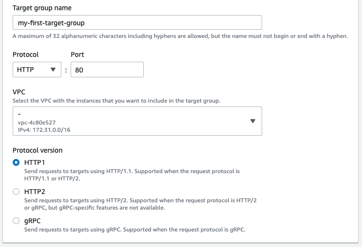
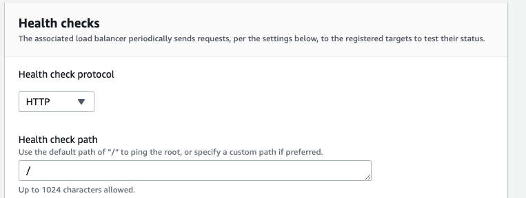

# Application Load Balancer 실습

HTTP 와 HTTPS 유형의 Application Load Balancer 를 만들어보자.

Application Load Balancer 가 어떻게 작동하는지 볼 수 있는 AWS 서비스가 있다.

EC2 서비스로 들어와서 로드 밸런서 콘솔창으로 이동, 로드 밸런서를 생성해보자

Application Load Balancer 를 클릭하고 Create 버튼을 클릭한다.

이름과 스키마 IP address type 을 정하고 network mapping 을 지정하는 등 각종 설정을 할 수 있다.

이름은 DemoALB 로 짓는다. 

### Schema

스키마에서는 Internet-facing 과 Internal 을 설정할 수 있는데, Internet-facing 로드 밸런서는 인터넷을 통해 클라이언트의 Request 를 받아 타겟 그룹으로 라우팅한다.

Internal 로드 밸런서는 VPC 안에 존재하는 클라이언트의 사적 IP 주소를 받아 해당 Request 를 다른 타겟 그룹으로 라우팅한다.

### IP address type

IP address type 은 로드 밸런서에 접근할 수 있는 IP 주소 타입을 정해준다. IPv4 유형이 로드 밸런서에 접근할 수 있게 설정해준다.

### Network Mapping

Network mapping 설정을 하면, IP 주소 설정에 따라 선택한 서브넷을 대상으로 트래픽을 라우팅한다.

가용 영역을 두개 이상 선택하는 것이 좋다, 로드 밸런서는 선택한 가용 영역의 대상에만 트래픽을 라우팅하고, 로드 밸런서나 VPC 에서 지원하지 않는 가용 영역은 선택할 수 없다. 

로드 밸런서가 생성되면 서브넷을 추가할 수 있지만 제거할 수는 없다!

ap-northeast-2a, 2b, 2c 를 선택했다. 로드 밸런서는 해당 가용 영역의 타겟 그룹으로 트래픽을 라우팅해준다!

### Security groups

다음으로는 로드 밸런서에 보안 그룹을 할당해야 한다.

첫번째 로드 밸런서 보안 그룹은 기존에 생성한 보안 그룹을 할당한다.

### Listeners and routing

리스너는 구성한 프로토콜과 포트를 사용하여 연결 요청을 확인하는 프로세스다. 

리스너가 수신한 트래픽은 사양에 따라 라우팅되고, 로드 밸런서를 생성한 후에 리스너 마다 여러 규칙과 여러 인증서를 지정할 수 있다.

다시 말하자면, 헤딩 포트에 해당 프로토콜이 오면 내가 설정한 규칙과 인증서를 가지고 타겟 그룹으로 라우팅시킬 수 있다는 뜻이다.

이걸 보면 80번 포트에 HTTP 프로토콜을 통해 어떤 요청이 오면 내가 지정한 타겟 그룹으로 라우팅 시키겠다는 뜻이다.

타겟 그룹을 만들어보자, 인스턴스 그룹을 만들 것인지, 사적 IP 주소 그룹을 만들 것인지, Lambda 함수 그룹을 만들 것인지, ALB 그룹을 만들 것인지 지정할 수 있다. 

ALB 일 경우에만 ALB 타겟 그룹에 라우팅할 수 있다.

해당 그룹의 이름을 my-first-target-group 로 지어주고, HTTP 프로토콜, 80번 포트로 설정, 프로토콜 버전은 HTTP1 로 세팅한다.

다음으로는 헬스 체크 설정이다.

HTTP 프로토콜로 루트 경로로 핑을 보내 헬스 체크를 하고 Advanced health check settings 를 눌러서 상세 설정을 할 수 있다.

### Healthy threshold
현자 상태가 정상 상태인지 확인하기 위해 연속 상태 확인 성공 횟수를 3회로 지정. 즉, 연속으로 3회 성공해야 정상적인 상태이다.

### Unhealthy threshold
현재 상태를 비정상으로 간주하기 전에 필요한 연속 상태 확인 실패 횟수를 2회로 지정. 즉, 연속으로 2회 실패하면 비정상 상태이다.

### Timeout
몇 초간 응답이 없으면 상태 확인이 실패했다고 나타내는 시간을 4초로 설정. 즉, 핑을 보냈는데 4초 동안 응답이 없으면 상태 확인 실패로 처리한다.

### Interval
몇 초 간격으로 상태 체크를 한다. 5초로 설정했다.

### Success codes
상태 확인 결과가 정상일 경우 response 로 어떤 코드를 보낼 것인지 세팅, 200-299 사이의 값을 세팅할 수 있다. 여기선 200으로 세

넥스트를 클릭

3개의 인스턴스 중에 2개의 인스턴스만 로드 밸런서에 연결해준다.

활성화된 include as pending below 버튼을 클릭하면 아래 Review targets 에 선택한 인스턴스들이 준비 상태가 된 것을 확인할 수 있다. 

create target group 버튼을 클릭해서 타겟 그룹을 생성한다.

EC2 서비스의 대상 그룹 콘솔 창에 방금 생성한 my-first-target-group 이 생성되었고 클릭하여 상세보기를 할 수 있다.

다시 ALB 생성 창으로 넘어와서 타겟 그룹을 설정해준다.

맨 아래로 내려오면 해당 ALB 의 요약이 나온다.

확인하고 Create load balancer 버튼을 클릭하자.

로드 밸런서 콘솔 창에서 생성한 로드 밸런서의 상세 보기가 가능하고 설정을 변경할 수도 있다.

DemoALB 의 DNS 이름을 복사 붙여넣기 하면 CLB 에서 마찬가지로 연결된 두개의 인스턴스가 로드 밸런서에 의해 무작위로 나타나는 것을 볼 수 있다.

CLB 와 다르게 ALB 이기 때문에 몇가지 기능이 더 존재한다.

대상 그룹 콘솔창으로 이동하고, 두번째 타겟 그룹을 생성한다.

동일하게 인스턴스 타겟 그룹이고 이름은 my-second-target-group 으로 만든다.

나머지 설정은 첫번째 타겟 그룹과 모두 동일하다.

이전과 다르게 인스턴스 하나만 타겟 그룹으로 등록한다.

이제 총 2개의 타겟 그룹이 만들어졌다.

DemoALB 로 돌아가면 리스너 탭에서 리스너를 추가하여 다른 타겟 그룹으로 라우팅을 시킬 수 있다.

현재는 리스너가 하나고 해당 리스너는 80번 포트로 HTTP 프로토콜을 사용하여 트래픽이 오면 로드 밸런서가 my-first-target-group 으로 라우팅하는 것을 볼 수 있다.

해당 리스너의 규칙 보기/편집을 클릭하여 규칙들을 추가할 수 있다.

플러스 버튼을 클릭, 규칙 삽입을 클릭한다.

조건 추가 버튼을 클릭하면 호스트 헤더, 경로, HTTP 헤더, HTTP 요청 메서드, 쿼리 스트링, IP 주소에 대해 조건을 추가하고 조건에 해당하는 값들이 오면 미리 설정한 작업을 수행하게 한다.

경로를 클릭하고 /test 로 세팅

작업 추가 버튼을 눌러서 전달 대상이나 리다이렉션 대상, 고정 응답을 반환할 수 있다.

여기서는 작업 대상을 클릭하여 my-second-target 으로 라우팅을 시키도록 설정했다.

그러면 두가지의 규칙이 생성됐고 로드 밸런서로 오는 url 의 맨끝에 /test 를 붙이면 규칙에 의해 my-second-target-group 으로 라우팅이 된다.

/constant 경로가 오면 고정 응답을 반환하는데 404 코드와 constant error 를 응답하도록 설정했다.

ABL 은 CLB 와 다르게 이런식으로 규칙들을 정해서 원하는 타겟 그룹으로 라우팅을 시킬 수 있다.

실제로 로드 밸런서 dns 네임 뒤에 /constant 를 붙이면 아래와 같이 404 Not Found 와 메세지를 response 로 받는다. 

