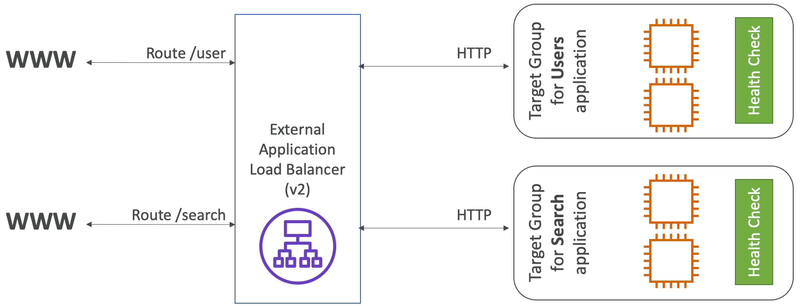
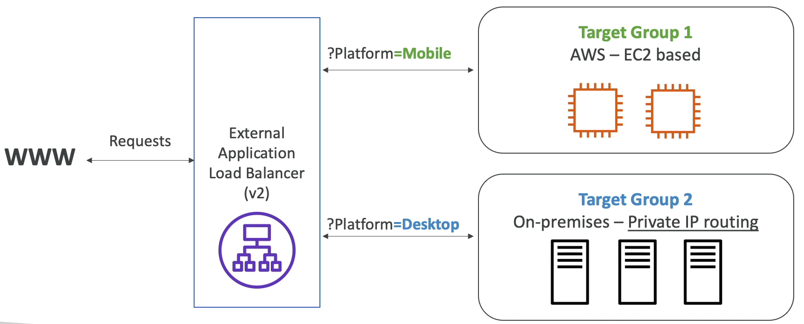
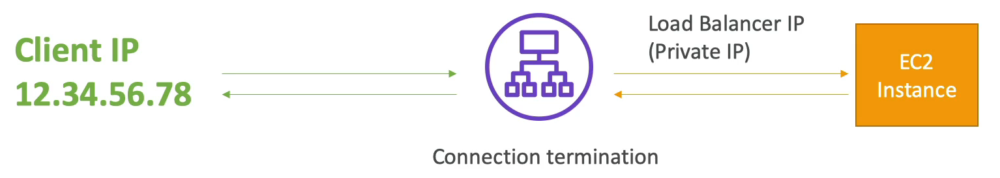

# Application Load Balancer

- 7계층 (HTTP) 로드 밸런서이다.
- 여러 가상 머신에서 여러 HTTP 애플리케이션으로 로드 밸런싱이 가능하다. (target groups)
- 동일한 가상 머신의 여러 애플리케이션으로 로드 밸런싱이 가능하다. (ex: ECS)
- HTTP/2 와 Websocket 을 지원한다.
- HTTP 에서 HTTPS 로 리다이렉션을 할 수 있다.
- 루트 라우팅을 지원한다.
  - URL 기반의 라우팅이 가능, 예를 들어 example.com/users 와 example.com/posts 가 있을 때 /users 와 /posts 는 서로 다른 경로를 가진다.
    그래서 이 둘을 다른 타겟 그룹으로 리다이렉션할 수 있다.
  - URL 호스트명 기반의 라우팅이 가능, 에를 들어 로드 밸런서가 one.example.com 이나 other.example.com 을 사용하여 접근한다면 서로 호스트 네임이 다르기 때문에
    호스트 이름에 맞는 타겟 그룹을 지정하여 로드 밸런싱이 가능하다.
  - 쿼리 스트링과 헤더에 기반하여 로드 밸런싱이 가능하다. 예를 들어 로드 밸런서가 다음과 같은 URL 을 받았을 경우에, example.com/users?id=123&order=false 쿼리 스트링에 해당하는 users?id=123&order=false 를 통해
    타겟 그룹을 지정하여 로드 밸런싱이 가능하다.
- Application Load Balancer 는 마이크로 서비스를 사용하거나 컨테이너 기반의 애플리케이션을 사용할 경우(Docker & Amazon ECS) 매우 유용하다.
- ECS 인스턴스의 동적 포트로 리다이렉션 시키고 ECS 에 직접 리다이렉션할 수 있는 port mapping 기능이 있다.

### ALB 예시
ALB 는 /user 와 /search 로 각각의 인스턴스에 라우팅을 시켜줄 수 있다. 즉, 두개의 다른 마이크로 서비스가 존재하고 첫번 째 인스턴스는 사용자에 대한 것을 관리하는 애플리케이션이고 두번 째 인스턴스는 검색 애플리케이션이다.

URL 에서 사용되는 경로를 기반으로 각각의 타겟 그룹에 자동으로 라우팅을 시켜주고 있다.

### 타겟 그룹이란??
- Auto Scaling 으로 관리되는 EC2 인스턴스들이 될 수 있다.
- ECS 에 의해 관리되는 ECS tasks 들이 될 수 있다.
- Lambda 함수들이 될 수 있다. 
- private IP 주소들이 될 수 있다.(private ip 만 타겟 그룹이 될 수 있다!!)

ALB 는 다양한 타겟 그룹들로 라우트를 시킬 수 있고, 타겟 그룹 레벨에서 헬스 체크를 할 수 있다.

### 타겟 그룹 예시

두 개의 타겟 그룹이 존재, 첫번째는 EC2 인스턴스들 그룹이고 두번째는 온 프레미스 서버의 private ip 그룹이다.

ALB 의 기능 중 하나인 쿼리스트링을 통해 목표 타겟을 지정하여 로드 밸런싱할 것이다.

로드 밸런서로 요청이 들어오고 해당 요청의 쿼리 스트링이 ?Platform=Mobile 일 경우엔 첫번째 타겟 그룹인 EC2 인스턴스들 그룹으로 라우팅하고, ?Platform=Desktop 일 경우에는 두번째 타겟 그룹인 사적 ip 그룹으로 라우팅한다.

이런 식으로 ALB 를 통해 라우팅하고 싶은 그룹으로 트래픽을 보낼 수 있다.

### ALB 에 대해 알아둬야 할 것들

첫번째로 ALB 는 클래식 로드 밸런서처럼 고정된 호스트명을 가져야 한다. (XXX.region.elb.amazonaws.com) XXX 에는 www, mail, ftp, dev.... 등이 올 수 있다.

두번째로 애플리케이션 서버는 클라이언트의 IP를 직접 볼 수 없다. 클라이언트의 IP 는 HTTP 헤더의 X-Forwarded-Port 와 X-Forwarded-Proto 에 들어있다.

자세히 설명하자면, 고객의 IP 가 12.34.56.78 이고, 로드 밸런서에 요청을 보낸다. 로드 밸런서는 해당 클라이언트의 request 를 처리하기 위해 타겟 그룹으로 로드 밸런싱을 한다. 

이 때 타겟 그룹으로 오는 IP 는 클라이언트의 IP 주소가 아닌 로드 밸런서의 사적 IP 주소이다. 그래서 타겟 그룹에서 클라이언트의 IP 를 알기 위해서는 HTTP request 헤더의 X-Forwarded-Port and Proto 를 확인해야 한다.

